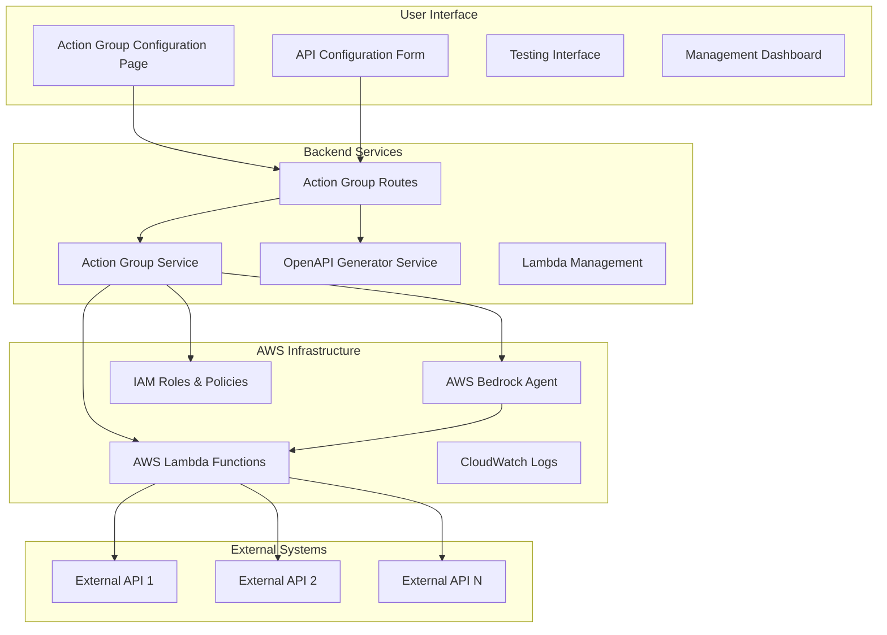
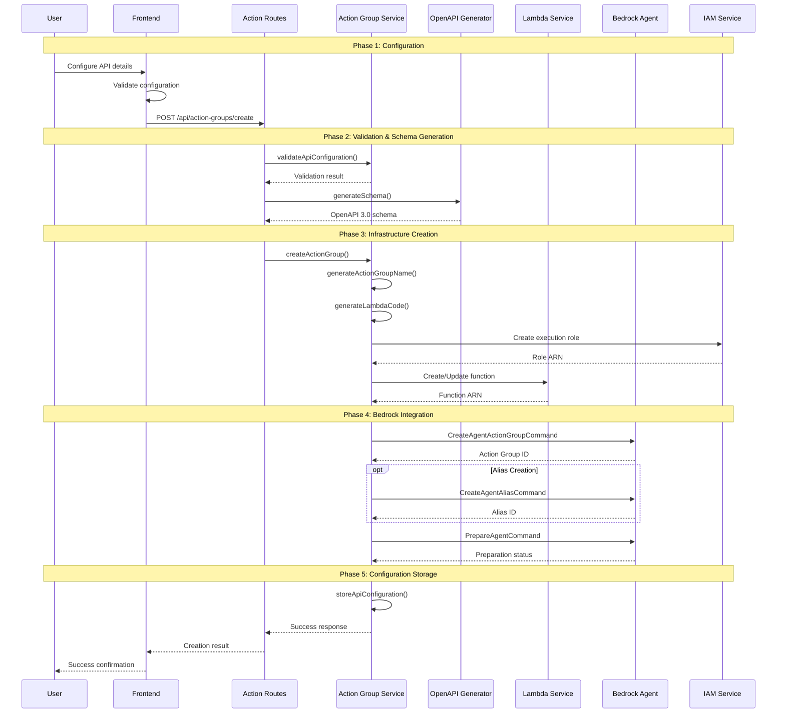
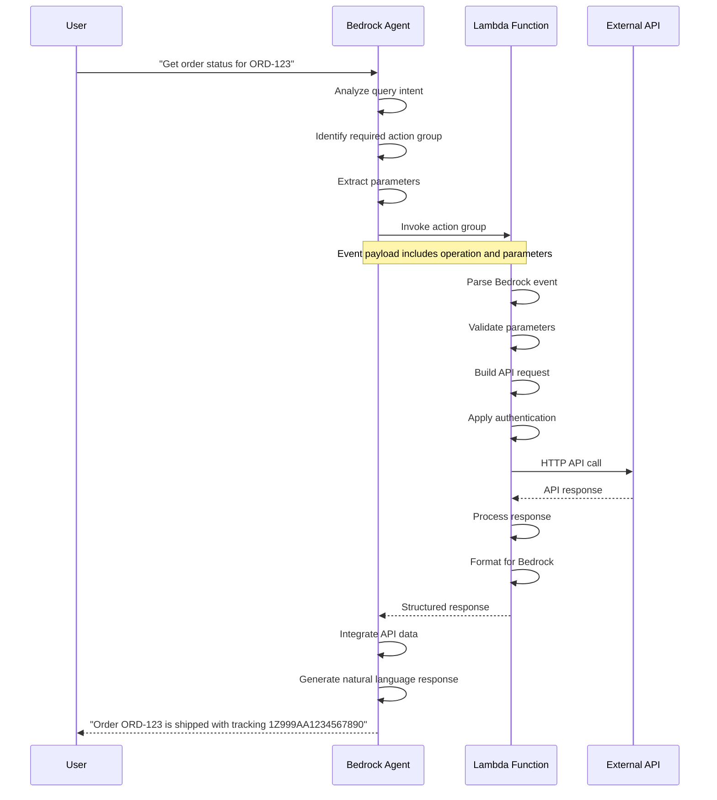

# Action Groups and Alias Management Complete Flow Documentation

## Executive Summary

This document provides a comprehensive overview of the Action Groups system in the Oralia AI Chatbot, detailing the complete flow from user configuration through deployment, management, and alias handling. The system enables non-technical users to integrate external APIs with the Bedrock Agent through a sophisticated automated pipeline that generates Lambda functions, OpenAPI schemas, and manages agent deployments.

## Table of Contents
1. [Action Groups Architecture Overview](#action-groups-architecture-overview)
2. [Complete Creation Flow](#complete-creation-flow)
3. [OpenAPI Schema Generation](#openapi-schema-generation)
4. [Lambda Function Management](#lambda-function-management)
5. [Agent Integration Process](#agent-integration-process)
6. [Alias Management System](#alias-management-system)
7. [Runtime Execution Flow](#runtime-execution-flow)
8. [Management and Monitoring](#management-and-monitoring)

---

## Action Groups Architecture Overview

### System Components



### Core Value Proposition

**Self-Service Integration**: Business users can integrate external APIs without developer involvement
**Automated Infrastructure**: Complete Lambda function and IAM role creation
**Intelligent Routing**: Bedrock Agent automatically calls appropriate APIs based on query context
**Scalable Architecture**: Supports unlimited API integrations with proper resource management

---

## Complete Creation Flow

### End-to-End Process Overview



### Detailed Implementation Steps

#### Step 1: User Configuration

**Configuration Form Structure**:

```javascript
// Location: frontend/src/pages/ActionGroupPage.jsx:162-190
const apiConfig = {
  apiName: "Order Tracking API",
  description: "Track customer orders in real-time",
  baseUrl: "https://api.ordertracking.com",
  authentication: {
    type: "api_key",
    keyName: "X-API-Key", 
    keyValue: "sk_live_abc123",
    location: "header"
  },
  endpoints: [
    {
      path: "/orders/{orderId}",
      method: "GET",
      description: "Get order status by ID",
      parameters: [
        {
          name: "orderId",
          type: "path",
          required: true,
          description: "Order identifier"
        }
      ],
      responseExample: {
        "orderId": "ORD-123",
        "status": "shipped",
        "trackingNumber": "1Z999AA1234567890"
      }
    }
  ],
  aliasName: "order-tracker-v1"  // Optional alias for deployment
};
```

**Frontend Validation**:

```javascript
// Location: frontend/src/pages/ActionGroupPage.jsx:128-150
const validateConfiguration = () => {
  const errors = [];
  
  if (!apiConfig.apiName.trim()) errors.push("API Name is required");
  if (!apiConfig.description.trim()) errors.push("Description is required");
  
  try {
    new URL(apiConfig.baseUrl);
  } catch (e) {
    errors.push("Invalid Base URL format");
  }
  
  apiConfig.endpoints.forEach((endpoint, index) => {
    if (!endpoint.path.trim()) errors.push(`Endpoint ${index + 1}: Path is required`);
    if (!endpoint.description.trim()) errors.push(`Endpoint ${index + 1}: Description is required`);
    
    if (endpoint.responseExample) {
      try {
        JSON.parse(endpoint.responseExample);
      } catch (e) {
        errors.push(`Endpoint ${index + 1}: Invalid JSON in response example`);
      }
    }
  });
  
  return errors;
};
```

#### Step 2: Backend Validation

**Configuration Validation Process**:

```javascript
// Location: src/services/actionGroupService.js:201-280
async validateApiConfiguration(apiConfig) {
  const validation = {
    valid: true,
    errors: [],
    warnings: []
  };

  // Basic structure validation
  if (!apiConfig.apiName || typeof apiConfig.apiName !== 'string') {
    validation.errors.push('API name is required and must be a string');
  }

  if (!apiConfig.baseUrl || !this.isValidUrl(apiConfig.baseUrl)) {
    validation.errors.push('Valid base URL is required');
  }

  // Authentication validation
  if (apiConfig.authentication) {
    const authValidation = this.validateAuthentication(apiConfig.authentication);
    if (!authValidation.valid) {
      validation.errors.push(...authValidation.errors);
    }
  }

  // Endpoints validation
  if (!apiConfig.endpoints || !Array.isArray(apiConfig.endpoints) || apiConfig.endpoints.length === 0) {
    validation.errors.push('At least one endpoint is required');
  } else {
    apiConfig.endpoints.forEach((endpoint, index) => {
      const endpointValidation = this.validateEndpoint(endpoint);
      if (!endpointValidation.valid) {
        validation.errors.push(...endpointValidation.errors.map(error => `Endpoint ${index + 1}: ${error}`));
      }
    });
  }

  // URL accessibility test (optional)
  if (validation.errors.length === 0) {
    try {
      const isAccessible = await this.testApiAccessibility(apiConfig.baseUrl);
      if (!isAccessible) {
        validation.warnings.push('API URL may not be accessible from AWS Lambda environment');
      }
    } catch (error) {
      validation.warnings.push(`Could not verify API accessibility: ${error.message}`);
    }
  }

  validation.valid = validation.errors.length === 0;
  return validation;
}
```

#### Step 3: OpenAPI Schema Generation

**Automated Schema Creation**:

```javascript
// Location: src/services/openApiGeneratorService.js:45-150
async generateSchema(apiConfig) {
  const schema = {
    openapi: '3.0.0',
    info: {
      title: apiConfig.apiName,
      description: apiConfig.description,
      version: '1.0.0'
    },
    servers: [
      {
        url: apiConfig.baseUrl,
        description: 'Production server'
      }
    ],
    security: this.generateSecuritySchemes(apiConfig.authentication),
    paths: {},
    components: {
      securitySchemes: this.generateSecurityComponents(apiConfig.authentication),
      schemas: {}
    }
  };

  // Generate paths from endpoints
  apiConfig.endpoints.forEach(endpoint => {
    const pathKey = endpoint.path.replace(/{([^}]+)}/g, '{$1}'); // Normalize path parameters
    
    if (!schema.paths[pathKey]) {
      schema.paths[pathKey] = {};
    }
    
    schema.paths[pathKey][endpoint.method.toLowerCase()] = {
      summary: endpoint.description,
      description: endpoint.description,
      operationId: this.generateOperationId(endpoint),
      parameters: this.generateParameters(endpoint.parameters),
      responses: this.generateResponses(endpoint.responseExample),
      security: this.generateEndpointSecurity(apiConfig.authentication)
    };
  });

  // Validate generated schema
  const validation = this.validateOpenAPISchema(schema);
  if (!validation.valid) {
    throw new Error(`Generated OpenAPI schema is invalid: ${validation.errors.join(', ')}`);
  }

  return schema;
}
```

**Security Scheme Generation**:

```javascript
generateSecurityComponents(authentication) {
  const components = {};
  
  if (!authentication) return components;
  
  switch (authentication.type) {
    case 'api_key':
      components.apiKeyAuth = {
        type: 'apiKey',
        in: authentication.location || 'header',
        name: authentication.keyName || 'X-API-Key'
      };
      break;
      
    case 'bearer_token':
      components.bearerAuth = {
        type: 'http',
        scheme: 'bearer',
        bearerFormat: 'JWT'
      };
      break;
      
    case 'basic':
      components.basicAuth = {
        type: 'http', 
        scheme: 'basic'
      };
      break;
      
    case 'custom':
      components.customAuth = {
        type: 'apiKey',
        in: 'header',
        name: authentication.headerName || 'Authorization'
      };
      break;
  }
  
  return components;
}
```

---

## Lambda Function Management

### Automated Function Creation

**Lambda Function Generation Process**:

```javascript
// Location: src/services/actionGroupService.js:122-183
async createLambdaFunction(apiConfig) {
  const functionName = this.generateLambdaFunctionName(apiConfig.apiName);
  
  try {
    // Check if function exists
    const getCommand = new GetFunctionCommand({ FunctionName: functionName });
    const existingFunction = await this.lambdaClient.send(getCommand);
    
    logger.info(`Updating existing Lambda function: ${functionName}`);
    
    // Update existing function code
    const zipFile = await this.generateLambdaCode(apiConfig);
    const updateCommand = new UpdateFunctionCodeCommand({
      FunctionName: functionName,
      ZipFile: zipFile
    });
    
    const updatedFunction = await this.lambdaClient.send(updateCommand);
    
    // Update configuration if needed
    await this.updateLambdaConfiguration(functionName, apiConfig);
    
    return {
      functionName: updatedFunction.FunctionName,
      functionArn: updatedFunction.FunctionArn,
      updated: true
    };
    
  } catch (error) {
    if (error.name === 'ResourceNotFoundException') {
      logger.info(`Creating new Lambda function: ${functionName}`);
      return await this.createNewLambdaFunction(functionName, apiConfig);
    } else {
      throw error;
    }
  }
}
```

**New Function Creation**:

```javascript
// Location: src/services/actionGroupService.js:185-250
async createNewLambdaFunction(functionName, apiConfig) {
  // Create execution role first
  const executionRole = await this.createLambdaExecutionRole(functionName);
  
  // Generate Lambda deployment package
  const zipFile = await this.generateLambdaCode(apiConfig);
  
  const createCommand = new CreateFunctionCommand({
    FunctionName: functionName,
    Runtime: 'nodejs18.x',
    Role: executionRole.arn,
    Handler: 'index.handler',
    Code: { ZipFile: zipFile },
    Description: `Action group handler for ${apiConfig.apiName}`,
    Timeout: 30,
    MemorySize: 256,
    Environment: {
      Variables: {
        API_BASE_URL: apiConfig.baseUrl,
        API_NAME: apiConfig.apiName,
        LOG_LEVEL: 'INFO'
      }
    },
    Tags: {
      'CreatedBy': 'oralia-action-group-service',
      'ApiName': apiConfig.apiName,
      'CreatedAt': new Date().toISOString()
    }
  });
  
  const newFunction = await this.lambdaClient.send(createCommand);
  
  // Wait for function to be ready
  await this.waitForFunctionActive(functionName);
  
  // Add permissions for Bedrock Agent to invoke
  await this.addBedrockInvokePermissions(functionName);
  
  return {
    functionName: newFunction.FunctionName,
    functionArn: newFunction.FunctionArn,
    created: true
  };
}
```

### Lambda Code Generation

**Dynamic Code Template System**:

```javascript
// Location: src/services/actionGroupService.js:441-655
generateLambdaCodeString(apiConfig) {
  // Read base template
  const templatePath = path.join(__dirname, '../../lambda-templates/generic-api-handler.js');
  let template = fs.readFileSync(templatePath, 'utf8');
  
  // Inject API configuration
  const configInjection = `
const API_CONFIG = ${JSON.stringify(apiConfig, null, 2)};
const API_BASE_URL = '${apiConfig.baseUrl}';
const AUTHENTICATION = ${JSON.stringify(apiConfig.authentication || {}, null, 2)};
const ENDPOINTS_MAP = ${JSON.stringify(this.createEndpointsMap(apiConfig.endpoints), null, 2)};
`;
  
  // Replace template placeholders
  template = template.replace('// INJECT_CONFIG_HERE', configInjection);
  
  // Inject authentication handlers
  template = template.replace('// INJECT_AUTH_HANDLER', this.generateAuthHandler(apiConfig.authentication));
  
  // Inject endpoint routing logic
  template = template.replace('// INJECT_ROUTING_LOGIC', this.generateRoutingLogic(apiConfig.endpoints));
  
  return template;
}
```

**Generated Lambda Handler Example**:

```javascript
// Location: lambda-templates/generic-api-handler.js (with injections)
exports.handler = async (event) => {
  console.log('Action Group Lambda invoked:', JSON.stringify(event, null, 2));
  
  const { actionGroup, function: functionName, parameters } = event;
  
  try {
    // Extract operation details from Bedrock Agent
    const operation = extractOperation(event);
    
    // Find matching endpoint configuration
    const endpointConfig = ENDPOINTS_MAP[operation.operationId];
    if (!endpointConfig) {
      throw new Error(`Unknown operation: ${operation.operationId}`);
    }
    
    // Build API request
    const apiRequest = buildApiRequest(endpointConfig, parameters);
    
    // Add authentication
    applyAuthentication(apiRequest, AUTHENTICATION);
    
    // Make API call
    const apiResponse = await makeApiCall(apiRequest);
    
    // Format response for Bedrock Agent
    const formattedResponse = formatResponseForBedrock(apiResponse);
    
    return {
      statusCode: 200,
      body: {
        'application/json': {
          body: JSON.stringify(formattedResponse)
        }
      }
    };
    
  } catch (error) {
    console.error('Lambda execution error:', error);
    return {
      statusCode: 500,
      body: {
        'application/json': {
          body: JSON.stringify({
            error: error.message,
            timestamp: new Date().toISOString()
          })
        }
      }
    };
  }
};
```

---

## Agent Integration Process

### Bedrock Agent Action Group Creation

**Action Group Registration**:

```javascript
// Location: src/services/actionGroupService.js:72-115
async createActionGroup(apiConfig, openApiSchema) {
  try {
    // Step 1: Create Lambda function
    const lambdaFunction = await this.createLambdaFunction(apiConfig);
    logger.info('Lambda function created:', lambdaFunction.functionArn);
    
    // Step 2: Generate unique action group name
    const actionGroupName = this.generateActionGroupName(apiConfig.apiName);
    
    // Step 3: Create action group in Bedrock
    const createCommand = new CreateAgentActionGroupCommand({
      agentId: this.agentId,
      agentVersion: 'DRAFT',
      actionGroupName: actionGroupName,
      description: `Action group for ${apiConfig.apiName}: ${apiConfig.description}`,
      actionGroupExecutor: {
        lambda: lambdaFunction.functionArn
      },
      apiSchema: {
        payload: JSON.stringify(openApiSchema)
      },
      actionGroupState: 'ENABLED'
    });
    
    const response = await this.bedrockAgentClient.send(createCommand);
    const actionGroupId = response.agentActionGroup.actionGroupId;
    
    logger.info(`Action group created successfully: ${actionGroupId}`);
    
    // Step 4: Handle alias creation if requested
    let aliasResult = null;
    if (apiConfig.aliasName && apiConfig.aliasName.trim()) {
      aliasResult = await this.createAgentAlias(apiConfig.aliasName.trim(), actionGroupName);
    }
    
    // Step 5: Store configuration for runtime
    await this.storeApiConfiguration(actionGroupId, {
      ...apiConfig,
      actionGroupId,
      actionGroupName,
      lambdaFunctionArn: lambdaFunction.functionArn,
      createdAt: new Date().toISOString()
    });
    
    // Step 6: Prepare agent with new action group
    const prepareResult = await this.prepareAgent();
    
    return {
      actionGroupId: actionGroupId,
      actionGroupName: actionGroupName,
      status: response.agentActionGroup.actionGroupState,
      lambdaFunction: lambdaFunction,
      alias: aliasResult,
      agentStatus: prepareResult.agentStatus,
      createdAt: response.agentActionGroup.createdAt,
      success: true
    };
    
  } catch (error) {
    logger.error('Error creating action group:', error);
    throw new Error(`Failed to create action group: ${error.message}`);
  }
}
```

### Agent Preparation Process

**Agent Preparation and Deployment**:

```javascript
// Location: src/services/actionGroupService.js:300-350
async prepareAgent() {
  try {
    logger.info(`Preparing agent ${this.agentId} with new action group...`);
    
    const prepareCommand = new PrepareAgentCommand({
      agentId: this.agentId
    });
    
    const response = await this.bedrockAgentClient.send(prepareCommand);
    
    // Monitor preparation status
    let preparationStatus = response.agentStatus;
    let attempts = 0;
    const maxAttempts = 30; // 5 minutes max
    
    while (preparationStatus === 'PREPARING' && attempts < maxAttempts) {
      await new Promise(resolve => setTimeout(resolve, 10000)); // Wait 10 seconds
      
      const statusCheck = await this.bedrockAgentClient.send(new GetAgentCommand({
        agentId: this.agentId
      }));
      
      preparationStatus = statusCheck.agent.agentStatus;
      attempts++;
      
      logger.info(`Agent preparation status: ${preparationStatus} (attempt ${attempts}/${maxAttempts})`);
    }
    
    if (preparationStatus !== 'PREPARED') {
      throw new Error(`Agent preparation failed or timed out. Final status: ${preparationStatus}`);
    }
    
    logger.info('Agent prepared successfully');
    
    return {
      agentId: this.agentId,
      agentStatus: preparationStatus,
      preparedAt: new Date().toISOString(),
      preparationTime: attempts * 10 // seconds
    };
    
  } catch (error) {
    logger.error('Error preparing agent:', error);
    throw new Error(`Failed to prepare agent: ${error.message}`);
  }
}
```

---

## Alias Management System

### Agent Alias Creation

**Alias Creation Process**:

```javascript
// Location: src/services/actionGroupService.js:140-171
async createAgentAlias(aliasName, actionGroupName) {
  try {
    logger.info(`Creating alias "${aliasName}" for agent ${this.agentId}...`);
    
    const aliasCommand = new CreateAgentAliasCommand({
      agentId: this.agentId,
      agentAliasName: aliasName.trim(),
      description: `Alias for action group ${actionGroupName}`,
      // Note: AWS automatically handles routing configuration for aliases
    });
    
    const aliasResponse = await this.bedrockAgentClient.send(aliasCommand);
    
    logger.info('Alias created successfully:', aliasResponse.agentAlias?.agentAliasId);
    
    return {
      aliasId: aliasResponse.agentAlias?.agentAliasId,
      aliasName: aliasResponse.agentAlias?.agentAliasName,
      status: aliasResponse.agentAlias?.agentAliasStatus,
      createdAt: aliasResponse.agentAlias?.createdAt,
      description: aliasResponse.agentAlias?.description
    };
    
  } catch (aliasError) {
    logger.error('Failed to create alias:', aliasError);
    
    // Return error info but don't fail the entire operation
    return { 
      error: aliasError.message,
      aliasName: aliasName,
      attempted: true,
      createdAt: new Date().toISOString()
    };
  }
}
```

### Alias Management Operations

**List Available Aliases**:

```javascript
// Location: src/routes/actionGroups.js:450-500
router.get('/aliases', async (req, res) => {
  try {
    const aliases = await actionGroupService.listAgentAliases();
    
    res.json({
      success: true,
      data: {
        aliases: aliases.map(alias => ({
          aliasId: alias.agentAliasId,
          aliasName: alias.agentAliasName,
          status: alias.agentAliasStatus,
          description: alias.description,
          createdAt: alias.createdAt,
          updatedAt: alias.updatedAt,
          routingConfiguration: alias.routingConfiguration
        })),
        totalCount: aliases.length,
        agentId: process.env.BEDROCK_AGENT_ID
      }
    });
  } catch (error) {
    logger.error('Error listing aliases:', error);
    res.status(500).json({
      success: false,
      error: 'Failed to list agent aliases',
      message: error.message
    });
  }
});
```

**Update Alias Configuration**:

```javascript
// Location: src/services/actionGroupService.js:380-450
async updateAgentAlias(aliasId, updates) {
  try {
    const updateCommand = new UpdateAgentAliasCommand({
      agentId: this.agentId,
      agentAliasId: aliasId,
      agentAliasName: updates.aliasName,
      description: updates.description,
      routingConfiguration: updates.routingConfiguration
    });
    
    const response = await this.bedrockAgentClient.send(updateCommand);
    
    // If routing configuration changed, may need to prepare agent
    if (updates.routingConfiguration) {
      await this.prepareAgent();
    }
    
    return {
      aliasId: response.agentAlias.agentAliasId,
      aliasName: response.agentAlias.agentAliasName,
      status: response.agentAlias.agentAliasStatus,
      updatedAt: response.agentAlias.updatedAt,
      updated: true
    };
    
  } catch (error) {
    logger.error('Error updating alias:', error);
    throw new Error(`Failed to update alias: ${error.message}`);
  }
}
```

---

## Runtime Execution Flow

### Agent to Action Group Communication

**Runtime Execution Sequence**:



### Lambda Event Processing

**Bedrock Agent Event Structure**:

```javascript
// Event received from Bedrock Agent
const bedrockAgentEvent = {
  "messageVersion": "1.0",
  "agent": {
    "name": "OrderTrackingAgent",
    "version": "DRAFT",
    "id": "ABCD1234",
    "alias": "order-tracker-v1"
  },
  "actionGroup": {
    "name": "order-tracking-action-group",
    "id": "ACTION123"
  },
  "function": {
    "name": "getOrderStatus",
    "parameters": {
      "orderId": {
        "value": "ORD-123"
      }
    }
  },
  "inputText": "Get order status for ORD-123",
  "sessionId": "session-abc-123",
  "sessionAttributes": {},
  "promptSessionAttributes": {}
};
```

**Lambda Response Processing**:

```javascript
// Location: lambda-templates/generic-api-handler.js:150-200
function formatResponseForBedrock(apiResponse) {
  // Convert API response to Bedrock-compatible format
  const formattedResponse = {
    response: {
      actionGroup: event.actionGroup.name,
      function: event.function.name,
      functionResponse: {
        responseBody: {
          'application/json': {
            body: JSON.stringify({
              result: apiResponse.data,
              status: 'success',
              timestamp: new Date().toISOString(),
              apiCallDuration: apiResponse.duration,
              source: API_CONFIG.apiName
            })
          }
        }
      }
    },
    sessionAttributes: event.sessionAttributes || {},
    promptSessionAttributes: event.promptSessionAttributes || {}
  };
  
  return formattedResponse;
}
```

---

## Management and Monitoring

### Action Group Lifecycle Management

**Complete Management Operations**:

```javascript
// Location: src/routes/actionGroups.js:350-600
// List all action groups
router.get('/', async (req, res) => {
  const actionGroups = await actionGroupService.listActionGroups(req.query.agentId);
  res.json({ success: true, data: { actionGroups, totalCount: actionGroups.length } });
});

// Get specific action group details
router.get('/:actionGroupId', async (req, res) => {
  const actionGroup = await actionGroupService.getActionGroup(req.params.actionGroupId);
  res.json({ success: true, data: actionGroup });
});

// Update action group configuration
router.put('/:actionGroupId', async (req, res) => {
  const result = await actionGroupService.updateActionGroup(req.params.actionGroupId, req.body);
  res.json({ success: true, data: result });
});

// Delete action group
router.delete('/:actionGroupId', async (req, res) => {
  await actionGroupService.deleteActionGroup(req.params.actionGroupId);
  res.json({ success: true, message: 'Action group deleted successfully' });
});

// Test action group functionality
router.post('/:actionGroupId/test', async (req, res) => {
  const testResult = await actionGroupService.testActionGroup(req.params.actionGroupId, req.body);
  res.json({ success: true, data: testResult });
});
```

### Monitoring and Health Checks

**System Health Monitoring**:

```javascript
// Location: src/services/actionGroupService.js:500-600
async getActionGroupHealth(actionGroupId) {
  const health = {
    actionGroupId: actionGroupId,
    status: 'unknown',
    checks: {},
    timestamp: new Date().toISOString()
  };
  
  try {
    // Check action group status in Bedrock
    const agentActionGroup = await this.getActionGroup(actionGroupId);
    health.checks.bedrockStatus = {
      status: agentActionGroup.actionGroupState,
      lastUpdated: agentActionGroup.updatedAt
    };
    
    // Check Lambda function status
    const lambdaFunction = await this.getLambdaFunction(agentActionGroup.actionGroupExecutor.lambda);
    health.checks.lambdaStatus = {
      status: lambdaFunction.State,
      lastModified: lambdaFunction.LastModified
    };
    
    // Check API accessibility
    const apiConfig = await this.getStoredApiConfiguration(actionGroupId);
    const apiAccessible = await this.testApiAccessibility(apiConfig.baseUrl);
    health.checks.apiAccessibility = {
      accessible: apiAccessible,
      baseUrl: apiConfig.baseUrl,
      testedAt: new Date().toISOString()
    };
    
    // Overall health determination
    health.status = this.determineOverallHealth(health.checks);
    
  } catch (error) {
    health.status = 'error';
    health.error = error.message;
  }
  
  return health;
}
```

### Performance Metrics Collection

**Metrics Tracking**:

```javascript
async collectActionGroupMetrics(actionGroupId, timeRange = '24h') {
  const metrics = {
    actionGroupId: actionGroupId,
    timeRange: timeRange,
    invocationCount: 0,
    successRate: 0,
    averageResponseTime: 0,
    errorRate: 0,
    apiCallMetrics: {},
    lambdaMetrics: {},
    collectedAt: new Date().toISOString()
  };
  
  try {
    // Get CloudWatch metrics for Lambda function
    const lambdaMetrics = await this.getLambdaMetrics(actionGroupId, timeRange);
    metrics.lambdaMetrics = lambdaMetrics;
    
    // Calculate derived metrics
    metrics.invocationCount = lambdaMetrics.invocations || 0;
    metrics.successRate = this.calculateSuccessRate(lambdaMetrics);
    metrics.averageResponseTime = lambdaMetrics.averageDuration || 0;
    metrics.errorRate = this.calculateErrorRate(lambdaMetrics);
    
    // Get API-specific metrics if available
    metrics.apiCallMetrics = await this.getApiCallMetrics(actionGroupId, timeRange);
    
  } catch (error) {
    logger.error('Error collecting metrics:', error);
    metrics.error = error.message;
  }
  
  return metrics;
}
```

---

## Error Handling and Troubleshooting

### Common Failure Scenarios

**Creation Process Failures**:

1. **Lambda Creation Failure**
   - **Cause**: IAM permissions, resource limits, invalid code
   - **Resolution**: Check execution role, verify quotas, validate generated code
   - **Recovery**: Retry with corrected configuration

2. **Action Group Registration Failure**
   - **Cause**: Invalid OpenAPI schema, agent not found, permission issues
   - **Resolution**: Validate schema format, verify agent ID, check Bedrock permissions
   - **Recovery**: Fix schema and retry registration

3. **Agent Preparation Failure**
   - **Cause**: Configuration conflicts, resource limits, service issues
   - **Resolution**: Check for conflicting action groups, verify limits
   - **Recovery**: Wait and retry, may need to remove conflicting resources

**Runtime Execution Failures**:

1. **API Authentication Failure**
   - **Cause**: Invalid credentials, expired tokens, incorrect configuration
   - **Resolution**: Verify credentials, refresh tokens, update configuration
   - **Recovery**: Update stored configuration and redeploy

2. **External API Unavailability**
   - **Cause**: Service downtime, network issues, rate limiting
   - **Resolution**: Implement retry logic, add circuit breakers, monitor API status
   - **Recovery**: Automatic retry with exponential backoff

### Comprehensive Error Handling

```javascript
// Location: src/services/actionGroupService.js:700-800
async handleActionGroupError(error, context) {
  const errorInfo = {
    type: this.classifyError(error),
    message: error.message,
    context: context,
    timestamp: new Date().toISOString(),
    correlationId: generateCorrelationId()
  };
  
  // Log error for monitoring
  logger.error('Action Group Error:', errorInfo);
  
  // Determine recovery strategy
  const recoveryStrategy = this.determineRecoveryStrategy(errorInfo);
  
  if (recoveryStrategy.canRecover) {
    logger.info('Attempting automatic recovery:', recoveryStrategy);
    
    try {
      const recoveryResult = await this.executeRecovery(recoveryStrategy, context);
      errorInfo.recovery = recoveryResult;
      return errorInfo;
    } catch (recoveryError) {
      errorInfo.recoveryFailed = recoveryError.message;
    }
  }
  
  // Send alerts for critical errors
  if (errorInfo.type === 'critical') {
    await this.sendErrorAlert(errorInfo);
  }
  
  throw new EnhancedError(errorInfo);
}
```

This comprehensive documentation covers the complete Action Groups and Alias Management system, providing all the technical details needed for understanding, implementing, managing, and troubleshooting the system. The flow ensures seamless integration between user configuration and AWS infrastructure while maintaining enterprise-grade reliability and monitoring capabilities.
