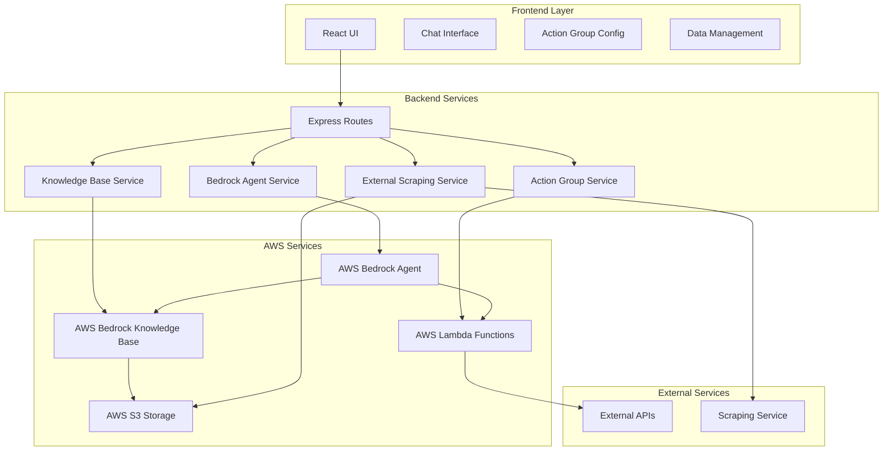
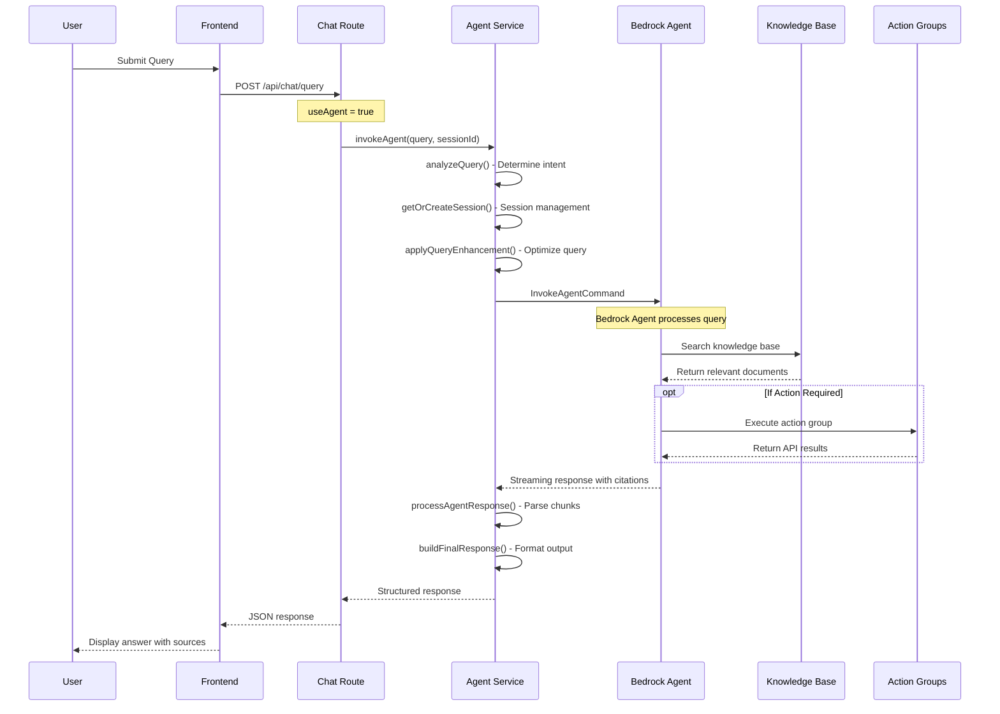
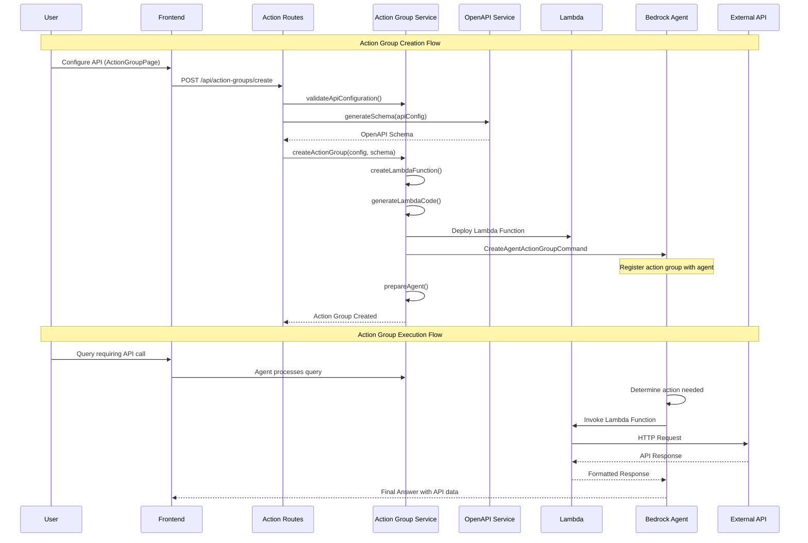
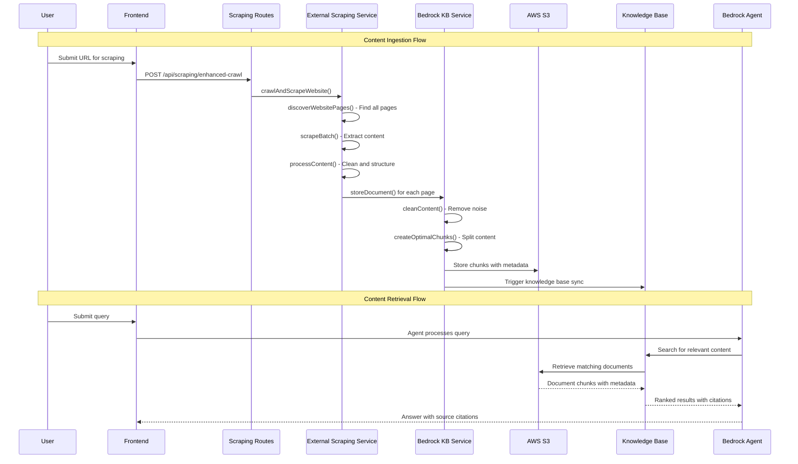
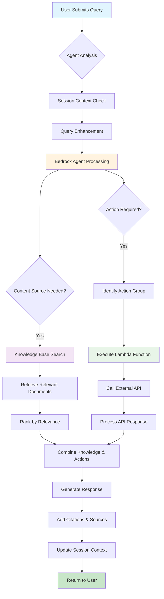

# Agent Flow Architecture Documentation

## Executive Summary

This document provides a comprehensive overview of the AWS Bedrock Agent implementation with Knowledge Base and Action Groups integration. The system is designed as an intelligent AI assistant that can:

1. **Query Knowledge Base**: Retrieve information from processed documents and scraped web content
2. **Execute Action Groups**: Call external APIs to perform operations or fetch real-time data
3. **Maintain Context**: Handle conversational sessions with memory and context awareness

---

## System Architecture Overview

### Core Components



---

## 1. Agent Query Flow with Knowledge Base

### Overview
When a user submits a query, the system routes it through the Bedrock Agent, which intelligently determines whether to search the knowledge base, execute action groups, or both.

### Flow Diagram



### Technical Implementation Details

#### 1.1 Query Analysis and Enhancement
```javascript
// Location: src/services/bedrockAgentService.js:116-180
analyzeQuery(query, context) {
    // Determine interaction style (conversational, analytical, technical)
    // Analyze conversation history and user intent
    // Apply context-aware query enhancement
    // Return optimized query with metadata
}
```

**Why this happens**: The system analyzes user queries to provide more contextually relevant responses and maintain conversation continuity.

#### 1.2 Session Management
```javascript
// Location: src/services/bedrockAgentService.js:85-108
getOrCreateSession(sessionId, sessionConfig) {
    // Create or retrieve existing conversation session
    // Maintain conversation context and preferences
    // Handle session timeout and cleanup
}
```

**Why this happens**: Sessions enable multi-turn conversations where the agent remembers previous interactions and maintains context.

#### 1.3 Bedrock Agent Invocation
```javascript
// Location: src/services/bedrockAgentService.js:295-321
const agentParams = {
    agentId: this.agentId,
    agentAliasId: this.agentAliasId,
    sessionId: session.id,
    inputText: enhancedQuery,
    enableTrace: process.env.NODE_ENV === 'development'
};
```

**Why this happens**: This is the core integration point with AWS Bedrock Agent, which handles the intelligent processing and decision-making.

---

## 2. Action Group Integration Flow

### Overview
Action Groups enable the Bedrock Agent to call external APIs as functions, extending its capabilities beyond static knowledge retrieval to dynamic data access and operations.

### Flow Diagram



### Technical Implementation Details

#### 2.1 Action Group Creation
```javascript
// Location: src/services/actionGroupService.js:47-115
async createActionGroup(apiConfig, openApiSchema) {
    // Step 1: Create Lambda function for API handling
    const lambdaFunction = await this.createLambdaFunction(apiConfig);
    
    // Step 2: Generate action group name
    const actionGroupName = this.generateActionGroupName(apiConfig.apiName);
    
    // Step 3: Create action group in Bedrock
    const createCommand = new CreateAgentActionGroupCommand({
        agentId: this.agentId,
        actionGroupExecutor: { lambda: lambdaFunction.functionArn },
        apiSchema: { payload: JSON.stringify(openApiSchema) }
    });
}
```

**Why this happens**: Action Groups bridge the gap between the AI agent and external systems, allowing real-time data access and operations.

#### 2.2 Lambda Function Generation
```javascript
// Location: src/services/actionGroupService.js:441-655
generateLambdaCodeString(apiConfig) {
    // Read template from lambda-templates/generic-api-handler.js
    // Inject API configuration into Lambda runtime
    // Handle authentication, request routing, response formatting
    // Return deployable Lambda code
}
```

**Why this happens**: Lambda functions act as secure, scalable adapters between the Bedrock Agent and external APIs, handling authentication and data transformation.

---

## 3. Knowledge Base Storage and Retrieval Flow

### Overview
The system continuously ingests content from web scraping and document uploads, processes it into searchable chunks, and stores it in the Bedrock Knowledge Base for intelligent retrieval.

### Flow Diagram



### Technical Implementation Details

#### 3.1 Content Processing and Chunking
```javascript
// Location: src/services/bedrockKnowledgeBaseService.js:240-285
createOptimalChunks(content) {
    const maxChunkSize = 1000; // Optimal for Bedrock retrieval
    const overlapSize = 100;   // Character overlap between chunks
    
    // Split by paragraphs first, then sentences if needed
    // Maintain semantic boundaries for better search relevance
    // Create overlap between chunks for context preservation
}
```

**Why this happens**: Proper chunking ensures that search results are meaningful and contain sufficient context while staying within Bedrock's processing limits.

#### 3.2 Knowledge Base Synchronization
```javascript
// Location: src/services/bedrockKnowledgeBaseService.js:404-426
async syncKnowledgeBase() {
    const command = new StartIngestionJobCommand({
        knowledgeBaseId: this.knowledgeBaseId,
        dataSourceId: this.dataSourceId,
        description: `Sync triggered at ${new Date().toISOString()}`
    });
    
    const response = await this.bedrockAgent.send(command);
    return response.ingestionJob.ingestionJobId;
}
```

**Why this happens**: Synchronization ensures that newly added content becomes available for agent queries, keeping the knowledge base current.

---

## 4. Complete Integration Flow

### The Full User Journey



---

## 5. Why This Architecture?

### Design Principles

1. **Intelligent Routing**: The Bedrock Agent automatically determines the best approach for each query
2. **Extensibility**: Action Groups allow seamless integration with any REST API
3. **Context Awareness**: Session management maintains conversation history and preferences
4. **Scalability**: Lambda functions and S3 storage scale automatically with demand
5. **Accuracy**: Citation tracking ensures responses are attributable to sources

### Benefits

1. **Unified Interface**: Single chat interface for both static knowledge and dynamic data
2. **Real-time Capabilities**: Action Groups enable current information and operations
3. **Intelligent Chunking**: Optimized content processing improves search relevance
4. **Session Continuity**: Conversations maintain context across multiple interactions
5. **Modular Design**: Components can be updated independently

---

## 6. Configuration Requirements

### Environment Variables

```bash
# Core AWS Configuration
AWS_REGION=us-east-1
AWS_ACCESS_KEY_ID=your_access_key
AWS_SECRET_ACCESS_KEY=your_secret_key

# Bedrock Agent Configuration
BEDROCK_AGENT_ID=your_agent_id
BEDROCK_AGENT_ALIAS_ID=your_alias_id
BEDROCK_KNOWLEDGE_BASE_ID=your_kb_id

# Storage Configuration
BEDROCK_S3_BUCKET=your_bucket_name
DEFAULT_MODEL_ID=anthropic.claude-3-sonnet-20240229-v1:0
```

### Key Endpoints

| Endpoint | Purpose | Flow |
|----------|---------|------|
| `POST /api/chat/query` | Primary chat interface | Agent Query Flow |
| `POST /api/chat/agent` | Direct agent communication | Agent Query Flow |
| `POST /api/action-groups/create` | Create new action group | Action Group Integration |
| `POST /api/scraping/enhanced-crawl` | Web content ingestion | Knowledge Base Storage |

---

## 7. Monitoring and Debugging

### Key Metrics to Monitor

1. **Agent Response Time**: Track query processing speed
2. **Knowledge Base Hit Rate**: Measure search effectiveness
3. **Action Group Success Rate**: Monitor API call reliability
4. **Session Management**: Track active conversations
5. **Content Processing**: Monitor scraping and storage operations

### Debug Endpoints

- `GET /api/chat/agent/health` - Agent connectivity status
- `GET /api/chat/agent/test` - Test agent functionality
- `GET /api/chat/status` - Overall system status

---

## 8. Next Steps and Recommendations

### Immediate Improvements

1. **Performance Optimization**: Implement caching for frequently accessed content
2. **Error Handling**: Enhance fallback mechanisms between services
3. **Monitoring**: Set up CloudWatch dashboards for system metrics
4. **Security**: Implement API key rotation for external services

### Future Enhancements

1. **Multi-modal Support**: Add image and document analysis capabilities
2. **Advanced Analytics**: Implement query pattern analysis
3. **Custom Models**: Fine-tune models for domain-specific knowledge
4. **Real-time Sync**: Implement webhooks for immediate content updates

---

This architecture provides a robust, scalable foundation for an intelligent AI assistant that can both access stored knowledge and interact with live systems through APIs. The modular design ensures maintainability while the integration with AWS Bedrock provides enterprise-grade AI capabilities.
