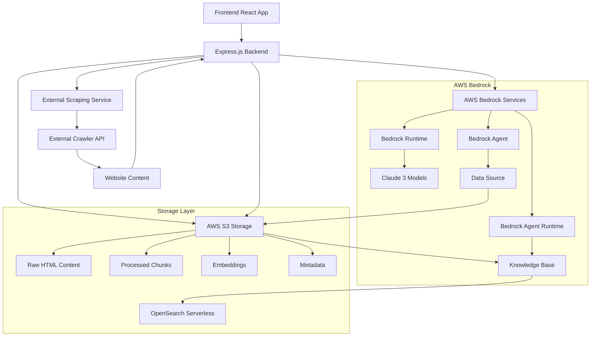
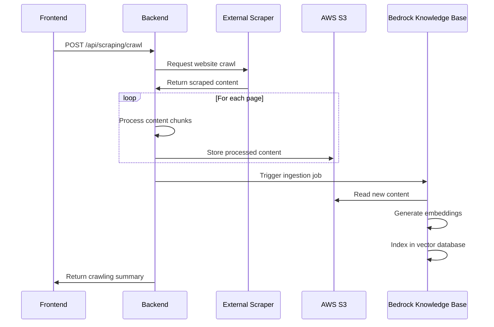
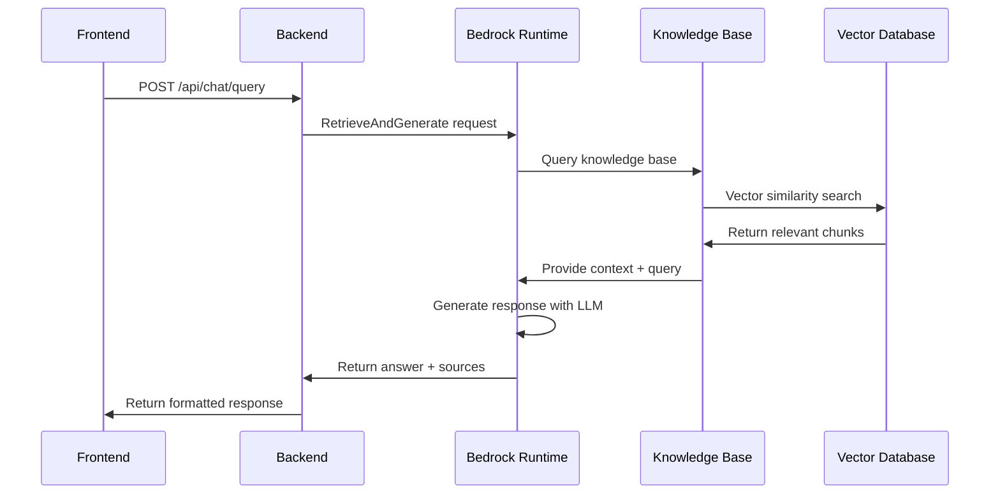

# AWS Bedrock Complete Integration Guide

## Table of Contents
1. [Architecture Overview](#architecture-overview)
2. [AWS Bedrock Setup](#aws-bedrock-setup)
3. [Ready-to-Use Bedrock Functions](#ready-to-use-bedrock-functions)
4. [Knowledge Base Integration](#knowledge-base-integration)
5. [Complete Service Flow](#complete-service-flow)
6. [API Endpoints](#api-endpoints)
7. [Environment Configuration](#environment-configuration)
8. [Deployment Guide](#deployment-guide)
9. [Troubleshooting](#troubleshooting)

---

## Architecture Overview



---

## AWS Bedrock Setup

### 1. Prerequisites

- AWS Account with Bedrock access enabled
- IAM User with appropriate permissions
- S3 Bucket for knowledge base storage
- OpenSearch Serverless collection (auto-created by Bedrock)

### 2. Required AWS IAM Permissions

```json
{
    "Version": "2012-10-17",
    "Statement": [
        {
            "Effect": "Allow",
            "Action": [
                "bedrock:InvokeModel",
                "bedrock:InvokeModelWithResponseStream"
            ],
            "Resource": "arn:aws:bedrock:*::foundation-model/*"
        },
        {
            "Effect": "Allow",
            "Action": [
                "bedrock-agent-runtime:Retrieve",
                "bedrock-agent-runtime:RetrieveAndGenerate"
            ],
            "Resource": "arn:aws:bedrock:*:*:knowledge-base/*"
        },
        {
            "Effect": "Allow",
            "Action": [
                "bedrock-agent:StartIngestionJob",
                "bedrock-agent:GetIngestionJob",
                "bedrock-agent:ListIngestionJobs"
            ],
            "Resource": [
                "arn:aws:bedrock:*:*:knowledge-base/*",
                "arn:aws:bedrock:*:*:data-source/*"
            ]
        },
        {
            "Effect": "Allow",
            "Action": [
                "s3:GetObject",
                "s3:PutObject",
                "s3:DeleteObject",
                "s3:ListBucket"
            ],
            "Resource": [
                "arn:aws:s3:::your-bedrock-bucket",
                "arn:aws:s3:::your-bedrock-bucket/*"
            ]
        }
    ]
}
```

### 3. Knowledge Base Setup Steps

1. **Create S3 Bucket**: For storing scraped content
2. **Create Knowledge Base**: In AWS Bedrock console
3. **Configure Data Source**: Link S3 bucket to knowledge base
4. **Set Embedding Model**: Use Amazon Titan Embeddings V2
5. **Configure Vector Database**: OpenSearch Serverless (auto-configured)

---

## Ready-to-Use Bedrock Functions

### Core Bedrock Service Class

```javascript
const { BedrockAgentRuntimeClient, RetrieveAndGenerateCommand } = require('@aws-sdk/client-bedrock-agent-runtime');
const { BedrockRuntimeClient, InvokeModelCommand } = require('@aws-sdk/client-bedrock-runtime');
const { BedrockAgentClient, StartIngestionJobCommand, GetIngestionJobCommand } = require('@aws-sdk/client-bedrock-agent');

class BedrockService {
  constructor() {
    // Initialize Bedrock Agent Runtime Client for RAG queries
    this.agentRuntimeClient = new BedrockAgentRuntimeClient({
      region: process.env.AWS_REGION || 'us-east-1',
      credentials: {
        accessKeyId: process.env.AWS_ACCESS_KEY_ID,
        secretAccessKey: process.env.AWS_SECRET_ACCESS_KEY,
      },
      endpoint: `https://bedrock-agent-runtime.${process.env.AWS_REGION || 'us-east-1'}.amazonaws.com`,
      maxAttempts: 3,
    });

    // Initialize Bedrock Runtime Client for direct model invocation
    this.runtimeClient = new BedrockRuntimeClient({
      region: process.env.AWS_REGION || 'us-east-1',
      credentials: {
        accessKeyId: process.env.AWS_ACCESS_KEY_ID,
        secretAccessKey: process.env.AWS_SECRET_ACCESS_KEY,
      },
      endpoint: `https://bedrock-runtime.${process.env.AWS_REGION || 'us-east-1'}.amazonaws.com`,
      maxAttempts: 3,
    });

    // Initialize Bedrock Agent Client for knowledge base management
    this.bedrockAgentClient = new BedrockAgentClient({
      region: process.env.AWS_REGION || 'us-east-1',
      credentials: {
        accessKeyId: process.env.AWS_ACCESS_KEY_ID,
        secretAccessKey: process.env.AWS_SECRET_ACCESS_KEY,
      },
      endpoint: `https://bedrock-agent.${process.env.AWS_REGION || 'us-east-1'}.amazonaws.com`,
      maxAttempts: 3,
    });

    this.knowledgeBaseId = process.env.BEDROCK_KNOWLEDGE_BASE_ID;
    this.dataSourceId = process.env.BEDROCK_DATA_SOURCE_ID;
    this.defaultModelId = process.env.DEFAULT_MODEL_ID || 'anthropic.claude-3-sonnet-20240229-v1:0';
    
    // Available foundation models
    this.availableModels = {
      'claude-3-sonnet': {
        id: 'anthropic.claude-3-sonnet-20240229-v1:0',
        name: 'Claude 3 Sonnet',
        provider: 'Anthropic',
        description: 'Balanced performance and speed'
      },
      'claude-3-haiku': {
        id: 'anthropic.claude-3-haiku-20240307-v1:0',
        name: 'Claude 3 Haiku',
        provider: 'Anthropic',
        description: 'Fast and efficient'
      },
      'titan-text-express': {
        id: 'amazon.titan-text-express-v1',
        name: 'Titan Text G1 - Express',
        provider: 'Amazon',
        description: 'Fast text generation'
      },
      'titan-embeddings': {
        id: 'amazon.titan-embed-text-v2:0',
        name: 'Titan Text Embeddings V2',
        provider: 'Amazon',
        description: 'Text embeddings model'
      }
    };
  }

  /**
   * Query Knowledge Base using RAG (Retrieval-Augmented Generation)
   * @param {string} query - User query
   * @param {string} sessionId - Optional session ID for conversation tracking
   * @param {string} modelKey - Optional model to use
   * @returns {Promise<Object>} - Response with answer and sources
   */
  async queryKnowledgeBase(query, sessionId = null, modelKey = null) {
    try {
      const selectedModelId = this.getModelId(modelKey);
      console.log(`Querying knowledge base with: ${query}`);
      console.log(`Using Knowledge Base ID: ${this.knowledgeBaseId}`);
      console.log(`Using Model: ${selectedModelId}`);

      // Validate required configuration
      if (!this.knowledgeBaseId) {
        throw new Error('BEDROCK_KNOWLEDGE_BASE_ID is not configured');
      }

      // Create command parameters
      const commandParams = {
        input: {
          text: query,
        },
        retrieveAndGenerateConfiguration: {
          type: 'KNOWLEDGE_BASE',
          knowledgeBaseConfiguration: {
            knowledgeBaseId: this.knowledgeBaseId,
            modelArn: `arn:aws:bedrock:${process.env.AWS_REGION}::foundation-model/${selectedModelId}`,
            retrievalConfiguration: {
              vectorSearchConfiguration: {
                numberOfResults: 5,
              },
            },
          },
        },
      };

      // Add session ID if provided
      if (sessionId && !sessionId.includes('health-check')) {
        commandParams.sessionId = sessionId;
      }

      // Execute query
      const command = new RetrieveAndGenerateCommand(commandParams);
      const response = await this.agentRuntimeClient.send(command);
      
      return {
        answer: response.output?.text || 'No answer generated',
        sources: response.citations || [],
        sessionId: response.sessionId,
        model: selectedModelId
      };
    } catch (error) {
      console.error('Error querying knowledge base:', error);
      throw new Error(`Failed to query knowledge base: ${error.message}`);
    }
  }

  /**
   * Direct Model Invocation (without RAG)
   * @param {string} prompt - The prompt to send to the model
   * @param {string} modelKey - Optional model to use
   * @returns {Promise<string>} - Response from the model
   */
  async invokeModel(prompt, modelKey = null) {
    try {
      const selectedModelId = this.getModelId(modelKey);
      console.log('Invoking Bedrock model directly');
      console.log(`Using model: ${selectedModelId}`);

      const body = JSON.stringify({
        anthropic_version: "bedrock-2023-05-31",
        max_tokens: 1000,
        messages: [
          {
            role: "user",
            content: prompt
          }
        ]
      });

      const command = new InvokeModelCommand({
        modelId: selectedModelId,
        body: body,
        contentType: 'application/json',
        accept: 'application/json',
      });

      const response = await this.runtimeClient.send(command);
      const responseBody = JSON.parse(new TextDecoder().decode(response.body));
      
      return responseBody.content[0].text;
    } catch (error) {
      console.error('Error invoking model:', error);
      throw new Error(`Failed to invoke model: ${error.message}`);
    }
  }

  /**
   * Start Knowledge Base Ingestion Job
   * @param {string} domain - Domain that was scraped
   * @returns {Promise<Object>} - Ingestion job result
   */
  async startIngestionJob(domain) {
    try {
      console.log(`Starting knowledge base ingestion for domain: ${domain}`);

      const command = new StartIngestionJobCommand({
        knowledgeBaseId: this.knowledgeBaseId,
        dataSourceId: this.dataSourceId,
        description: `Sync scraped content from ${domain} - ${new Date().toISOString()}`
      });

      const response = await this.bedrockAgentClient.send(command);
      
      return {
        jobId: response.ingestionJob.ingestionJobId,
        status: response.ingestionJob.status,
        startedAt: response.ingestionJob.startedAt
      };

    } catch (error) {
      console.error('Error starting ingestion job:', error);
      throw new Error(`Failed to start ingestion job: ${error.message}`);
    }
  }

  /**
   * Check Ingestion Job Status
   * @param {string} jobId - Ingestion job ID
   * @returns {Promise<Object>} - Job status
   */
  async checkIngestionJobStatus(jobId) {
    try {
      const command = new GetIngestionJobCommand({
        knowledgeBaseId: this.knowledgeBaseId,
        dataSourceId: this.dataSourceId,
        ingestionJobId: jobId
      });

      const response = await this.bedrockAgentClient.send(command);
      
      return {
        jobId: response.ingestionJob.ingestionJobId,
        status: response.ingestionJob.status,
        startedAt: response.ingestionJob.startedAt,
        updatedAt: response.ingestionJob.updatedAt,
        failureReasons: response.ingestionJob.failureReasons || []
      };

    } catch (error) {
      console.error('Error checking ingestion job status:', error);
      throw new Error(`Failed to check job status: ${error.message}`);
    }
  }

  /**
   * Health Check for Bedrock Service
   * @returns {Promise<boolean>} - Service health status
   */
  async healthCheck() {
    try {
      console.log('Starting Bedrock health check...');
      
      const testPrompt = "Hello, respond with 'OK' if you can hear me.";
      const response = await this.invokeModel(testPrompt);
      
      console.log('Bedrock health check completed successfully');
      return response && response.length > 0;
    } catch (error) {
      console.error('Bedrock health check failed:', error);
      return false;
    }
  }

  /**
   * Get Model ID from key or return default
   * @param {string} modelKey - Model key or full model ID
   * @returns {string} - Full model ID
   */
  getModelId(modelKey) {
    if (!modelKey) {
      return this.defaultModelId;
    }
    
    // If it's a full model ID, use it directly
    if (modelKey.includes('.') || modelKey.includes(':')) {
      return modelKey;
    }
    
    // If it's a key, look it up
    const model = this.availableModels[modelKey];
    return model ? model.id : this.defaultModelId;
  }

  /**
   * Get Available Models
   * @returns {Object} - Available models
   */
  getAvailableModels() {
    return this.availableModels;
  }
}

module.exports = new BedrockService();
```

### S3 Storage Service for Knowledge Base

```javascript
const { S3Client, PutObjectCommand, GetObjectCommand, ListObjectsV2Command } = require('@aws-sdk/client-s3');

class S3StorageService {
  constructor() {
    this.s3Client = new S3Client({
      region: process.env.AWS_REGION || 'us-east-1',
      credentials: {
        accessKeyId: process.env.AWS_ACCESS_KEY_ID,
        secretAccessKey: process.env.AWS_SECRET_ACCESS_KEY,
      },
    });
    this.bucket = process.env.BEDROCK_S3_BUCKET;
  }

  /**
   * Store content in S3 for knowledge base ingestion
   * @param {Object} content - Content to store
   * @param {string} domain - Domain of the content
   * @returns {Promise<string>} - S3 key of stored object
   */
  async storeContent(content, domain) {
    try {
      const timestamp = new Date().toISOString();
      const urlHash = this.generateHash(content.url);
      const key = `processed/${domain}/${timestamp.split('T')[0]}/${urlHash}.json`;

      const putCommand = new PutObjectCommand({
        Bucket: this.bucket,
        Key: key,
        Body: JSON.stringify(content),
        ContentType: 'application/json',
        Metadata: {
          domain: domain,
          url: content.url,
          timestamp: timestamp
        }
      });

      await this.s3Client.send(putCommand);
      console.log(`Content stored in S3: ${key}`);
      
      return key;
    } catch (error) {
      console.error('Error storing content in S3:', error);
      throw error;
    }
  }

  /**
   * List content for a domain
   * @param {string} domain - Domain to list content for
   * @returns {Promise<Array>} - List of content objects
   */
  async listDomainContent(domain) {
    try {
      const listCommand = new ListObjectsV2Command({
        Bucket: this.bucket,
        Prefix: `processed/${domain}/`,
        MaxKeys: 1000
      });

      const response = await this.s3Client.send(listCommand);
      return response.Contents || [];
    } catch (error) {
      console.error('Error listing domain content:', error);
      throw error;
    }
  }

  /**
   * Generate hash for content identification
   * @param {string} input - Input to hash
   * @returns {string} - SHA256 hash
   */
  generateHash(input) {
    const crypto = require('crypto');
    return crypto.createHash('sha256').update(input).digest('hex');
  }
}

module.exports = new S3StorageService();
```

---

## Knowledge Base Integration

### Content Processing Pipeline

```javascript
class ContentProcessor {
  /**
   * Process scraped content for knowledge base ingestion
   * @param {Object} scrapedData - Raw scraped data
   * @returns {Object} - Processed content ready for knowledge base
   */
  static processForKnowledgeBase(scrapedData) {
    const { url, title, content, description } = scrapedData;
    
    // Clean and structure content
    const cleanContent = this.cleanContent(content);
    const chunks = this.createChunks(cleanContent, url, title);
    
    return {
      url,
      title,
      description,
      content: cleanContent,
      chunks,
      metadata: {
        processedAt: new Date().toISOString(),
        chunkCount: chunks.length,
        contentLength: cleanContent.length
      }
    };
  }

  /**
   * Clean content for better processing
   * @param {string} content - Raw content
   * @returns {string} - Cleaned content
   */
  static cleanContent(content) {
    return content
      .replace(/<script\b[^<]*(?:(?!<\/script>)<[^<]*)*<\/script>/gi, '') // Remove scripts
      .replace(/<style\b[^<]*(?:(?!<\/style>)<[^<]*)*<\/style>/gi, '')   // Remove styles
      .replace(/<[^>]*>/g, ' ')  // Remove HTML tags
      .replace(/\s+/g, ' ')      // Normalize whitespace
      .trim();
  }

  /**
   * Create content chunks for vector search
   * @param {string} content - Content to chunk
   * @param {string} url - Source URL
   * @param {string} title - Content title
   * @returns {Array} - Array of chunks
   */
  static createChunks(content, url, title) {
    const chunks = [];
    const chunkSize = 1000;
    const overlapSize = 100;
    
    if (!content || content.length === 0) {
      return chunks;
    }

    // Split content into sentences for better chunking
    const sentences = content.split(/[.!?]+/).filter(s => s.trim().length > 0);
    
    let currentChunk = '';
    let chunkIndex = 0;
    
    for (const sentence of sentences) {
      const sentenceWithPunctuation = sentence.trim() + '.';
      
      if (currentChunk.length + sentenceWithPunctuation.length > chunkSize && currentChunk.length > 0) {
        // Create chunk
        chunks.push({
          id: `${url}-chunk-${chunkIndex}`,
          content: currentChunk.trim(),
          metadata: {
            url,
            title,
            chunkIndex,
            contentLength: currentChunk.length
          }
        });
        
        // Start new chunk with overlap
        const words = currentChunk.split(' ');
        const overlapWords = words.slice(-Math.floor(overlapSize / 5));
        currentChunk = overlapWords.join(' ') + ' ' + sentenceWithPunctuation;
        chunkIndex++;
      } else {
        currentChunk += (currentChunk ? ' ' : '') + sentenceWithPunctuation;
      }
    }
    
    // Add final chunk if there's remaining content
    if (currentChunk.trim().length > 0) {
      chunks.push({
        id: `${url}-chunk-${chunkIndex}`,
        content: currentChunk.trim(),
        metadata: {
          url,
          title,
          chunkIndex,
          contentLength: currentChunk.length
        }
      });
    }
    
    return chunks;
  }
}

module.exports = ContentProcessor;
```

---

## Complete Service Flow

### 1. Content Ingestion Flow



### 2. Query Processing Flow



### 3. Complete Integration Workflow

```javascript
class IntegrationWorkflow {
  constructor() {
    this.bedrockService = require('./bedrockService');
    this.s3Storage = require('./s3StorageService');
    this.contentProcessor = require('./contentProcessor');
  }

  /**
   * Complete workflow: Scrape → Process → Store → Sync → Query
   */
  async executeCompleteWorkflow(url) {
    try {
      // Step 1: Scrape content
      console.log('Step 1: Scraping content...');
      const scrapedData = await this.scrapeWebsite(url);
      
      // Step 2: Process content for knowledge base
      console.log('Step 2: Processing content...');
      const processedContent = this.contentProcessor.processForKnowledgeBase(scrapedData);
      
      // Step 3: Store in S3
      console.log('Step 3: Storing in S3...');
      const s3Key = await this.s3Storage.storeContent(processedContent, new URL(url).hostname);
      
      // Step 4: Trigger knowledge base sync
      console.log('Step 4: Triggering knowledge base sync...');
      const syncJob = await this.bedrockService.startIngestionJob(new URL(url).hostname);
      
      // Step 5: Wait for sync completion (optional)
      console.log('Step 5: Waiting for sync completion...');
      await this.waitForSyncCompletion(syncJob.jobId);
      
      // Step 6: Test query
      console.log('Step 6: Testing query...');
      const testQuery = `What information is available about ${new URL(url).hostname}?`;
      const queryResult = await this.bedrockService.queryKnowledgeBase(testQuery);
      
      return {
        scrapingSuccess: true,
        s3Key,
        syncJob,
        testQuery: queryResult,
        summary: `Successfully integrated content from ${url} into knowledge base`
      };
      
    } catch (error) {
      console.error('Workflow error:', error);
      throw error;
    }
  }

  async waitForSyncCompletion(jobId, maxWaitTime = 300000) {
    const startTime = Date.now();
    const pollInterval = 10000;

    while (Date.now() - startTime < maxWaitTime) {
      const status = await this.bedrockService.checkIngestionJobStatus(jobId);
      
      if (status.status === 'COMPLETE') {
        console.log('Sync completed successfully');
        return status;
      }
      
      if (status.status === 'FAILED') {
        throw new Error(`Sync failed: ${status.failureReasons.join(', ')}`);
      }
      
      console.log(`Sync in progress... Status: ${status.status}`);
      await new Promise(resolve => setTimeout(resolve, pollInterval));
    }
    
    throw new Error('Sync timeout');
  }
}

module.exports = new IntegrationWorkflow();
```

---

## API Endpoints

### Chat Endpoints

```javascript
// Query with RAG
POST /api/chat/query
{
  "message": "What is the company's mission?",
  "sessionId": "optional-session-id",
  "model": "claude-3-sonnet"
}

// Direct model query
POST /api/chat/direct
{
  "prompt": "Explain machine learning in simple terms"
}

// Get available models
GET /api/chat/models

// Test knowledge base
GET /api/chat/test
```

### Scraping & Knowledge Base Endpoints

```javascript
// Single page scraping
POST /api/scraping/scrape
{
  "url": "https://example.com",
  "options": {}
}

// Full website crawling
POST /api/scraping/crawl
{
  "url": "https://example.com",
  "options": {
    "maxPages": 50,
    "delay": 1000
  }
}

// Manual knowledge base sync
POST /api/scraping/sync
{
  "domain": "example.com",
  "waitForAvailability": true
}

// Check sync status
GET /api/scraping/sync/status/:jobId
```

---

## Environment Configuration

### Required Environment Variables

```bash
# AWS Configuration
AWS_ACCESS_KEY_ID=your_access_key_here
AWS_SECRET_ACCESS_KEY=your_secret_key_here
AWS_REGION=us-east-1

# Bedrock Configuration
BEDROCK_KNOWLEDGE_BASE_ID=your_knowledge_base_id
BEDROCK_DATA_SOURCE_ID=your_data_source_id
BEDROCK_S3_BUCKET=your_s3_bucket_name
DEFAULT_MODEL_ID=anthropic.claude-3-sonnet-20240229-v1:0

# Server Configuration
PORT=3002
NODE_ENV=production
FRONTEND_URL=https://your-domain.com

# External Scraper Configuration
EXTERNAL_SCRAPER_URL=https://scrapper.apps.kaaylabs.com/api
```

### Complete .env Template

```bash
# ================================
# AWS Bedrock Configuration
# ================================
AWS_ACCESS_KEY_ID=AKIA...
AWS_SECRET_ACCESS_KEY=...
AWS_REGION=us-east-1

# ================================
# Bedrock Services
# ================================
BEDROCK_KNOWLEDGE_BASE_ID=ABCD1234
BEDROCK_DATA_SOURCE_ID=EFGH5678
BEDROCK_S3_BUCKET=my-bedrock-knowledge-base-bucket
DEFAULT_MODEL_ID=anthropic.claude-3-sonnet-20240229-v1:0

# ================================
# Application Configuration
# ================================
PORT=3002
NODE_ENV=production
FRONTEND_URL=https://your-app.herokuapp.com

# ================================
# External Services
# ================================
EXTERNAL_SCRAPER_URL=https://scrapper.apps.kaaylabs.com/api

# ================================
# Optional: Logging & Monitoring
# ================================
LOG_LEVEL=info
```

---

## Deployment Guide

### 1. Heroku Deployment

```json
// package.json scripts
{
  "scripts": {
    "start": "node server.js",
    "build": "echo 'Backend build complete'",
    "heroku-postbuild": "cd frontend && npm install && npm run build"
  }
}
```

```
// Procfile
web: node server.js
```

### 2. Heroku Environment Setup

```bash
# Set environment variables
heroku config:set AWS_ACCESS_KEY_ID=your_key
heroku config:set AWS_SECRET_ACCESS_KEY=your_secret
heroku config:set BEDROCK_KNOWLEDGE_BASE_ID=your_kb_id
heroku config:set BEDROCK_DATA_SOURCE_ID=your_ds_id
heroku config:set BEDROCK_S3_BUCKET=your_bucket
```

### 3. AWS CLI Setup Commands

```bash
# Create S3 bucket
aws s3 mb s3://your-bedrock-bucket --region us-east-1

# Create knowledge base (via AWS Console or CDK)
# Create data source linking to S3 bucket
# Configure embedding model (Titan Embeddings V2)
```

---

## Troubleshooting

### Common Issues & Solutions

#### 1. Knowledge Base Not Found
```
Error: BEDROCK_KNOWLEDGE_BASE_ID is not configured
```
**Solution**: Verify knowledge base ID in AWS Console and update environment variable.

#### 2. Permission Denied
```
Error: User is not authorized to perform: bedrock-agent-runtime:RetrieveAndGenerate
```
**Solution**: Add required IAM permissions (see IAM policy above).

#### 3. Model Not Available
```
Error: Could not find model
```
**Solution**: Ensure model is enabled in Bedrock model access settings.

#### 4. Ingestion Job Conflicts
```
Error: Knowledge base is currently processing data
```
**Solution**: Wait for current job to complete or use the `waitForAvailability` parameter.

### Health Check Endpoints

```javascript
// Backend health
GET /api/health

// Bedrock service health
GET /api/chat/test

// External scraper health
GET /api/scraping/health

// Knowledge base sync status
GET /api/scraping/sync/status/:jobId
```

### Debugging Tips

1. **Enable detailed logging**:
   ```javascript
   const logger = require('./utils/logger');
   logger.info('Debug information', { data });
   ```

2. **Test individual components**:
   ```bash
   # Test Bedrock connectivity
   curl -X GET https://your-app.com/api/chat/test
   
   # Test scraping service
   curl -X GET https://your-app.com/api/scraping/health
   ```

3. **Monitor AWS CloudWatch logs** for Bedrock service errors

4. **Check S3 bucket contents** to verify content is being stored correctly

---

## Performance Optimization

### 1. Caching Strategy
- Cache model responses for repeated queries
- Implement session-based caching
- Use Redis for distributed caching

### 2. Batch Processing
- Process multiple pages in parallel
- Implement queue system for large crawls
- Use batch ingestion for knowledge base updates

### 3. Error Handling
- Implement exponential backoff for API retries
- Graceful degradation when services are unavailable
- Comprehensive error logging and monitoring

---

This guide provides everything needed to integrate AWS Bedrock into your application. All functions are ready for copy-paste implementation, and the architecture flow is documented for clear understanding of the complete system.