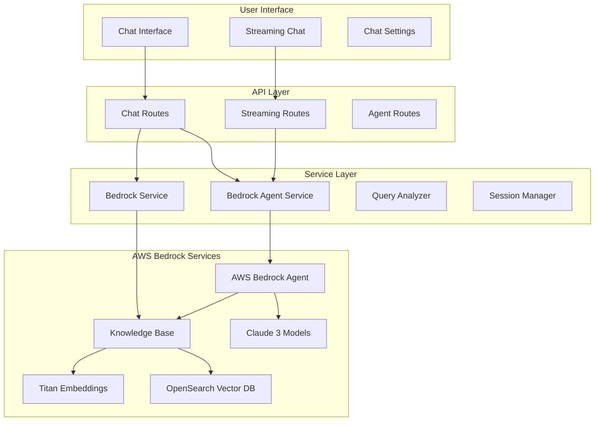
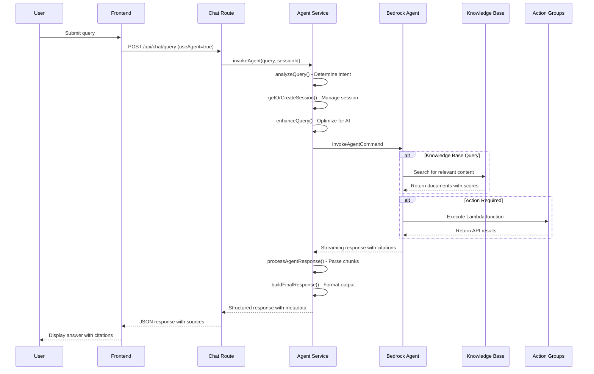
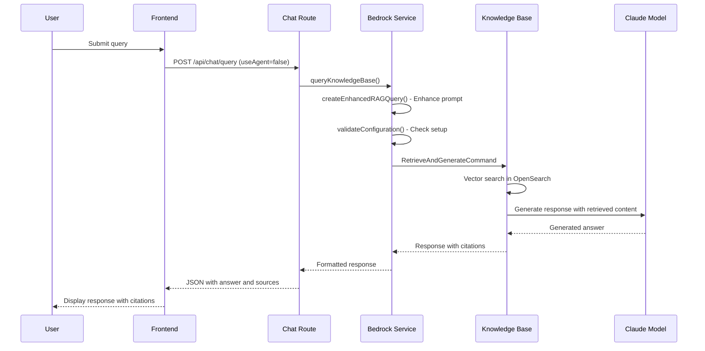
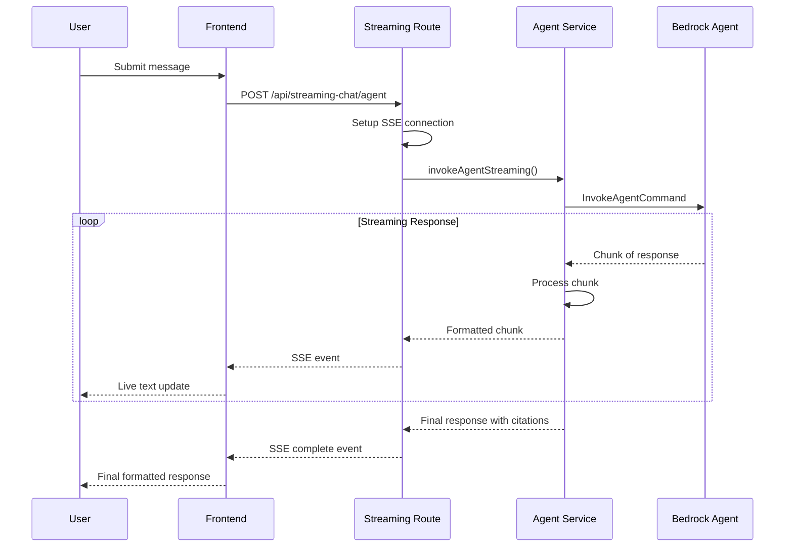
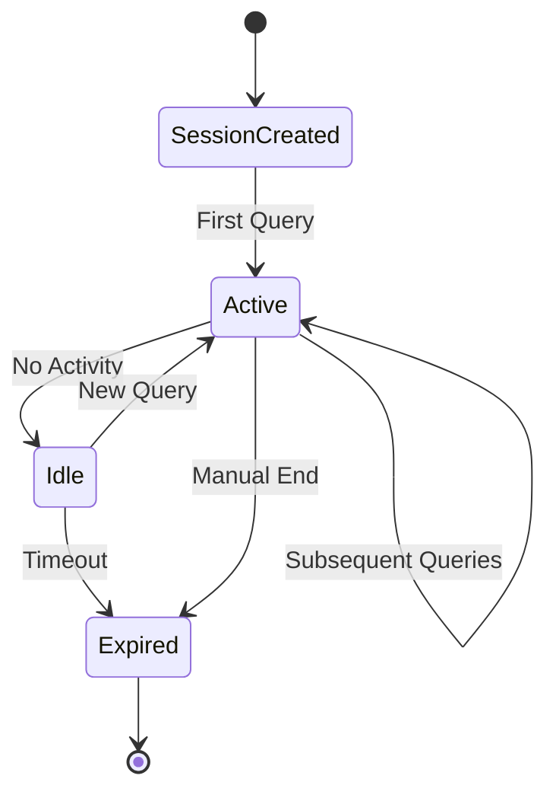
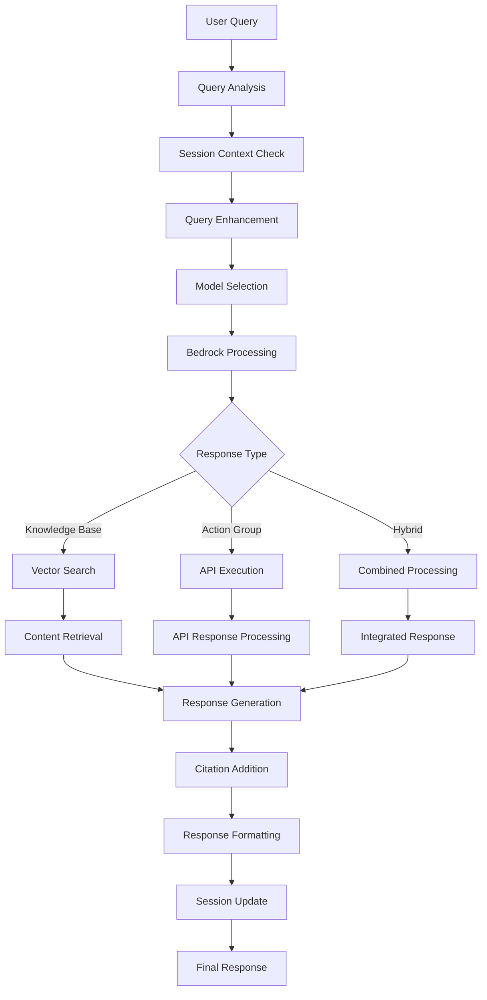
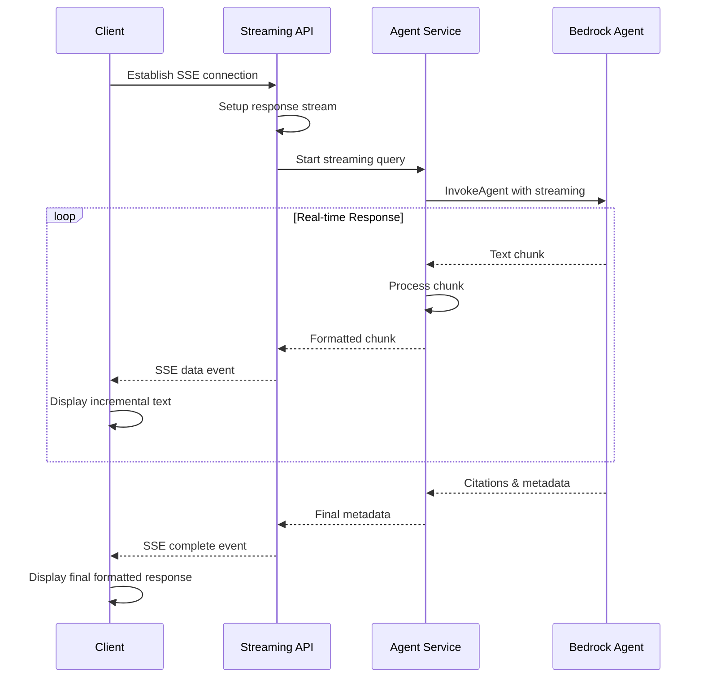
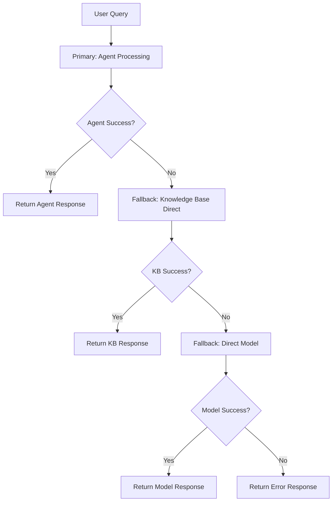

# Chat Functionality and Agent Interaction Documentation

## Executive Summary

This document provides comprehensive details on how the Oralia AI Chatbot's chat functionality operates, including the sophisticated interplay between AWS Bedrock Agent, Knowledge Base, and foundation models. The system implements multiple conversation modes, intelligent query routing, and context-aware response generation to deliver enterprise-grade conversational AI experiences.

## Table of Contents
1. [Chat Architecture Overview](#chat-architecture-overview)
2. [Conversation Flow Types](#conversation-flow-types)
3. [Agent-Knowledge Base Integration](#agent-knowledge-base-integration)
4. [Model Selection and Usage](#model-selection-and-usage)
5. [Session Management](#session-management)
6. [Response Generation Pipeline](#response-generation-pipeline)
7. [Streaming Capabilities](#streaming-capabilities)
8. [Error Handling and Fallbacks](#error-handling-and-fallbacks)

---

## Chat Architecture Overview

### Core Components Interaction



### System Capabilities

**Multi-Modal Conversations**:
- **Agent-Based Chat**: Intelligent routing between knowledge base and action groups
- **Direct Knowledge Base**: Focused document and web content queries
- **Direct Model**: Raw foundation model interactions
- **Streaming Chat**: Real-time response generation with live updates

**Context Management**:
- **Session Continuity**: Multi-turn conversations with memory
- **Query Enhancement**: Context-aware query optimization
- **Citation Tracking**: Full source attribution for all responses
- **Conversation History**: Persistent session storage

---

## Conversation Flow Types

### 1. Agent-Based Conversation Flow

**Purpose**: Intelligent conversation handling with automatic resource routing



**Key Implementation Details**:

```javascript
// Location: src/routes/chat.js:380-464
router.post('/query', async (req, res) => {
  const { message, sessionId, model, useAgent, enhancementOptions } = req.body;
  
  if (useAgent) {
    // Route to Bedrock Agent for intelligent processing
    const agentResponse = await bedrockAgentService.invokeAgent(message, sessionId, {
      useEnhancement: enhancementOptions.includeContext,
      sessionConfig: { enableTrace: process.env.NODE_ENV === 'development' }
    });
    
    response = {
      answer: agentResponse.answer,
      sources: agentResponse.citations?.map(citation => ({
        documentId: citation.retrievedReferences?.[0]?.location?.s3Location?.uri,
        relevanceScore: citation.retrievedReferences?.[0]?.metadata?.relevanceScore,
        excerpt: citation.generatedResponsePart?.textResponsePart?.text
      })) || [],
      sessionId: agentResponse.session?.id,
      model: agentResponse.metadata?.agentId || "agent",
      agentMetadata: {
        analysis: agentResponse.analysis,
        session: agentResponse.session,
        responseTime: agentResponse.metadata?.responseTime,
        tokensUsed: agentResponse.metadata?.tokensUsed
      },
      method: "agent"
    };
  }
});
```

### 2. Knowledge Base Direct Query Flow

**Purpose**: Focused retrieval from processed documents and web content



**Enhanced RAG Query Creation**:

```javascript
// Location: src/services/bedrockService.js:350-444
async queryKnowledgeBase(query, sessionId = null, modelKey = null, enhancementOptions = {}) {
  // Enhance the query for more detailed responses
  const enhancedQuery = this.createEnhancedRAGQuery(query, enhancementOptions);
  
  const commandParams = {
    input: { text: enhancedQuery },
    retrieveAndGenerateConfiguration: {
      type: 'KNOWLEDGE_BASE',
      knowledgeBaseConfiguration: {
        knowledgeBaseId: this.knowledgeBaseId,
        modelArn: `arn:aws:bedrock:${process.env.AWS_REGION}::foundation-model/${selectedModelId}`,
        retrievalConfiguration: {
          vectorSearchConfiguration: {
            numberOfResults: 10,  // Retrieve top 10 most relevant chunks
          },
        },
      },
    },
  };
  
  const response = await this.agentRuntimeClient.send(command);
  return this.formatKnowledgeBaseResponse(response, sessionId);
}
```

### 3. Streaming Conversation Flow

**Purpose**: Real-time response generation for improved user experience



**Streaming Implementation**:

```javascript
// Location: src/routes/streaming-chat.js:250-350
router.post('/agent', async (req, res) => {
  // Set up Server-Sent Events
  res.writeHead(200, {
    'Content-Type': 'text/event-stream',
    'Cache-Control': 'no-cache',
    'Connection': 'keep-alive',
    'Access-Control-Allow-Origin': '*'
  });

  try {
    const streamingResponse = await bedrockAgentService.invokeAgentStreaming(
      message, sessionId, options, dataSources
    );

    // Process streaming chunks
    for await (const chunk of streamingResponse) {
      if (chunk.text) {
        res.write(`data: ${JSON.stringify({
          type: 'text',
          content: chunk.text,
          timestamp: new Date().toISOString()
        })}\n\n`);
      }
      
      if (chunk.citations) {
        res.write(`data: ${JSON.stringify({
          type: 'citations', 
          content: chunk.citations
        })}\n\n`);
      }
    }
  } catch (error) {
    res.write(`data: ${JSON.stringify({
      type: 'error',
      content: error.message
    })}\n\n`);
  }
  
  res.write('data: {"type": "complete"}\n\n');
  res.end();
});
```

---

## Agent-Knowledge Base Integration

### Intelligent Query Routing

The Bedrock Agent automatically determines the best approach for each query:

1. **Knowledge Base Search**: For informational queries requiring document retrieval
2. **Action Group Execution**: For operational tasks requiring external API calls
3. **Hybrid Approach**: Combining knowledge base content with real-time data

**Query Analysis Process**:

```javascript
// Location: src/services/bedrockAgentService.js:116-180
analyzeQuery(query, context) {
  const analysis = {
    queryType: this.determineQueryType(query),
    interactionStyle: this.determineInteractionStyle(query, context),
    contextualFactors: this.extractContextualFactors(query, context),
    enhancementStrategy: null
  };

  // Apply context-aware enhancements based on conversation history
  if (context && context.recentQueries.length > 0) {
    analysis.enhancementStrategy = this.determineEnhancementStrategy(query, context);
  }

  // Generate query enhancement based on analysis
  analysis.queryEnhancement = this.generateQueryEnhancement(query, analysis);
  
  return analysis;
}
```

### Context-Aware Enhancement

**Query Enhancement Strategies**:

1. **Context Addition**: Include relevant conversation history
2. **Clarification**: Add context for ambiguous queries  
3. **Specificity**: Make vague queries more specific
4. **Domain Focus**: Target specific knowledge domains

**Example Enhancement**:
- **Original**: "What's the pricing?"
- **Enhanced**: "Based on our previous discussion about AWS Bedrock services, what's the pricing structure for AWS Bedrock Agent and Knowledge Base usage?"

### Citation and Source Tracking

**Citation Generation Process**:

```javascript
// Location: src/services/bedrockAgentService.js:389-700
async processAgentResponse(response) {
  let citations = [];
  
  for await (const chunkEvent of response.completion) {
    if (chunkEvent.chunk?.bytes) {
      const chunkData = JSON.parse(Buffer.from(chunkEvent.chunk.bytes).toString());
      
      // Extract citations for source attribution
      if (chunkData.type === 'citation') {
        const formattedCitation = {
          documentId: chunkData.citation.retrievedReferences?.[0]?.location?.s3Location?.uri,
          relevanceScore: chunkData.citation.retrievedReferences?.[0]?.metadata?.relevanceScore,
          excerpt: chunkData.citation.generatedResponsePart?.textResponsePart?.text,
          sourceType: this.determineSourceType(chunkData.citation),
          retrievalTimestamp: new Date().toISOString()
        };
        citations.push(formattedCitation);
      }
    }
  }
  
  return { text: fullText, citations, trace, tokensUsed };
}
```

---

## Model Selection and Usage

### Foundation Models Configuration

**Available Models**:

```javascript
// Location: src/services/bedrockService.js:75-118
this.availableModels = [
  {
    key: 'claude-3-sonnet',
    name: 'Claude 3 Sonnet', 
    id: 'anthropic.claude-3-sonnet-20240229-v1:0',
    description: 'Best balance of intelligence and speed',
    maxTokens: 4096,
    capabilities: ['text', 'analysis', 'reasoning'],
    recommendedFor: ['general', 'analysis', 'complex-queries']
  },
  {
    key: 'claude-3-haiku',
    name: 'Claude 3 Haiku',
    id: 'anthropic.claude-3-haiku-20240307-v1:0', 
    description: 'Fastest responses for simple queries',
    maxTokens: 4096,
    capabilities: ['text', 'speed'],
    recommendedFor: ['simple-queries', 'quick-responses']
  },
  {
    key: 'titan-embeddings',
    name: 'Titan Text Embeddings',
    id: 'amazon.titan-embed-text-v1',
    description: 'Vector embeddings for knowledge base',
    capabilities: ['embeddings'],
    recommendedFor: ['knowledge-base', 'search']
  }
];
```

### Model Selection Logic

**Automatic Model Selection**:

```javascript
// Agent-based queries: Use agent's configured model (typically Claude 3 Sonnet)
// Knowledge base queries: User selectable with Claude 3 Sonnet default  
// Embeddings: Always Titan Text Embeddings for consistency
// Streaming: Optimized models for real-time response

getOptimalModel(queryType, userPreference, responseTime) {
  if (queryType === 'complex-analysis') return 'claude-3-sonnet';
  if (queryType === 'simple-query' && responseTime === 'fast') return 'claude-3-haiku';
  if (queryType === 'knowledge-search') return userPreference || 'claude-3-sonnet';
  return this.defaultModelId;
}
```

### Model-Specific Configurations

**Claude 3 Sonnet Configuration**:
- **Temperature**: 0.1 (focused, consistent responses)
- **Top P**: 0.9 (balanced creativity)
- **Max Tokens**: 4096 (comprehensive responses)
- **Stop Sequences**: Custom sequences for structured output

**Claude 3 Haiku Configuration**:
- **Temperature**: 0.0 (deterministic responses)
- **Top P**: 0.8 (efficient processing)
- **Max Tokens**: 2048 (concise responses)
- **Optimizations**: Reduced context for speed

---

## Session Management

### Session Lifecycle



### Session Data Structure

```javascript
// Location: src/services/bedrockAgentService.js:85-108
const newSession = {
  id: sessionId || `session-${Date.now()}-${Math.random().toString(36).substr(2, 9)}`,
  createdAt: new Date().toISOString(),
  lastActivity: new Date().toISOString(),
  messageCount: 0,
  context: {
    recentQueries: [],        // Last 5 queries for context
    queryTypes: [],           // Types of queries in session
    userPreferences: {},      // Learned user preferences  
    topicFocus: null,        // Current conversation topic
    citedSources: []         // Sources referenced in session
  },
  config: {
    enableTrace: process.env.NODE_ENV === 'development',
    maxContextLength: 5,
    sessionTimeout: 30 * 60 * 1000,  // 30 minutes
    ...sessionConfig
  }
};
```

### Context Management

**Context Preservation Strategy**:

```javascript
// Location: src/services/bedrockAgentService.js:182-220  
updateSessionContext(session, query, response) {
  // Add to recent queries (maintain sliding window)
  session.context.recentQueries.push({
    query: query,
    timestamp: new Date().toISOString(),
    queryType: this.determineQueryType(query),
    responseLength: response.text.length
  });

  // Keep only recent queries to avoid context bloat
  if (session.context.recentQueries.length > session.config.maxContextLength) {
    session.context.recentQueries.shift();
  }

  // Update topic focus based on query patterns
  session.context.topicFocus = this.inferTopicFocus(session.context.recentQueries);
  
  // Track cited sources for follow-up queries
  if (response.citations) {
    session.context.citedSources.push(...response.citations);
  }

  session.lastActivity = new Date().toISOString();
  session.messageCount++;
}
```

---

## Response Generation Pipeline

### Multi-Stage Processing



### Response Formatting

**Standard Response Structure**:

```javascript
// Comprehensive response format
const formattedResponse = {
  success: true,
  data: {
    answer: response.text,                    // Main response content
    sources: formattedCitations,             // Source attributions
    sessionId: session.id,                   // Session identifier
    model: modelUsed,                        // Model information
    metadata: {
      responseTime: processingTime,           // Performance metrics
      tokensUsed: tokensConsumed,            // Usage tracking
      queryType: analysis.queryType,         // Query classification
      confidenceScore: response.confidence,  // Response confidence
      retrievedDocuments: documentCount      // Sources consulted
    },
    method: "agent",                         // Processing method
    timestamp: new Date().toISOString()      // Response timestamp
  }
};
```

### Citation Formatting

**Citation Structure**:

```javascript
const formattedCitations = response.citations?.map(citation => ({
  documentId: citation.retrievedReferences?.[0]?.location?.s3Location?.uri,
  title: this.extractDocumentTitle(citation),
  excerpt: citation.generatedResponsePart?.textResponsePart?.text,
  relevanceScore: citation.retrievedReferences?.[0]?.metadata?.relevanceScore,
  sourceType: this.determineSourceType(citation),
  retrievalTimestamp: new Date().toISOString(),
  chunkIndex: citation.retrievedReferences?.[0]?.metadata?.chunkIndex,
  totalChunks: citation.retrievedReferences?.[0]?.metadata?.totalChunks
})) || [];
```

---

## Streaming Capabilities

### Real-Time Response Streaming

**Streaming Architecture**:



### Streaming Event Types

**Event Stream Format**:

```javascript
// Text content events
{
  type: 'text',
  content: 'Incremental response text...',
  timestamp: '2024-12-19T10:30:00.000Z',
  chunkIndex: 1
}

// Citation events
{
  type: 'citations',
  content: [
    {
      documentId: 's3://bucket/documents/doc123.txt',
      excerpt: 'Relevant document excerpt...',
      relevanceScore: 0.95
    }
  ]
}

// Metadata events
{
  type: 'metadata',
  content: {
    tokensUsed: 250,
    responseTime: 1500,
    queryType: 'informational'
  }
}

// Completion event
{
  type: 'complete',
  content: {
    totalTokens: 450,
    finalResponseTime: 3200,
    citationCount: 3
  }
}
```

### Stream Processing Optimization

**Chunk Processing Strategy**:

```javascript  
// Location: src/services/bedrockAgentService.js:750-805
async *processStreamingResponse(response) {
  let accumulatedText = '';
  let chunkIndex = 0;
  
  for await (const chunkEvent of response.completion) {
    if (chunkEvent.chunk?.bytes) {
      const chunkData = JSON.parse(Buffer.from(chunkEvent.chunk.bytes).toString());
      
      if (chunkData.type === 'text' && chunkData.text) {
        accumulatedText += chunkData.text;
        
        // Yield meaningful text chunks (sentence boundaries preferred)
        if (this.isChunkBoundary(accumulatedText)) {
          yield {
            type: 'text',
            content: chunkData.text,
            chunkIndex: chunkIndex++,
            timestamp: new Date().toISOString()
          };
        }
      }
      
      if (chunkData.type === 'citation') {
        yield {
          type: 'citation',
          content: this.formatCitation(chunkData.citation),
          timestamp: new Date().toISOString()
        };
      }
    }
  }
  
  // Final completion event
  yield {
    type: 'complete',
    content: { totalChunks: chunkIndex, finalText: accumulatedText },
    timestamp: new Date().toISOString()
  };
}
```

---

## Error Handling and Fallbacks

### Graceful Degradation Strategy



### Error Handling Implementation

**Comprehensive Error Handling**:

```javascript
// Location: src/routes/chat.js:464-485  
try {
  // Primary: Bedrock Agent
  response = await bedrockAgentService.invokeAgent(message, sessionId, options);
} catch (agentError) {
  logger.warn('Agent call failed, falling back to knowledge base:', agentError.message);
  
  try {
    // Fallback: Direct Knowledge Base
    const kbResponse = await bedrockService.queryKnowledgeBase(
      message, sessionId, model, enhancementOptions
    );
    response = {
      ...kbResponse,
      method: "knowledge_base_fallback",
      fallbackReason: agentError.message
    };
  } catch (kbError) {
    logger.warn('Knowledge base fallback failed, trying direct model:', kbError.message);
    
    try {
      // Final Fallback: Direct Model
      const modelResponse = await bedrockService.directModelQuery(message, model);
      response = {
        ...modelResponse,
        method: "direct_model_fallback",
        fallbackReason: `Agent: ${agentError.message}, KB: ${kbError.message}`
      };
    } catch (finalError) {
      throw new Error(`All chat methods failed. Agent: ${agentError.message}, KB: ${kbError.message}, Model: ${finalError.message}`);
    }
  }
}
```

### Error Types and Responses

**Common Error Scenarios**:

1. **Service Unavailability**: AWS service temporarily down
2. **Rate Limiting**: Token/request limits exceeded  
3. **Invalid Configuration**: Missing IDs or permissions
4. **Content Issues**: Malformed queries or responses
5. **Network Problems**: Connectivity or timeout issues

**Error Response Format**:

```javascript
const errorResponse = {
  success: false,
  error: {
    type: 'service_unavailable',
    message: 'Bedrock Agent is temporarily unavailable',
    code: 'AGENT_503',
    timestamp: new Date().toISOString(),
    fallbackUsed: 'knowledge_base',
    retryAfter: 30,
    supportInfo: {
      correlationId: generateCorrelationId(),
      troubleshootingUrl: '/docs/troubleshooting#agent-errors'
    }
  },
  data: fallbackResponse  // Include fallback response if available
};
```

---

## Performance Optimization

### Response Time Optimization

**Performance Strategies**:

1. **Parallel Processing**: Concurrent knowledge base and action group evaluation
2. **Intelligent Caching**: Session context and frequent query caching
3. **Model Selection**: Automatic optimal model selection for query type
4. **Streaming**: Immediate response start for better perceived performance

**Performance Metrics**:

```javascript
const performanceMetrics = {
  queryAnalysisTime: 45,           // ms
  sessionRetrievalTime: 12,        // ms  
  agentProcessingTime: 1800,       // ms
  knowledgeBaseSearchTime: 300,    // ms
  responseFormattingTime: 25,      // ms
  totalResponseTime: 2182,         // ms
  tokensProcessed: 450,
  documentsRetrieved: 5,
  citationsGenerated: 3
};
```

### Scalability Considerations

**Horizontal Scaling**:
- Stateless service design enables multiple instances
- Session data externalization for multi-instance support
- Load balancing across service instances
- Auto-scaling based on demand patterns

**Vertical Scaling**:
- Memory optimization for large context processing
- CPU optimization for concurrent query processing
- Network optimization for AWS service communication

This comprehensive chat functionality provides enterprise-grade conversational AI with intelligent routing, robust error handling, and optimal user experience through streaming and context awareness.
