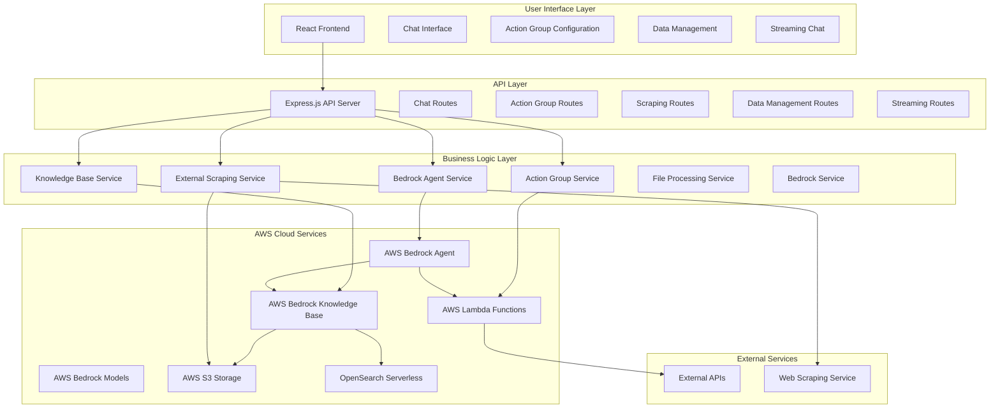
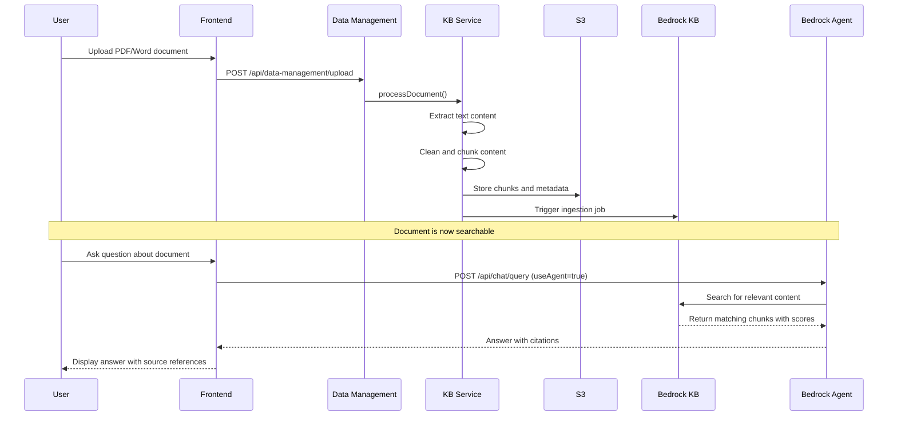
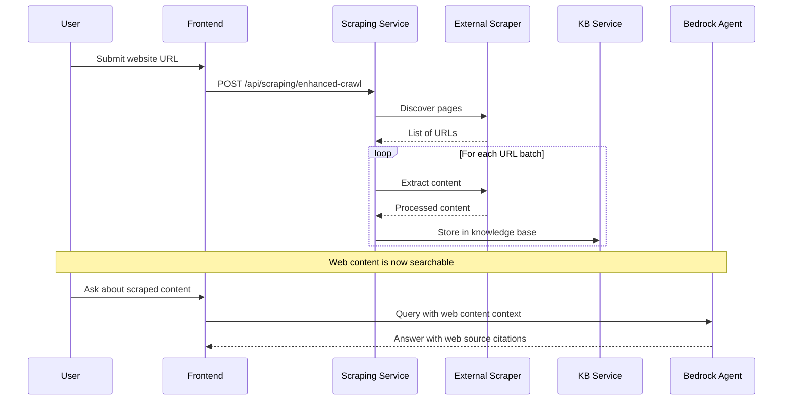
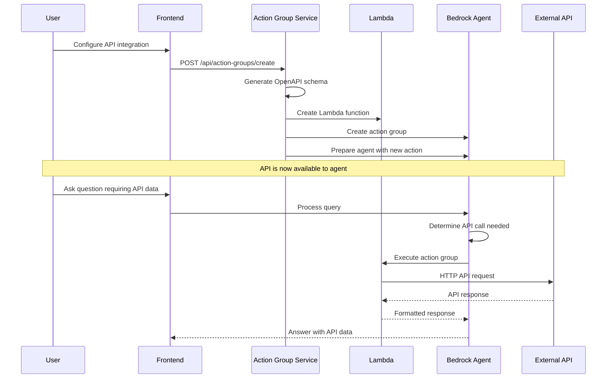

# Comprehensive Application Overview - Oralia AI Chatbot

## Executive Summary

**Oralia AI Chatbot** is a comprehensive enterprise-grade intelligent assistant built on AWS Bedrock that combines static knowledge management with dynamic API integrations. The system provides a unified interface for users to interact with processed documents, web content, and real-time external APIs through natural language conversations.

### Core Value Proposition
- **Unified Intelligence Hub**: Single interface for both static knowledge and dynamic data access
- **Enterprise-Ready**: Built on AWS infrastructure with enterprise security and scalability
- **Self-Service Integration**: Non-technical users can integrate external APIs through a web interface
- **Intelligent Processing**: Automated content processing with delta detection and optimization
- **Conversation Context**: Maintains session memory and provides cited, trackable responses

---

## System Architecture Overview

### High-Level Architecture



---

## Core Components Deep Dive

### 1. Frontend Application (React/Vite)

**Purpose**: Modern, responsive user interface for all system interactions

**Key Features**:
- **Multi-Modal Chat Interface**: Support for agent-based and direct knowledge base queries
- **Real-Time Streaming**: WebSocket-based streaming for live conversation updates
- **Action Group Configuration**: Visual interface for API integration setup
- **Data Management**: Upload, view, and manage documents and scraped content
- **Session Management**: Persistent conversation contexts

**Technology Stack**:
- React 18 with modern hooks
- Tailwind CSS for styling
- Vite for fast development and building
- Modern ES6+ with async/await patterns

### 2. Backend Services (Node.js/Express)

**Purpose**: RESTful API server providing all business logic and AWS integrations

**Architecture Pattern**: Service-oriented with clear separation of concerns

#### Core Services:

##### BedrockAgentService
- **Role**: Primary interface to AWS Bedrock Agent
- **Functions**: Query processing, session management, response formatting
- **Key Methods**: `invokeAgent()`, `processAgentResponse()`, `analyzeQuery()`

##### ActionGroupService  
- **Role**: Manages external API integrations via Lambda functions
- **Functions**: Lambda creation, OpenAPI schema generation, Bedrock integration
- **Key Methods**: `createActionGroup()`, `generateLambdaCode()`, `prepareAgent()`

##### BedrockKnowledgeBaseService
- **Role**: Document processing and knowledge base management
- **Functions**: Content chunking, S3 storage, sync management
- **Key Methods**: `storeDocument()`, `createOptimalChunks()`, `syncKnowledgeBase()`

##### ExternalScrapingService
- **Role**: Web content discovery and extraction
- **Functions**: Website crawling, content processing, batch operations
- **Key Methods**: `crawlAndScrapeWebsite()`, `discoverWebsitePages()`, `storeInS3()`

### 3. AWS Bedrock Integration

**Purpose**: Provides the AI/ML capabilities that power the intelligent assistant

#### AWS Bedrock Agent
- **Function**: Central orchestrator for query processing
- **Capabilities**: 
  - Intelligent routing between knowledge base and action groups
  - Context-aware conversation management
  - Citation tracking and source attribution
  - Multi-turn conversation handling

#### AWS Bedrock Knowledge Base
- **Function**: Vector-based document storage and retrieval
- **Features**:
  - Automatic embeddings generation using Titan models
  - Semantic search capabilities
  - Real-time content synchronization
  - Scalable document processing

#### Foundation Models
- **Claude 3 Sonnet**: Primary conversational AI model
- **Claude 3 Haiku**: Fast responses for simple queries
- **Titan Text Embeddings**: Vector generation for knowledge base

### 4. Storage and Data Management

#### S3 Bucket Organization
```
s3://bucket-name/
├── documents/                    # Bedrock KB compatible format
│   └── YYYY-MM-DD/              # Date-based organization
│       └── {documentId}.txt     # Processed documents
├── processed-chunks/            # Optimized chunk storage
│   ├── web-content/             # Web scraped content chunks
│   │   └── {chunkId}.json
│   └── document-content/        # Uploaded document chunks
│       └── {chunkId}.json
├── raw-content/                 # Original content backup
│   ├── documents/               # Original uploaded files
│   │   ├── pdfs/
│   │   ├── docs/
│   │   └── others/
│   └── web-scrapes/             # Raw scraped content
│       └── {domain}/
│           └── {timestamp}/
└── metadata/                    # Index and tracking files
    ├── content-index.json       # Master content index
    └── sync-logs/               # Knowledge base sync logs
```

---

## Key User Journeys

### 1. Document-Based Q&A Journey



### 2. Web Content Scraping and Querying



### 3. External API Integration Journey



---

## Technical Architecture Patterns

### 1. Service-Oriented Architecture (SOA)
- **Principle**: Each service has a single responsibility
- **Benefits**: Maintainable, testable, scalable components
- **Implementation**: Clear service boundaries with defined interfaces

### 2. Event-Driven Processing
- **Pattern**: Asynchronous processing for long-running operations
- **Use Cases**: Web scraping, document processing, knowledge base sync
- **Benefits**: Responsive user experience, scalable processing

### 3. Streaming Response Architecture
- **Purpose**: Real-time conversation experience
- **Implementation**: Server-sent events and streaming API responses
- **Benefits**: Immediate user feedback, reduced perceived latency

### 4. Configuration-Driven Integration
- **Concept**: External APIs integrated through configuration, not code
- **Implementation**: OpenAPI schema generation and Lambda function creation
- **Benefits**: Self-service integration, rapid deployment

---

## Data Flow Architecture

### 1. Content Ingestion Flow
```
Raw Content → Content Processing → Chunking → Embedding Generation → Vector Storage → Search Index
```

### 2. Query Processing Flow
```
User Query → Query Analysis → Intent Detection → Resource Routing → Content Retrieval → Response Generation → Citation Addition
```

### 3. Action Execution Flow
```
API Configuration → Schema Generation → Lambda Creation → Bedrock Integration → Agent Preparation → Runtime Execution
```

---

## Security and Compliance

### 1. AWS Security Model
- **IAM Role-Based Access**: Minimal required permissions
- **Service-to-Service Authentication**: AWS internal security
- **Data Encryption**: At rest (S3) and in transit (TLS)

### 2. Application Security
- **Input Validation**: All user inputs validated and sanitized
- **Rate Limiting**: Protection against abuse
- **Session Management**: Secure session handling
- **API Authentication**: Configurable auth methods for external APIs

### 3. Data Privacy
- **Content Isolation**: User data kept separate
- **Audit Trails**: All operations logged
- **Data Retention**: Configurable retention policies
- **GDPR Compliance**: Data deletion and export capabilities

---

## Scalability and Performance

### 1. Horizontal Scaling
- **Stateless Services**: All services can be horizontally scaled
- **Load Distribution**: AWS services handle load automatically
- **Session Externalization**: Sessions can be shared across instances

### 2. Performance Optimization
- **Chunking Strategy**: Optimized for vector search performance
- **Caching**: Intelligent caching at multiple layers
- **Async Processing**: Long-running tasks processed asynchronously
- **Streaming**: Immediate response start for better UX

### 3. Cost Optimization
- **Pay-per-Use**: AWS Bedrock usage-based pricing
- **Efficient Chunking**: Minimizes vector storage costs
- **Smart Sync**: Only sync when content changes
- **Lambda Cold Start Optimization**: Efficient function packaging

---

## Monitoring and Observability

### 1. Application Metrics
- **Response Times**: Query processing performance
- **Success Rates**: Operation success tracking
- **Error Rates**: System reliability metrics
- **Usage Patterns**: User behavior insights

### 2. AWS Service Metrics
- **Bedrock Usage**: Token consumption and model usage
- **S3 Operations**: Storage and retrieval metrics
- **Lambda Performance**: Function execution metrics
- **Knowledge Base Sync**: Ingestion job status

### 3. Business Metrics
- **User Engagement**: Session duration and query frequency
- **Content Quality**: Response accuracy and user satisfaction
- **Integration Usage**: Action group utilization
- **Cost Tracking**: Service cost attribution

---

## Development and Deployment

### 1. Development Workflow
- **Local Development**: Full local environment with AWS credentials
- **Environment Variables**: Configuration through environment
- **Hot Reloading**: Instant feedback during development
- **Component Testing**: Isolated service testing

### 2. Deployment Strategy
- **Environment Promotion**: Dev → Staging → Production
- **Configuration Management**: Environment-specific configurations
- **Health Checks**: Comprehensive health monitoring
- **Rollback Capability**: Quick rollback for issues

### 3. Quality Assurance
- **Input Validation**: Multi-layer validation
- **Error Handling**: Graceful error recovery
- **Logging**: Comprehensive operational logging
- **Performance Testing**: Load and stress testing

---

## Integration Capabilities

### 1. Supported Content Types
- **Documents**: PDF, Word, RTF, TXT, Markdown
- **Web Content**: Any publicly accessible webpage
- **Structured Data**: JSON, CSV, XML processing
- **Real-time APIs**: REST APIs with various authentication methods

### 2. API Integration Features
- **Authentication Types**: API Key, Bearer Token, Basic Auth, Custom Headers
- **HTTP Methods**: GET, POST, PUT, DELETE support
- **Request Transformation**: Automatic parameter mapping
- **Response Processing**: Intelligent response formatting

### 3. Export and Import
- **Configuration Export**: Action group and system configurations
- **Content Export**: Processed document and metadata export
- **Backup and Restore**: Complete system state management
- **Migration Tools**: Environment-to-environment migration

---

## Business Benefits

### 1. Operational Efficiency
- **Reduced Manual Work**: Automated content processing and API integration
- **Faster Response Times**: Instant access to information and data
- **Self-Service Capabilities**: Non-technical users can configure integrations
- **Unified Interface**: Single point of access for all information needs

### 2. Cost Benefits
- **Reduced Development Time**: No custom coding for API integrations
- **Lower Maintenance**: Managed AWS services reduce operational overhead
- **Scalable Pricing**: Pay only for actual usage
- **Faster Time-to-Market**: Rapid deployment of new integrations

### 3. Competitive Advantages
- **Advanced AI Capabilities**: Latest Claude and Titan models
- **Enterprise Security**: AWS enterprise-grade security
- **Scalable Architecture**: Grows with business needs
- **Future-Proof**: Built on cutting-edge AWS services

---

## Success Metrics and KPIs

### 1. Technical KPIs
- **System Uptime**: >99.9% availability
- **Response Time**: <2 seconds for standard queries
- **Accuracy Rate**: >95% citation accuracy
- **Processing Speed**: <30 seconds for document processing

### 2. Business KPIs  
- **User Adoption**: Active user count and growth
- **Query Volume**: Queries per user per session
- **Integration Success**: Successful API integrations created
- **User Satisfaction**: Feedback scores and usage patterns

### 3. Operational KPIs
- **Cost per Query**: AWS service cost optimization
- **Error Rates**: System reliability and stability
- **Processing Efficiency**: Content processing throughput
- **Maintenance Overhead**: Time spent on system maintenance

---

## Future Roadmap

### Phase 1 Enhancements (Next 3 Months)
- **Multi-modal Support**: Image and document analysis
- **Advanced Analytics**: Query pattern analysis and insights
- **Enhanced Security**: Advanced authentication and authorization
- **Performance Optimization**: Advanced caching and optimization

### Phase 2 Expansions (6 Months)
- **Multi-language Support**: Non-English content processing
- **Custom Models**: Fine-tuned models for specific domains
- **Workflow Automation**: Complex multi-step processes
- **Advanced Integrations**: GraphQL APIs, webhooks, real-time events

### Phase 3 Innovation (12 Months)
- **Autonomous Agents**: Self-improving agents with learning capabilities
- **Predictive Analytics**: Proactive information delivery
- **Voice Integration**: Speech-to-text and text-to-speech
- **Mobile Applications**: Native mobile apps for on-the-go access

---

This comprehensive overview demonstrates that Oralia AI Chatbot is not just a simple chatbot, but a sophisticated enterprise platform that bridges the gap between static knowledge management and dynamic business operations, providing a unified, intelligent interface for all organizational information needs.
