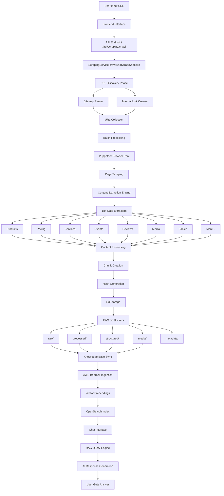

# 🚀 Oralia AI Scraping Service - Comprehensive Documentation

## 📋 Table of Contents

1. [Application Overview](#application-overview)
2. [Architecture Flow Diagram](#architecture-flow-diagram)
3. [Service Components](#service-components)
4. [Data Flow Process](#data-flow-process)
5. [Ready-to-Integrate Functions](#ready-to-integrate-functions)
6. [Implementation Guides](#implementation-guides)
7. [AWS Configuration](#aws-configuration)
8. [API Endpoints](#api-endpoints)
9. [Data Storage Structure](#data-storage-structure)
10. [Deployment Guide](#deployment-guide)

---

## 🎯 Application Overview

The Oralia AI Scraping Service is a comprehensive web scraping and knowledge management system that:

- **Scrapes websites** comprehensively without missing any data
- **Extracts structured data** from 18+ content types (products, pricing, services, events, etc.)
- **Stores data in AWS S3** with organized folder structure
- **Creates vector embeddings** for semantic search
- **Integrates with AWS Bedrock** Knowledge Base for AI-powered responses
- **Provides real-time chat interface** for querying scraped data

### 🏗️ Core Components

```
┌─────────────────┐    ┌─────────────────┐    ┌─────────────────┐
│   Frontend      │    │   Backend       │    │   AWS Services  │
│   (React)       │ ── │   (Node.js)     │ ── │   (S3, Bedrock) │
└─────────────────┘    └─────────────────┘    └─────────────────┘
```

---

## 🔄 Architecture Flow Diagram



---

## 🧩 Service Components

### 1. **ScrapingService** (`src/services/scrapingService.js`)
- Main orchestrator for all scraping operations
- Handles browser management with Puppeteer
- Implements comprehensive data extraction
- Manages batch processing and error handling

### 2. **WebsiteCrawler** (`src/services/websiteCrawler.js`)
- URL discovery from sitemaps
- Internal link crawling
- Duplicate URL filtering
- Domain validation

### 3. **BedrockService** (`src/services/bedrockService.js`)
- AWS Bedrock integration
- Knowledge base querying
- RAG (Retrieval Augmented Generation)
- Session management

### 4. **KnowledgeBaseSync** (`src/services/knowledgeBaseSync.js`)
- Synchronizes scraped data with AWS Bedrock
- Manages ingestion jobs
- Handles data source updates

### 5. **Hash Utils** (`src/utils/hash.js`)
- Content hashing for deduplication
- Chunk ID generation
- Version control

---

## 📊 Data Flow Process

### Phase 1: URL Discovery
```
Input URL → Sitemap Parsing → Internal Link Discovery → URL Collection
```

### Phase 2: Content Extraction
```
URL → Puppeteer → HTML Content → Cheerio Parser → 18+ Extractors → Structured Data
```

### Phase 3: Data Processing
```
Raw Data → Content Cleaning → Chunking → Hash Generation → Metadata Creation
```

### Phase 4: Storage & Indexing
```
Processed Data → S3 Upload → Bedrock Sync → Vector Embeddings → Search Index
```

### Phase 5: Query & Response
```
User Query → RAG Engine → Vector Search → Context Retrieval → AI Response
```

---

## 🔧 Ready-to-Integrate Functions

### 1. Single Page Scraper Function

```javascript
/**
 * Ready-to-integrate single page scraper
 * Copy-paste this function anywhere you need basic scraping
 */
async function scrapeSinglePage(url, options = {}) {
  const puppeteer = require('puppeteer');
  const cheerio = require('cheerio');
  
  const browser = await puppeteer.launch({
    headless: true,
    args: ['--no-sandbox', '--disable-setuid-sandbox']
  });
  
  try {
    const page = await browser.newPage();
    await page.setUserAgent('Mozilla/5.0 (Windows NT 10.0; Win64; x64) AppleWebKit/537.36');
    
    await page.goto(url, { waitUntil: 'networkidle2', timeout: 60000 });
    
    // Simulate scrolling for dynamic content
    await page.evaluate(() => {
      return new Promise((resolve) => {
        let totalHeight = 0;
        const distance = 100;
        const timer = setInterval(() => {
          window.scrollBy(0, distance);
          totalHeight += distance;
          if (totalHeight >= document.body.scrollHeight) {
            clearInterval(timer);
            resolve();
          }
        }, 100);
      });
    });
    
    const html = await page.content();
    const title = await page.title();
    
    await browser.close();
    
    // Parse with Cheerio
    const $ = cheerio.load(html);
    $('script, style, noscript').remove();
    
    // Extract comprehensive data
    const extractedData = {
      url,
      title,
      timestamp: new Date().toISOString(),
      content: {
        text: $('body').text().trim(),
        products: extractProducts($),
        pricing: extractPricing($),
        images: extractImages($),
        links: extractLinks($)
      }
    };
    
    return extractedData;
    
  } catch (error) {
    await browser.close();
    throw error;
  }
}

// Helper extraction functions
function extractProducts($) {
  const products = [];
  $('.product, .product-item, .product-card').each((i, element) => {
    const $el = $(element);
    products.push({
      name: $el.find('h1, h2, h3, .title, .name').first().text().trim(),
      price: $el.find('.price, .cost, .amount').first().text().trim(),
      description: $el.find('.description, .summary').first().text().trim(),
      image: $el.find('img').first().attr('src') || ''
    });
  });
  return products;
}

function extractPricing($) {
  const pricing = [];
  $('.price, .pricing, .cost').each((i, element) => {
    const $el = $(element);
    const priceText = $el.text().trim();
    const priceMatch = priceText.match(/[$£€¥₹₽¢]?[\d,]+\.?\d*/);
    if (priceMatch) {
      pricing.push({
        price: priceMatch[0],
        context: $el.parent().text().slice(0, 100),
        position: i
      });
    }
  });
  return pricing;
}

function extractImages($) {
  const images = [];
  $('img').each((i, img) => {
    const $img = $(img);
    const src = $img.attr('src') || $img.attr('data-src');
    if (src) {
      images.push({
        src,
        alt: $img.attr('alt') || '',
        title: $img.attr('title') || ''
      });
    }
  });
  return images;
}

function extractLinks($) {
  const links = [];
  $('a[href]').each((i, link) => {
    const $link = $(link);
    links.push({
      href: $link.attr('href'),
      text: $link.text().trim(),
      title: $link.attr('title') || ''
    });
  });
  return links;
}
```

### 2. Batch URL Processor Function

```javascript
/**
 * Ready-to-integrate batch URL processor
 * Processes multiple URLs efficiently with concurrency control
 */
async function processBatchUrls(urls, options = {}) {
  const {
    batchSize = 3,
    delay = 1000,
    maxRetries = 2,
    onProgress = () => {},
    onError = () => {}
  } = options;
  
  const results = [];
  const errors = [];
  
  for (let i = 0; i < urls.length; i += batchSize) {
    const batch = urls.slice(i, i + batchSize);
    const batchNumber = Math.floor(i / batchSize) + 1;
    const totalBatches = Math.ceil(urls.length / batchSize);
    
    console.log(`Processing batch ${batchNumber}/${totalBatches} (${batch.length} URLs)`);
    
    const batchPromises = batch.map(async (url) => {
      let lastError;
      
      for (let attempt = 1; attempt <= maxRetries; attempt++) {
        try {
          const result = await scrapeSinglePage(url);
          return { url, success: true, data: result };
        } catch (error) {
          lastError = error;
          if (attempt < maxRetries) {
            console.log(`Attempt ${attempt}/${maxRetries} failed for ${url}: ${error.message}`);
            await new Promise(resolve => setTimeout(resolve, delay * attempt));
          }
        }
      }
      
      const errorResult = { url, success: false, error: lastError.message };
      onError(errorResult);
      return errorResult;
    });
    
    const batchResults = await Promise.all(batchPromises);
    
    batchResults.forEach(result => {
      if (result.success) {
        results.push(result);
      } else {
        errors.push(result);
      }
    });
    
    onProgress({
      completed: results.length,
      total: urls.length,
      errors: errors.length,
      currentBatch: batchNumber,
      totalBatches
    });
    
    // Delay between batches
    if (i + batchSize < urls.length) {
      await new Promise(resolve => setTimeout(resolve, delay));
    }
  }
  
  return {
    results,
    errors,
    summary: {
      total: urls.length,
      successful: results.length,
      failed: errors.length,
      successRate: ((results.length / urls.length) * 100).toFixed(2) + '%'
    }
  };
}
```

### 3. AWS S3 Storage Function

```javascript
/**
 * Ready-to-integrate AWS S3 storage function
 * Handles organized data storage with proper folder structure
 */
async function storeScrapedData(scrapedData, options = {}) {
  const { S3Client, PutObjectCommand } = require('@aws-sdk/client-s3');
  const crypto = require('crypto');
  
  const {
    bucketName = process.env.BEDROCK_S3_BUCKET,
    region = process.env.AWS_REGION || 'us-east-1'
  } = options;
  
  const s3Client = new S3Client({ region });
  
  const domain = new URL(scrapedData.url).hostname;
  const date = new Date().toISOString().split('T')[0];
  const urlHash = crypto.createHash('md5').update(scrapedData.url).digest('hex').substring(0, 8);
  
  const uploadResults = [];
  
  try {
    // Store raw content
    const rawKey = `raw/${domain}/${date}/${urlHash}_raw.html`;
    await uploadToS3(s3Client, bucketName, rawKey, scrapedData.content.text);
    uploadResults.push({ type: 'raw', key: rawKey, status: 'success' });
    
    // Store processed data
    const processedKey = `processed/${domain}/${date}/${urlHash}_processed.json`;
    await uploadToS3(s3Client, bucketName, processedKey, JSON.stringify(scrapedData, null, 2));
    uploadResults.push({ type: 'processed', key: processedKey, status: 'success' });
    
    // Store structured data if available
    if (scrapedData.content.products?.length > 0) {
      const productsKey = `structured/${domain}/${date}/${urlHash}_products.json`;
      await uploadToS3(s3Client, bucketName, productsKey, JSON.stringify(scrapedData.content.products, null, 2));
      uploadResults.push({ type: 'products', key: productsKey, status: 'success' });
    }
    
    if (scrapedData.content.pricing?.length > 0) {
      const pricingKey = `structured/${domain}/${date}/${urlHash}_pricing.json`;
      await uploadToS3(s3Client, bucketName, pricingKey, JSON.stringify(scrapedData.content.pricing, null, 2));
      uploadResults.push({ type: 'pricing', key: pricingKey, status: 'success' });
    }
    
    // Store metadata
    const metadata = {
      url: scrapedData.url,
      title: scrapedData.title,
      scrapedAt: scrapedData.timestamp,
      domain,
      totalProducts: scrapedData.content.products?.length || 0,
      totalPricing: scrapedData.content.pricing?.length || 0,
      totalImages: scrapedData.content.images?.length || 0,
      contentHash: crypto.createHash('sha256').update(scrapedData.content.text).digest('hex')
    };
    
    const metadataKey = `metadata/${domain}/${date}/${urlHash}_metadata.json`;
    await uploadToS3(s3Client, bucketName, metadataKey, JSON.stringify(metadata, null, 2));
    uploadResults.push({ type: 'metadata', key: metadataKey, status: 'success' });
    
    return {
      success: true,
      uploads: uploadResults,
      summary: {
        totalUploads: uploadResults.length,
        domain,
        date,
        urlHash
      }
    };
    
  } catch (error) {
    return {
      success: false,
      error: error.message,
      uploads: uploadResults
    };
  }
}

async function uploadToS3(s3Client, bucket, key, content) {
  const command = new PutObjectCommand({
    Bucket: bucket,
    Key: key,
    Body: content,
    ContentType: key.endsWith('.json') ? 'application/json' : 'text/plain'
  });
  
  return await s3Client.send(command);
}
```

### 4. Sitemap URL Discovery Function

```javascript
/**
 * Ready-to-integrate sitemap URL discovery
 * Extracts all URLs from website sitemaps
 */
async function discoverSitemapUrls(baseUrl) {
  const axios = require('axios');
  const { parseStringPromise } = require('xml2js');
  
  const discoveredUrls = new Set();
  const processedSitemaps = new Set();
  
  async function processSitemap(sitemapUrl) {
    if (processedSitemaps.has(sitemapUrl)) return;
    processedSitemaps.add(sitemapUrl);
    
    try {
      console.log(`Fetching sitemap: ${sitemapUrl}`);
      const response = await axios.get(sitemapUrl, {
        timeout: 30000,
        headers: {
          'User-Agent': 'Mozilla/5.0 (compatible; SitemapBot/1.0)'
        }
      });
      
      const result = await parseStringPromise(response.data);
      
      // Handle sitemap index
      if (result.sitemapindex?.sitemap) {
        for (const sitemap of result.sitemapindex.sitemap) {
          if (sitemap.loc?.[0]) {
            await processSitemap(sitemap.loc[0]);
          }
        }
      }
      
      // Handle URL set
      if (result.urlset?.url) {
        for (const url of result.urlset.url) {
          if (url.loc?.[0]) {
            discoveredUrls.add(url.loc[0]);
          }
        }
      }
      
    } catch (error) {
      console.log(`Error processing sitemap ${sitemapUrl}: ${error.message}`);
    }
  }
  
  // Try common sitemap locations
  const sitemapPaths = [
    '/sitemap.xml',
    '/sitemap_index.xml',
    '/sitemaps.xml',
    '/sitemap/sitemap.xml'
  ];
  
  const baseHost = new URL(baseUrl).origin;
  
  for (const path of sitemapPaths) {
    const sitemapUrl = baseHost + path;
    await processSitemap(sitemapUrl);
  }
  
  return Array.from(discoveredUrls);
}
```

### 5. Knowledge Base Query Function

```javascript
/**
 * Ready-to-integrate knowledge base query function
 * Queries AWS Bedrock knowledge base with RAG
 */
async function queryKnowledgeBase(query, options = {}) {
  const { BedrockAgentRuntimeClient, RetrieveAndGenerateCommand } = require('@aws-sdk/client-bedrock-agent-runtime');
  
  const {
    knowledgeBaseId = process.env.BEDROCK_KNOWLEDGE_BASE_ID,
    modelId = 'anthropic.claude-3-sonnet-20240229-v1:0',
    region = process.env.AWS_REGION || 'us-east-1',
    numberOfResults = 5,
    sessionId = null
  } = options;
  
  const client = new BedrockAgentRuntimeClient({ region });
  
  try {
    const commandParams = {
      input: { text: query },
      retrieveAndGenerateConfiguration: {
        type: 'KNOWLEDGE_BASE',
        knowledgeBaseConfiguration: {
          knowledgeBaseId,
          modelArn: `arn:aws:bedrock:${region}::foundation-model/${modelId}`,
          retrievalConfiguration: {
            vectorSearchConfiguration: {
              numberOfResults,
            },
          },
        },
      },
    };
    
    if (sessionId) {
      commandParams.sessionId = sessionId;
    }
    
    const command = new RetrieveAndGenerateCommand(commandParams);
    const response = await client.send(command);
    
    return {
      success: true,
      answer: response.output?.text || '',
      sessionId: response.sessionId,
      citations: response.citations || [],
      metadata: {
        queryTime: new Date().toISOString(),
        modelUsed: modelId,
        resultsRetrieved: numberOfResults
      }
    };
    
  } catch (error) {
    return {
      success: false,
      error: error.message,
      query,
      timestamp: new Date().toISOString()
    };
  }
}
```

---

## 📚 Implementation Guides

### Step 1: Environment Setup

```bash
# Install dependencies
npm install puppeteer cheerio axios xml2js @aws-sdk/client-s3 @aws-sdk/client-bedrock-agent-runtime

# Set environment variables
export AWS_REGION=us-east-1
export BEDROCK_KNOWLEDGE_BASE_ID=your-kb-id
export BEDROCK_S3_BUCKET=your-bucket-name
export AWS_ACCESS_KEY_ID=your-access-key
export AWS_SECRET_ACCESS_KEY=your-secret-key
```

### Step 2: Basic Scraper Implementation

```javascript
// basic-scraper.js
const { scrapeSinglePage } = require('./functions/scraper');

async function main() {
  try {
    const result = await scrapeSinglePage('https://example.com');
    console.log('Scraped data:', JSON.stringify(result, null, 2));
  } catch (error) {
    console.error('Scraping failed:', error.message);
  }
}

main();
```

### Step 3: Batch Processing Implementation

```javascript
// batch-processor.js
const { processBatchUrls } = require('./functions/batch-processor');

async function processSite() {
  const urls = [
    'https://example.com/page1',
    'https://example.com/page2',
    'https://example.com/page3'
  ];
  
  const options = {
    batchSize: 3,
    delay: 2000,
    maxRetries: 2,
    onProgress: (progress) => {
      console.log(`Progress: ${progress.completed}/${progress.total} (${progress.successRate})`);
    },
    onError: (error) => {
      console.error(`Failed to scrape: ${error.url} - ${error.error}`);
    }
  };
  
  const results = await processBatchUrls(urls, options);
  console.log('Batch processing complete:', results.summary);
}

processSite();
```

### Step 4: AWS Integration Implementation

```javascript
// aws-integration.js
const { storeScrapedData } = require('./functions/s3-storage');
const { queryKnowledgeBase } = require('./functions/knowledge-base');

async function scrapeAndStore() {
  // 1. Scrape data
  const scrapedData = await scrapeSinglePage('https://example.com');
  
  // 2. Store in S3
  const storageResult = await storeScrapedData(scrapedData);
  console.log('Storage result:', storageResult);
  
  // 3. Query knowledge base
  const queryResult = await queryKnowledgeBase('What products are available?');
  console.log('Query result:', queryResult);
}

scrapeAndStore();
```

---

## ☁️ AWS Configuration

### Required AWS Services

1. **Amazon S3**
   - Bucket for storing scraped content
   - Organized folder structure
   - Versioning enabled

2. **Amazon Bedrock**
   - Knowledge Base setup
   - Data Source configuration
   - Vector embeddings

3. **Amazon OpenSearch**
   - Vector index for semantic search
   - Automatic scaling

### S3 Bucket Policy

```json
{
  "Version": "2012-10-17",
  "Statement": [
    {
      "Effect": "Allow",
      "Principal": {
        "Service": "bedrock.amazonaws.com"
      },
      "Action": [
        "s3:GetObject",
        "s3:ListBucket"
      ],
      "Resource": [
        "arn:aws:s3:::your-bucket-name",
        "arn:aws:s3:::your-bucket-name/*"
      ]
    }
  ]
}
```

### IAM Role for Bedrock

```json
{
  "Version": "2012-10-17",
  "Statement": [
    {
      "Effect": "Allow",
      "Action": [
        "bedrock:InvokeModel",
        "bedrock:RetrieveAndGenerate",
        "bedrock:StartIngestionJob"
      ],
      "Resource": "*"
    },
    {
      "Effect": "Allow",
      "Action": [
        "s3:GetObject",
        "s3:ListBucket",
        "s3:PutObject"
      ],
      "Resource": [
        "arn:aws:s3:::your-bucket-name",
        "arn:aws:s3:::your-bucket-name/*"
      ]
    }
  ]
}
```

---

## 🌐 API Endpoints

### 1. Single Page Scraping
```
POST /api/scraping/single
```

**Request Body:**
```json
{
  "url": "https://example.com",
  "options": {
    "waitTime": 3000,
    "deepExtraction": true
  }
}
```

**Response:**
```json
{
  "success": true,
  "data": {
    "url": "https://example.com",
    "title": "Page Title",
    "content": {
      "text": "...",
      "products": [...],
      "pricing": [...]
    }
  }
}
```

### 2. Website Crawling
```
POST /api/scraping/crawl
```

**Request Body:**
```json
{
  "url": "https://example.com",
  "crawlOptions": {
    "maxPages": 1000,
    "delay": 3000,
    "batchSize": 3,
    "deepExtraction": true
  }
}
```

**Response:**
```json
{
  "success": true,
  "crawlId": "crawl_123",
  "summary": {
    "totalPages": 150,
    "successful": 148,
    "failed": 2
  }
}
```

### 3. Knowledge Base Query
```
POST /api/chat/query
```

**Request Body:**
```json
{
  "query": "What products are available?",
  "sessionId": "session_123"
}
```

**Response:**
```json
{
  "success": true,
  "answer": "Based on the scraped data...",
  "sessionId": "session_123",
  "citations": [...]
}
```

---

## 📁 Data Storage Structure

```
s3://your-bucket-name/
├── raw/                          # Raw HTML content
│   └── domain.com/
│       └── 2024-01-15/
│           ├── abc123_raw.html
│           └── def456_raw.html
├── processed/                    # Processed content chunks
│   └── domain.com/
│       └── 2024-01-15/
│           ├── abc123_processed.json
│           └── def456_processed.json
├── structured/                   # Structured data
│   └── domain.com/
│       └── 2024-01-15/
│           ├── abc123_products.json
│           ├── abc123_pricing.json
│           └── abc123_services.json
├── media/                        # Media metadata
│   └── domain.com/
│       └── 2024-01-15/
│           └── abc123_media.json
├── tables/                       # Table data
│   └── domain.com/
│       └── 2024-01-15/
│           └── abc123_tables.json
├── interactive/                  # Forms & interactive elements
│   └── domain.com/
│       └── 2024-01-15/
│           └── abc123_interactive.json
└── metadata/                     # Scraping metadata
    └── domain.com/
        └── 2024-01-15/
            ├── abc123_metadata.json
            └── scraping-log.json
```

---

## 🚀 Deployment Guide

### Docker Deployment

```dockerfile
# Dockerfile
FROM node:18-alpine

# Install Puppeteer dependencies
RUN apk add --no-cache \
    chromium \
    nss \
    freetype \
    freetype-dev \
    harfbuzz \
    ca-certificates \
    ttf-freefont

# Set Puppeteer to use installed Chromium
ENV PUPPETEER_SKIP_CHROMIUM_DOWNLOAD=true
ENV PUPPETEER_EXECUTABLE_PATH=/usr/bin/chromium-browser

WORKDIR /app
COPY package*.json ./
RUN npm ci --only=production

COPY . .

EXPOSE 3002
CMD ["npm", "start"]
```

### Docker Compose

```yaml
# docker-compose.yml
version: '3.8'
services:
  scraper-backend:
    build: .
    ports:
      - "3002:3002"
    environment:
      - AWS_REGION=us-east-1
      - BEDROCK_KNOWLEDGE_BASE_ID=${BEDROCK_KNOWLEDGE_BASE_ID}
      - BEDROCK_S3_BUCKET=${BEDROCK_S3_BUCKET}
      - AWS_ACCESS_KEY_ID=${AWS_ACCESS_KEY_ID}
      - AWS_SECRET_ACCESS_KEY=${AWS_SECRET_ACCESS_KEY}
    volumes:
      - ./logs:/app/logs

  scraper-frontend:
    build: ./frontend
    ports:
      - "5173:5173"
    depends_on:
      - scraper-backend
```

### Production Environment Variables

```bash
# .env.production
NODE_ENV=production
PORT=3002

# AWS Configuration
AWS_REGION=us-east-1
BEDROCK_KNOWLEDGE_BASE_ID=ULMW8DTS1N
BEDROCK_DATA_SOURCE_ID=your-data-source-id
BEDROCK_S3_BUCKET=your-bucket-name

# Rate Limiting
RATE_LIMIT_WINDOW_MS=900000
RATE_LIMIT_MAX_REQUESTS=100

# Browser Pool
MAX_BROWSER_INSTANCES=3
BROWSER_TIMEOUT=60000
```

---

## 🧪 Testing & Monitoring

### Health Check Endpoint

```javascript
// Add to your Express app
app.get('/health', async (req, res) => {
  const health = {
    status: 'healthy',
    timestamp: new Date().toISOString(),
    services: {
      database: 'healthy',
      aws: 'checking...',
      browser: 'checking...'
    }
  };
  
  try {
    // Test AWS connection
    await queryKnowledgeBase('health check');
    health.services.aws = 'healthy';
  } catch (error) {
    health.services.aws = 'unhealthy';
    health.status = 'degraded';
  }
  
  try {
    // Test browser
    await scrapeSinglePage('https://httpbin.org/html');
    health.services.browser = 'healthy';
  } catch (error) {
    health.services.browser = 'unhealthy';
    health.status = 'degraded';
  }
  
  res.json(health);
});
```

### Performance Monitoring

```javascript
// middleware/performance.js
function performanceMiddleware(req, res, next) {
  const startTime = Date.now();
  
  res.on('finish', () => {
    const duration = Date.now() - startTime;
    console.log(`${req.method} ${req.path} - ${res.statusCode} - ${duration}ms`);
    
    // Log slow requests
    if (duration > 5000) {
      console.warn(`Slow request detected: ${req.method} ${req.path} took ${duration}ms`);
    }
  });
  
  next();
}
```

---

## 🔒 Security Best Practices

### Rate Limiting Configuration

```javascript
const rateLimit = require('express-rate-limit');

const scraperLimiter = rateLimit({
  windowMs: 15 * 60 * 1000, // 15 minutes
  max: 10, // Limit each IP to 10 scraping requests per windowMs
  message: 'Too many scraping requests, please try again later.',
  standardHeaders: true,
  legacyHeaders: false,
});

app.use('/api/scraping', scraperLimiter);
```

### Input Validation

```javascript
const { body, validationResult } = require('express-validator');

const validateScrapingRequest = [
  body('url')
    .isURL()
    .withMessage('Valid URL is required')
    .custom((value) => {
      const url = new URL(value);
      if (!['http:', 'https:'].includes(url.protocol)) {
        throw new Error('Only HTTP and HTTPS protocols are allowed');
      }
      return true;
    }),
  body('crawlOptions.maxPages')
    .optional()
    .isInt({ min: 1, max: 10000 })
    .withMessage('maxPages must be between 1 and 10000'),
  (req, res, next) => {
    const errors = validationResult(req);
    if (!errors.isEmpty()) {
      return res.status(400).json({ errors: errors.array() });
    }
    next();
  }
];
```

---

## 📈 Scaling Considerations

### Horizontal Scaling

```yaml
# kubernetes/deployment.yaml
apiVersion: apps/v1
kind: Deployment
metadata:
  name: scraper-service
spec:
  replicas: 3
  selector:
    matchLabels:
      app: scraper-service
  template:
    metadata:
      labels:
        app: scraper-service
    spec:
      containers:
      - name: scraper
        image: your-registry/scraper:latest
        resources:
          requests:
            memory: "1Gi"
            cpu: "500m"
          limits:
            memory: "2Gi"
            cpu: "1000m"
        env:
        - name: MAX_BROWSER_INSTANCES
          value: "2"
```

### Load Balancing

```nginx
# nginx.conf
upstream scraper_backend {
    server scraper-1:3002;
    server scraper-2:3002;
    server scraper-3:3002;
}

server {
    listen 80;
    
    location /api/scraping {
        proxy_pass http://scraper_backend;
        proxy_timeout 300s;
        proxy_read_timeout 300s;
    }
}
```

---

This comprehensive documentation provides everything you need to understand, implement, and deploy the scraping service. Each function is ready to copy-paste and integrate into your projects with minimal modifications.