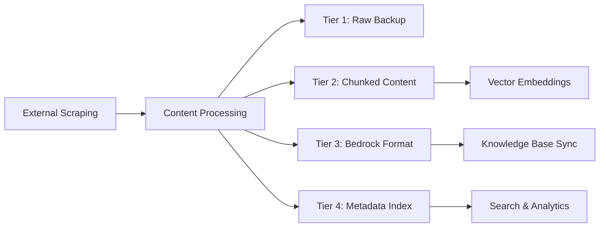
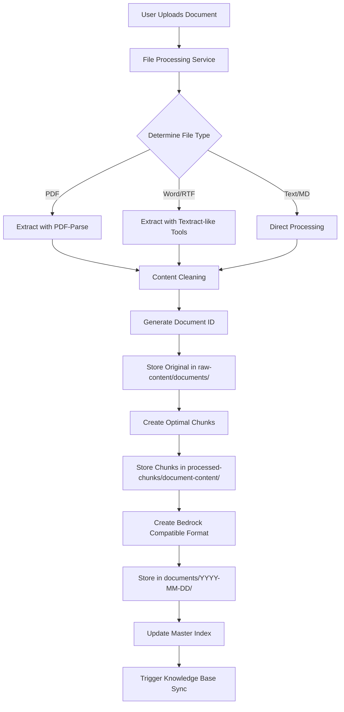
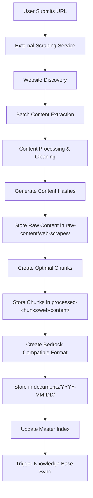
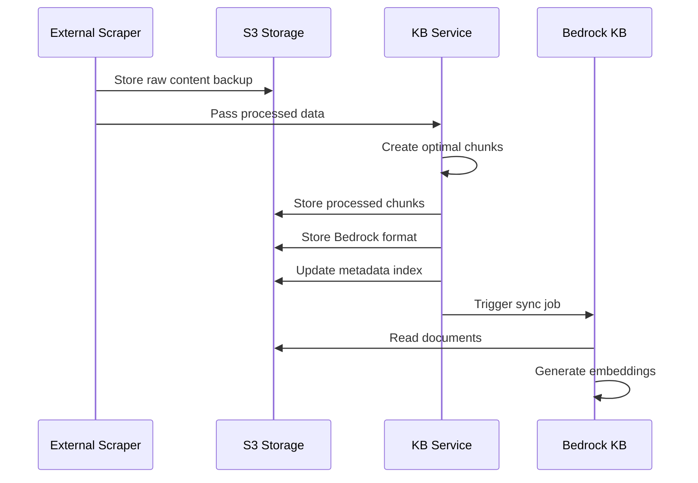
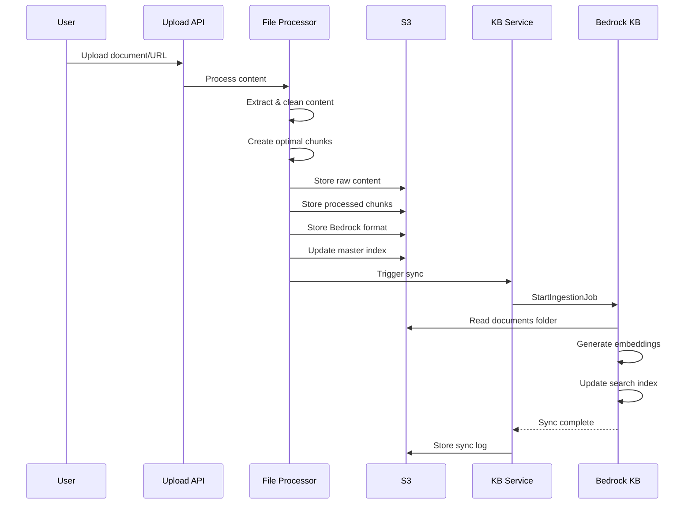

# Knowledge Base and S3 Storage Architecture Documentation

## Executive Summary

This document provides comprehensive details on how the Oralia AI Chatbot manages content storage, processing, and retrieval through AWS Bedrock Knowledge Base and S3 storage. The system implements a sophisticated multi-layered storage strategy that optimizes for both search performance and cost efficiency while maintaining data integrity and accessibility.

## Table of Contents
1. [S3 Storage Architecture](#s3-storage-architecture)
2. [Content Processing Pipeline](#content-processing-pipeline)
3. [Knowledge Base Integration](#knowledge-base-integration)
4. [Folder Structure Details](#folder-structure-details)
5. [Data Flow and Synchronization](#data-flow-and-synchronization)
6. [Performance Optimization](#performance-optimization)
7. [Backup and Recovery](#backup-and-recovery)

---

## S3 Storage Architecture

### Overview

The system uses a carefully designed S3 bucket structure that serves multiple purposes:
- **Raw Content Preservation**: Original content backup for audit and reprocessing
- **Optimized Processing**: Chunked content optimized for AI retrieval
- **Metadata Management**: Comprehensive indexing and tracking
- **Bedrock Compatibility**: Standard format for AWS Bedrock Knowledge Base

### Master Bucket Structure

```
s3://your-bedrock-bucket/
├── documents/                           # Bedrock KB compatible documents
│   └── YYYY-MM-DD/                     # Date-based partitioning
│       └── {documentId}.txt            # Processed documents for Bedrock
│
├── processed-chunks/                    # Optimized chunk storage for retrieval
│   ├── web-content/                    # Web-scraped content chunks
│   │   └── {chunkId}.json             # Individual chunk files
│   └── document-content/               # Document-based content chunks
│       └── {chunkId}.json             # Individual chunk files
│
├── raw-content/                        # Original content backup
│   ├── documents/                      # Original uploaded files
│   │   ├── pdfs/                      # PDF documents
│   │   │   └── {filename}.pdf
│   │   ├── docs/                      # Word/RTF documents
│   │   │   ├── {filename}.docx
│   │   │   ├── {filename}.doc
│   │   │   └── {filename}.rtf
│   │   └── others/                    # Other file types
│   │       ├── {filename}.txt
│   │       ├── {filename}.md
│   │       └── {filename}.csv
│   │
│   └── web-scrapes/                   # Raw web content
│       └── {domain}/                  # Organized by domain
│           └── YYYY-MM-DD/           # Date-based organization
│               └── {urlHash}.json    # Raw scraped content
│
└── metadata/                          # System metadata and indexes
    ├── content-index.json            # Master content index
    └── sync-logs/                    # Knowledge base sync logs
        └── YYYY-MM-DD/
            └── {syncJobId}.json
```

---

## Multi-Tier Storage Architecture

### Four-Tier Storage Strategy

The system implements a sophisticated **four-tier storage approach** optimized for different use cases:

#### **Tier 1: Raw Content Backup**
- **Location**: `raw-content/web-scrapes/{domain}/{date}/{urlHash}.json`
- **Purpose**: Preserves original scraped content for backup and reference
- **Retention**: Long-term storage for audit and reprocessing
- **Example Path**: `raw-content/web-scrapes/kaaylabs.com/2024-01-15/abc123def456.json`

#### **Tier 2: Processed Chunks (AI-Optimized)**
- **Location**: `processed-chunks/web-content/{chunkId}.json`
- **Purpose**: Individual content chunks optimized for vector search and retrieval
- **Configuration**:
  - Max Chunk Size: 2000 characters
  - Overlap Size: 200 characters  
  - Min Chunk Size: 150 characters
- **Benefits**: Direct access to specific content segments, enhanced search performance

#### **Tier 3: Bedrock-Formatted Documents**
- **Location**: `documents/{date}/{documentId}.txt`
- **Purpose**: Documents formatted specifically for AWS Bedrock Knowledge Base ingestion
- **Format**: Structured text with metadata headers and chunk separators

#### **Tier 4: Metadata Index**
- **Location**: `metadata/content-index.json`
- **Purpose**: Maintains searchable index of all stored documents
- **Features**: Cross-references between tiers, search optimization, analytics support

### Storage Flow Process



### Benefits of Multi-Tier Architecture

1. **Data Durability**: Raw content preserved for disaster recovery
2. **Performance Optimization**: Chunked content enables fast retrieval
3. **AI Integration**: Bedrock-formatted documents ensure seamless AI processing
4. **Operational Intelligence**: Metadata index provides system insights

---

## Content Processing Pipeline

### 1. Document Upload Processing



### 2. Web Scraping Processing



---

## Knowledge Base Integration

### AWS Bedrock Knowledge Base Configuration

The system integrates with AWS Bedrock Knowledge Base which provides:
- **Vector Embeddings**: Automatic generation using Titan Text Embeddings model
- **Semantic Search**: Vector-based similarity search
- **Managed Infrastructure**: OpenSearch Serverless backend
- **Automatic Scaling**: Handles increasing content volume

### Integration Points

1. **Data Source Configuration**
   - S3 Bucket: Points to `s3://your-bucket/documents/`
   - File Format: Plain text (.txt) files
   - Sync Strategy: Manual trigger after content updates

2. **Embedding Generation**
   - Model: `amazon.titan-embed-text-v1`
   - Chunk Size: Optimized to 2000 characters
   - Overlap: 200 characters between chunks
   - Vector Dimensions: 1536 (Titan default)

3. **Search Configuration**
   - Results Returned: Up to 10 most relevant chunks
   - Relevance Threshold: Configurable minimum score
   - Citation Tracking: Full source attribution

---

## Folder Structure Details

### 1. Documents Folder (`/documents/`)

**Purpose**: Bedrock Knowledge Base compatible format
**Structure**:
```
documents/
└── YYYY-MM-DD/                    # Date-based partitioning
    └── {documentId}.txt           # Processed document
```

**File Format Example**:
```
Title: AWS Bedrock User Guide
URL: https://docs.aws.amazon.com/bedrock/
Domain: docs.aws.amazon.com
Scraped: 2024-12-19T10:30:00.000Z
Chunks: 15

---

[Chunk 1]
Amazon Bedrock is a fully managed service that offers a choice of high-performing foundation models...

---

[Chunk 2]
You can use Amazon Bedrock to build generative AI applications...
```

**Metadata in S3 Object**:
```json
{
  "title": "AWS Bedrock User Guide",
  "url": "https://docs.aws.amazon.com/bedrock/",
  "domain": "docs.aws.amazon.com",
  "documentId": "abc123def456",
  "chunkCount": "15",
  "originalLength": "25430",
  "processedLength": "23890",
  "uploadedAt": "2024-12-19T10:30:00.000Z"
}
```

### 2. Processed Chunks Folder (`/processed-chunks/`)

**Purpose**: Optimized individual chunks for advanced search and processing

#### Web Content Structure (`/processed-chunks/web-content/`)
```
web-content/
└── {chunkId}.json                 # Individual chunk file
```

**Chunk File Example**:
```json
{
  "chunk_id": "abc123-chunk-001",
  "document_id": "abc123def456", 
  "source_type": "web-content",
  "source_url": "https://example.com/page",
  "title": "Product Features",
  "content": "Our advanced AI capabilities include natural language processing...",
  "chunk_index": 1,
  "total_chunks": 8,
  "word_count": 245,
  "processed_timestamp": "2024-12-19T10:30:00.000Z",
  "metadata": {
    "section": "chunk-1",
    "documentId": "abc123def456",
    "domain": "example.com",
    "contentHash": "sha256hash"
  }
}
```

#### Document Content Structure (`/processed-chunks/document-content/`)
```
document-content/
└── {chunkId}.json                 # Individual chunk file  
```

**Document Chunk Example**:
```json
{
  "chunk_id": "doc456-chunk-003",
  "document_id": "doc456ghi789",
  "source_type": "document-content", 
  "source_url": null,
  "title": "Company Policy Manual",
  "content": "Employee handbook section covering remote work policies...",
  "chunk_index": 3,
  "total_chunks": 12,
  "word_count": 189,
  "processed_timestamp": "2024-12-19T11:45:00.000Z",
  "metadata": {
    "section": "chunk-3",
    "documentId": "doc456ghi789",
    "fileType": "pdf",
    "originalFilename": "employee-handbook.pdf"
  }
}
```

### 3. Raw Content Folder (`/raw-content/`)

**Purpose**: Original content preservation for audit and reprocessing

#### Document Storage (`/raw-content/documents/`)
```
documents/
├── pdfs/
│   └── employee-handbook.pdf      # Original PDF file
├── docs/ 
│   ├── policy-update.docx         # Word documents
│   ├── legacy-doc.doc             # Legacy Word format
│   └── formatted-text.rtf         # RTF documents  
└── others/
    ├── readme.txt                 # Plain text files
    ├── specifications.md          # Markdown files
    └── data-export.csv            # CSV files
```

#### Web Scrape Storage (`/raw-content/web-scrapes/`)
```
web-scrapes/
└── example.com/                   # Domain-based organization
    └── 2024-12-19/               # Date-based sub-organization
        └── a1b2c3d4.json         # URL hash as filename
```

**Raw Scrape File Example**:
```json
{
  "content_id": "a1b2c3d4",
  "source_type": "web_scrape", 
  "source_url": "https://example.com/products",
  "title": "Product Catalog",
  "content": "Full extracted HTML content...",
  "chunks": [
    {
      "chunk_id": "a1b2c3d4-1",
      "content": "First chunk content...",
      "chunk_index": 1,
      "word_count": 234,
      "metadata": {
        "section": "chunk-1",
        "chunkId": "a1b2c3d4-1"
      }
    }
  ],
  "processed_timestamp": "2024-12-19T10:30:00.000Z",
  "content_hash": "sha256:abcdef123456",
  "file_type": "html",
  "language": "en"
}
```

**S3 Object Metadata for Raw Scrapes**:
```json
{
  "domain": "example.com",
  "url": "https://example.com/products",
  "title": "Product Catalog", 
  "contentHash": "sha256:abcdef123456",
  "chunkCount": "5",
  "scrapedAt": "2024-12-19T10:30:00.000Z",
  "source": "external-scraper"
}
```

### 4. Metadata Folder (`/metadata/`)

**Purpose**: System-wide indexing and operational data

#### Master Index (`/metadata/content-index.json`)
```json
[
  {
    "document_id": "abc123def456",
    "title": "AWS Bedrock User Guide", 
    "source_url": "https://docs.aws.amazon.com/bedrock/",
    "source_type": "web-content",
    "chunk_count": 15,
    "total_word_count": 3450,
    "processed_timestamp": "2024-12-19T10:30:00.000Z",
    "chunk_keys": [
      "processed-chunks/web-content/abc123-chunk-001.json",
      "processed-chunks/web-content/abc123-chunk-002.json"
    ],
    "metadata": {
      "domain": "docs.aws.amazon.com",
      "originalLength": 25430,
      "processedLength": 23890
    }
  }
]
```

#### Sync Logs (`/metadata/sync-logs/`)
```
sync-logs/
└── 2024-12-19/
    └── job-abc123-sync.json       # Bedrock sync job details
```

**Sync Log Example**:
```json
{
  "job_id": "abc123-sync",
  "knowledge_base_id": "KB123456",
  "data_source_id": "DS789012", 
  "status": "COMPLETE",
  "started_at": "2024-12-19T10:35:00.000Z",
  "completed_at": "2024-12-19T10:38:30.000Z",
  "documents_processed": 25,
  "documents_added": 3,
  "documents_updated": 2, 
  "documents_failed": 0,
  "total_chunks_processed": 420
}
```

---

## External Scraping Storage Process

### Detailed External Scraping Flow

The external scraping process implements a comprehensive storage strategy that ensures data durability and optimal retrieval performance:

#### Step 1: Content Acquisition
```javascript
// Location: src/services/externalScrapingService.js
async scrapeAndProcess(url) {
  // External API call to scraping service
  const scrapedData = await this.callExternalAPI(url);
  
  // Process and clean content
  const processedData = await this.processScrapedContent(scrapedData);
  
  // Store in multi-tier S3 architecture
  return await this.storeInS3(processedData);
}
```

#### Step 2: Multi-Tier Storage Implementation
**Tier 1 - Raw Content Backup**:
- **Path Pattern**: `raw-content/web-scrapes/{domain}/{date}/{urlHash}.json`
- **Content Structure**: Complete scraped data with metadata
- **Metadata Sanitization**: URL and title sanitization for S3 compatibility
- **Example Storage**:
  ```json
  {
    "content_id": "abc123def456",
    "source_type": "web_scrape",
    "source_url": "https://kaaylabs.com/services",
    "title": "Services - KayLabs",
    "content": "Full page content...",
    "chunks": [...],
    "processed_timestamp": "2024-01-15T10:30:00.000Z",
    "content_hash": "sha256:uniquehash",
    "file_type": "html",
    "language": "en"
  }
  ```

**Tier 2 - Optimized Processing**:
- **Path Pattern**: Uses Bedrock Knowledge Base Service for optimal chunk storage
- **Processing**: Content cleaning, intelligent chunking, metadata enhancement
- **Storage Location**: `processed-chunks/web-content/{chunkId}.json`

#### Step 3: S3 Object Metadata Enhancement
Each stored object includes comprehensive metadata for efficient retrieval and management:

```javascript
// S3 Object Metadata Structure
{
  domain: sanitizeMetadataValue(domain, 200),
  url: sanitizeMetadataValue(processedData.url, 1000),
  title: sanitizeMetadataValue(processedData.title),
  contentHash: sanitizeMetadataValue(processedData.contentHash, 100),
  chunkCount: String(processedData.chunks.length),
  scrapedAt: sanitizeMetadataValue(timestamp, 50),
  source: 'external-scraper'
}
```

#### Step 4: Content Optimization Features
**Hash-Based Deduplication**:
- URL-based hash generation prevents duplicate storage
- Content hash verification ensures data integrity
- Timestamp-based organization enables efficient retrieval

**Domain-Based Organization**:
- Automatic domain extraction and organization
- Date-based partitioning within domain folders
- Efficient filtering and bulk operations support

### Integration with Knowledge Base Service

After external scraping and S3 storage, the content flows into the main knowledge base service:



### Error Handling and Recovery

**Metadata Sanitization**:
```javascript
sanitizeMetadataValue(value, maxLength = 1000) {
  if (!value) return 'Unknown';
  
  return String(value)
    .replace(/[^\w\s\-\.\/\:]/g, '')
    .substring(0, maxLength) || 'Untitled';
}
```

**Storage Resilience**:
- Automatic retry logic for failed S3 operations
- Graceful handling of malformed content
- Comprehensive error logging and monitoring
- Rollback capabilities for partial failures

---

## Data Flow and Synchronization

### Content Ingestion Flow



### Knowledge Base Synchronization Process

1. **Trigger Conditions**
   - New content added
   - Existing content updated  
   - Manual sync request
   - Scheduled sync job

2. **Sync Process**
   ```javascript
   // Location: src/services/bedrockKnowledgeBaseService.js:404-426
   async syncKnowledgeBase() {
     const command = new StartIngestionJobCommand({
       knowledgeBaseId: this.knowledgeBaseId,
       dataSourceId: this.dataSourceId,
       description: `Sync triggered at ${new Date().toISOString()}`
     });
     
     const response = await this.bedrockAgent.send(command);
     return response.ingestionJob.ingestionJobId;
   }
   ```

3. **Sync Monitoring**
   - Job status tracking
   - Error handling and retry logic
   - Performance metrics collection
   - Completion notifications

---

## Performance Optimization

### 1. Chunking Strategy

**Optimal Chunk Configuration**:
```javascript
// Location: src/services/bedrockKnowledgeBaseService.js:30-37
this.chunkConfig = {
  maxChunkSize: 2000,     // Optimal for embedding models
  overlapSize: 200,       // Context preservation
  minChunkSize: 150,      // Reduced minimum for short content like contact pages
  separators: ['\n\n', '\n', '. ', '! ', '? ', '; ']
};
```

**Why These Settings**:
- **2000 characters**: Sweet spot for Titan embeddings quality vs. cost
- **200 character overlap**: Maintains context across chunk boundaries
- **150 character minimum**: Accommodates short content like contact pages and brief descriptions
- **Semantic separators**: Preserves meaning by breaking at natural boundaries

### 2. Content Cleaning and Optimization

**Intelligent Content Cleaning**:
```javascript
// Location: src/services/bedrockKnowledgeBaseService.js:206-233
cleanContent(content) {
  let cleaned = content;
  
  // Remove excessive whitespace
  cleaned = cleaned.replace(/\s+/g, ' ');
  cleaned = cleaned.replace(/\n\s*\n/g, '\n\n');
  
  // Remove common navigation and boilerplate text
  const removePatterns = [
    /skip to (main )?content/gi,
    /cookie policy/gi,
    /privacy policy/gi,
    /terms of service/gi,
    /newsletter signup/gi,
    /follow us on/gi,
    /share this/gi,
    /copyright \d{4}/gi
  ];
  
  removePatterns.forEach(pattern => {
    cleaned = cleaned.replace(pattern, '');
  });
  
  return cleaned.trim();
}
```

**Content Optimization Features**:
- **Whitespace Normalization**: Removes excessive spacing while preserving structure
- **Boilerplate Removal**: Eliminates common navigation and footer content
- **Pattern-Based Filtering**: Removes copyright notices, privacy policies, and other noise
- **Context Preservation**: Maintains paragraph breaks and meaningful formatting

### 3. Storage Optimization

**Partitioning Strategy**:
- **Date-based partitioning**: Enables efficient S3 lifecycle policies
- **Content-type separation**: Different retention policies per content type
- **Hash-based naming**: Prevents filename conflicts and enables deduplication

**Cost Optimization**:
- **S3 Storage Classes**: Transition to IA/Archive based on access patterns
- **Lifecycle Policies**: Automatic management of old content
- **Compression**: JSON files stored with efficient formatting

### 4. Search Performance

**Index Optimization**:
- **Vector dimensionality**: Balanced for speed vs. accuracy
- **Retrieval configuration**: Optimized number of results returned
- **Relevance scoring**: Tuned thresholds for quality results

---

## Backup and Recovery

### 1. Data Protection Strategy

**Multi-Layer Backup**:
1. **Raw Content**: Original files preserved indefinitely
2. **Processed Content**: Chunks can be regenerated from raw content
3. **Metadata Index**: Regular backups of master index
4. **Sync Logs**: Operational history preservation

### 2. Recovery Procedures

**Full System Recovery**:
1. Restore S3 bucket from backup
2. Rebuild Bedrock Knowledge Base from documents folder
3. Regenerate processed chunks if needed
4. Restore master index and sync logs

**Selective Recovery**:
1. Identify affected content via master index
2. Restore specific raw content
3. Reprocess and re-chunk content
4. Trigger targeted knowledge base sync

### 3. Disaster Recovery

**RTO/RPO Targets**:
- **Recovery Time Objective (RTO)**: 4 hours
- **Recovery Point Objective (RPO)**: 1 hour
- **Data Loss Prevention**: Cross-region replication for critical data

---

## Monitoring and Metrics

### 1. Storage Metrics

**S3 Metrics**:
- Total objects and storage size
- Request rates and patterns
- Cost per GB stored
- Access frequency patterns

**Knowledge Base Metrics**:
- Sync job success rate
- Sync duration and frequency  
- Search query performance
- Vector storage utilization

### 2. Performance Monitoring

```javascript
// Location: src/services/bedrockKnowledgeBaseService.js:480-520
async getStorageStats() {
  const response = await this.s3Client.send(command);
  const objects = response.Contents || [];
  
  return {
    totalDocuments: objects.length,
    totalSize: objects.reduce((sum, obj) => sum + (obj.Size || 0), 0),
    averageSize: totalDocuments > 0 ? Math.round(totalSize / totalDocuments) : 0,
    documentsByDate: byDate,
    bucket: this.bucket
  };
}
```

### 3. Health Checks

**System Health Indicators**:
- S3 bucket accessibility
- Knowledge base sync status
- Processing pipeline health
- Search functionality verification

---

## Metadata Key Standardization and Filtering Compatibility

### Current Challenge: Metadata Key Mismatch

The system currently faces a **critical compatibility issue** between storage metadata and AWS Bedrock filtering expectations:

#### **Current Custom Implementation**
```javascript
// Current Node.js Implementation
Metadata: {
  domain: "example.com",
  url: "https://example.com/page", 
  title: "Page Title",
  contentHash: "sha256hash",
  chunkCount: "5",
  scrapedAt: "2024-01-15T10:30:00.000Z",
  source: "external-scraper"
}
```

#### **AWS Bedrock Standard Requirements**
```javascript
// Expected by AWS Bedrock Filtering
Metadata: {
  "x-amz-bedrock-kb-source-uri": "s3://bucket/path/to/file.txt",
  "x-amz-bedrock-kb-data-source-id": "DATASOURCEID123",
  "x-amz-bedrock-kb-content-type": "text/html",
  "x-amz-bedrock-kb-created-date": "2024-01-15T10:30:00.000Z",
  "x-amz-bedrock-kb-last-modified-date": "2024-01-15T10:30:00.000Z",
  "x-amz-bedrock-kb-data": "Additional metadata content"
}
```

### **Recommended Hybrid Metadata Strategy**

To maintain **both custom functionality AND AWS compatibility**, implement a dual metadata approach:

#### **Enhanced Metadata Structure**
```javascript
// Recommended Implementation - Best of Both Worlds
Metadata: {
  // AWS Bedrock Standard Keys (for filtering)
  "x-amz-bedrock-kb-source-uri": `s3://${bucket}/${key}`,
  "x-amz-bedrock-kb-data-source-id": process.env.BEDROCK_DATA_SOURCE_ID,
  "x-amz-bedrock-kb-content-type": "text/html",
  "x-amz-bedrock-kb-created-date": timestamp,
  "x-amz-bedrock-kb-last-modified-date": timestamp,
  "x-amz-bedrock-kb-data": JSON.stringify({
    domain: "example.com",
    url: "https://example.com/page",
    title: "Page Title"
  }),
  
  // Custom Keys (for application logic) - KEEP THESE
  domain: "example.com",
  url: "https://example.com/page",
  title: "Page Title",
  contentHash: "sha256hash",
  chunkCount: "5",
  scrapedAt: timestamp,
  source: "external-scraper"
}
```

### **Implementation Changes Required**

#### **1. Update bedrockKnowledgeBaseService.js**
```javascript
// Location: src/services/bedrockKnowledgeBaseService.js
async storeDocument(document) {
  // ... existing code ...
  
  // Enhanced metadata with AWS compatibility
  const enhancedMetadata = {
    // AWS Bedrock Standard Keys
    "x-amz-bedrock-kb-source-uri": `s3://${this.bucket}/${s3Key}`,
    "x-amz-bedrock-kb-data-source-id": this.dataSourceId,
    "x-amz-bedrock-kb-content-type": this.getContentType(document),
    "x-amz-bedrock-kb-created-date": timestamp,
    "x-amz-bedrock-kb-last-modified-date": timestamp,
    "x-amz-bedrock-kb-data": JSON.stringify({
      domain: metadata?.domain,
      url: url,
      title: title,
      sourceType: metadata?.source === 'external-scraper' ? 'web-content' : 'document-content'
    }),
    
    // Keep existing custom keys for backwards compatibility
    ...metadata,
    documentId,
    chunkCount: chunks.length,
    originalLength: content.length,
    processedLength: cleanedContent.length
  };
  
  await this.uploadToS3(s3Key, formattedContent, enhancedMetadata);
}

getContentType(document) {
  if (document.metadata?.source === 'external-scraper') return 'text/html';
  if (document.metadata?.fileType?.includes('pdf')) return 'application/pdf';
  return 'text/plain';
}
```

#### **2. Update externalScrapingService.js**
```javascript
// Location: src/services/externalScrapingService.js
async storeInS3(processedData) {
  const enhancedMetadata = {
    // AWS Bedrock Standard Keys
    "x-amz-bedrock-kb-source-uri": `s3://${this.bucket}/${rawKey}`,
    "x-amz-bedrock-kb-data-source-id": process.env.BEDROCK_DATA_SOURCE_ID,
    "x-amz-bedrock-kb-content-type": "text/html",
    "x-amz-bedrock-kb-created-date": timestamp,
    "x-amz-bedrock-kb-last-modified-date": timestamp,
    "x-amz-bedrock-kb-data": JSON.stringify({
      domain: domain,
      url: processedData.url,
      title: processedData.title,
      sourceType: "web-content"
    }),
    
    // Keep existing custom metadata
    domain: this.sanitizeMetadataValue(domain, 200),
    url: this.sanitizeMetadataValue(processedData.url, 1000),
    title: this.sanitizeMetadataValue(processedData.title),
    contentHash: this.sanitizeMetadataValue(processedData.contentHash, 100),
    chunkCount: String(processedData.chunks.length),
    scrapedAt: this.sanitizeMetadataValue(timestamp, 50),
    source: 'external-scraper'
  };
  
  await this.s3Client.send(new PutObjectCommand({
    Bucket: this.bucket,
    Key: rawKey,
    Body: JSON.stringify(processedData),
    ContentType: 'application/json',
    Metadata: enhancedMetadata
  }));
}
```

### **Benefits of Hybrid Approach**

#### **✅ AWS Bedrock Compatibility**
- **Native filtering works**: `x-amz-bedrock-kb-source-uri` enables proper filtering
- **Standard compliance**: Follows AWS documentation and best practices
- **Better performance**: Leverages AWS-optimized filtering mechanisms

#### **✅ Backwards Compatibility**  
- **Existing code continues working**: Custom keys are preserved
- **No breaking changes**: Current search and retrieval logic unchanged
- **Gradual migration**: Can implement incrementally

#### **✅ Enhanced Filtering Capabilities**
```javascript
// Now both approaches work:

// AWS Native Filtering (Python/any language)
filter = {
  'stringContains': {
    'key': 'x-amz-bedrock-kb-source-uri',
    'value': 'kaaylabs.com'
  }
}

// Custom Application Filtering (Node.js)
filter = {
  'equals': {
    'key': 'domain', 
    'value': 'kaaylabs.com'
  }
}
```

### **Migration Strategy**

#### **Phase 1: Implement Enhanced Metadata (Recommended)**
1. Update storage services to include AWS standard keys
2. Keep existing custom keys for backwards compatibility
3. Test filtering with both key types
4. Deploy gradually with feature flags

#### **Phase 2: Update Filtering Logic** 
1. Update Python filtering to use `x-amz-bedrock-kb-source-uri`
2. Maintain Node.js filtering with custom keys
3. A/B test filtering performance
4. Monitor and optimize

#### **Phase 3: Optimize and Clean**
1. Remove redundant metadata keys if needed
2. Optimize for storage cost and performance  
3. Update documentation and processes

### **Immediate Action Required**

**YES, you should update your storage methods** to include AWS standard metadata keys while keeping your custom keys. This hybrid approach will:

1. **Fix current filtering issues** immediately
2. **Maintain backwards compatibility** 
3. **Future-proof** your implementation
4. **Improve performance** through native AWS filtering

The changes are **relatively straightforward** and can be implemented incrementally without breaking existing functionality.

---

## Security and Compliance

### 1. Access Control

**S3 Bucket Security**:
- IAM policies for service-level access
- Encryption at rest using AWS KMS
- Secure transport (TLS) for all operations
- Access logging enabled

**Bedrock Knowledge Base Security**:
- Service-linked roles for secure access
- VPC endpoints for private connectivity  
- Customer-managed encryption keys
- Audit trails through CloudTrail

### 2. Data Privacy

**Content Protection**:
- No sensitive data in object keys
- Metadata sanitization
- Regular security assessments
- Compliance with data retention policies

**User Data Isolation**:
- Tenant-specific prefixes (if multi-tenant)
- Access controls at object level
- Audit trails for all access
- Data anonymization capabilities

---

## Troubleshooting Guide

### 1. Common Issues

**Sync Job Failures**:
- Check S3 permissions
- Verify document format compliance
- Review Bedrock service limits
- Check for malformed content

**Search Quality Issues**:  
- Review chunking configuration
- Check embedding model performance
- Analyze query patterns
- Optimize relevance thresholds

### 2. Diagnostic Tools

**Built-in Diagnostics**:
- Storage statistics endpoint
- Sync status monitoring
- Content validation tools
- Performance profiling

**AWS Tools**:
- S3 access logs analysis
- CloudWatch metrics
- Bedrock service logs
- Cost and usage reports

---

## Future Enhancements

### 1. Advanced Features

**Planned Improvements**:
- Automatic content deduplication
- Multi-language support
- Advanced chunking strategies
- Real-time sync capabilities

### 2. Integration Expansions

**Additional Sources**:
- Database connectors
- Email system integration
- SharePoint/OneDrive sync
- Real-time data streams

This comprehensive storage architecture provides a robust, scalable foundation for intelligent content management while maintaining performance, security, and cost-effectiveness. The multi-layered approach ensures data integrity while optimizing for AI-powered search and retrieval capabilities.
