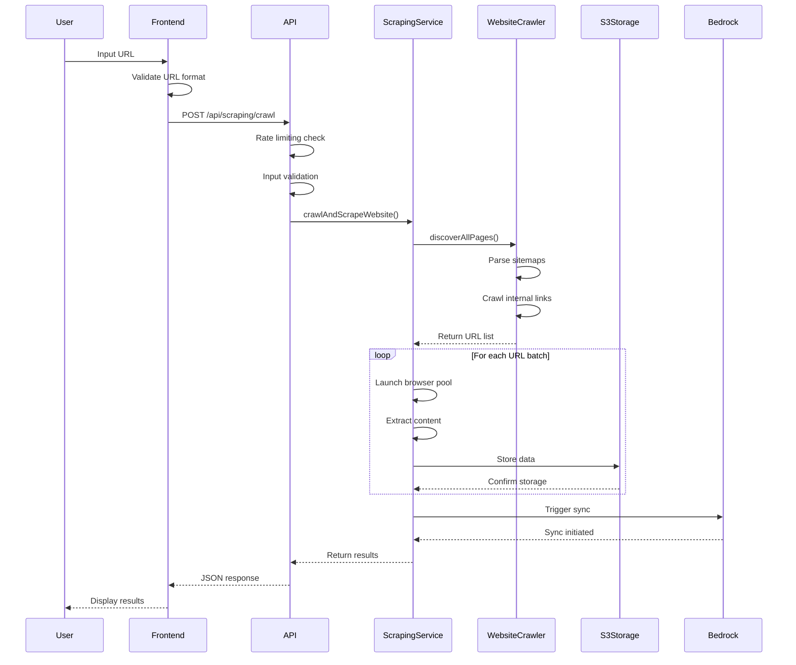

# 🏗️ Service Architecture & Data Flow Documentation

## 📊 System Architecture Overview

```
┌─────────────────────────────────────────────────────────────────────────────────┐
│                           ORALIA AI SCRAPING SERVICE                           │
└─────────────────────────────────────────────────────────────────────────────────┘

┌─────────────────┐    ┌─────────────────┐    ┌─────────────────────────────────┐
│   USER LAYER    │    │  APPLICATION    │    │        AWS CLOUD               │
│                 │    │     LAYER       │    │                                 │
│  ┌───────────┐  │    │  ┌───────────┐  │    │  ┌─────────┐  ┌─────────────┐  │
│  │  React    │◄─┼────┼─►│  Express  │◄─┼────┼─►│   S3    │  │   Bedrock   │  │
│  │ Frontend  │  │    │  │   API     │  │    │  │ Storage │  │ Knowledge   │  │
│  └───────────┘  │    │  └───────────┘  │    │  └─────────┘  │    Base     │  │
│                 │    │                 │    │               └─────────────┘  │
│  ┌───────────┐  │    │  ┌───────────┐  │    │  ┌─────────┐  ┌─────────────┐  │
│  │ Dashboard │  │    │  │ Scraping  │  │    │  │OpenSearch│  │  Foundation │  │
│  │    UI     │  │    │  │ Services  │  │    │  │  Vector  │  │   Models    │  │
│  └───────────┘  │    │  └───────────┘  │    │  │  Index   │  │    (LLMs)   │  │
└─────────────────┘    └─────────────────┘    │  └─────────┘  └─────────────┘  │
                                              └─────────────────────────────────┘
```

---

## 🔄 Complete Data Flow Process

### Phase 1: User Interaction & Request Processing

```
┌─────────────┐     ┌─────────────┐     ┌─────────────┐     ┌─────────────┐
│  User Input │ ──► │  Frontend   │ ──► │   API       │ ──► │ Validation  │
│    (URL)    │     │ Validation  │     │ Endpoint    │     │ Middleware  │
└─────────────┘     └─────────────┘     └─────────────┘     └─────────────┘
       │                   │                   │                   │
       ▼                   ▼                   ▼                   ▼
   📝 "Enter URL"     🔍 "Check format"   🌐 "POST /api/       ✅ "Validate &
   to scrape data     validate domain     scraping/crawl"     sanitize input"
```

### Phase 2: URL Discovery & Site Mapping

```
┌─────────────┐     ┌─────────────┐     ┌─────────────┐     ┌─────────────┐
│ Base URL    │ ──► │ Sitemap     │ ──► │ Robots.txt  │ ──► │ Internal    │
│ Processing  │     │ Discovery   │     │ Analysis    │     │ Link Crawl  │
└─────────────┘     └─────────────┘     └─────────────┘     └─────────────┘
       │                   │                   │                   │
       ▼                   ▼                   ▼                   ▼
   🎯 Parse domain    🗺️ "/sitemap.xml"   🤖 "/robots.txt"   🕷️ Extract all
   extract hostname   "/sitemap_index"    find sitemaps      internal links
                     parse XML structure                     from main pages

                               ▼
                     ┌─────────────────┐
                     │  URL Collection │
                     │ & Deduplication │
                     └─────────────────┘
                               │
                               ▼
                        📊 Final URL list
                        filter & prioritize
```

### Phase 3: Content Extraction Engine

```
┌─────────────┐     ┌─────────────┐     ┌─────────────┐     ┌─────────────┐
│ Puppeteer   │ ──► │ Page Load   │ ──► │ Dynamic     │ ──► │ Content     │
│ Browser     │     │ & Render    │     │ Content     │     │ Extraction  │
│ Launch      │     │             │     │ Loading     │     │             │
└─────────────┘     └─────────────┘     └─────────────┘     └─────────────┘
       │                   │                   │                   │
       ▼                   ▼                   ▼                   ▼
   🤖 Headless        🌐 Navigate to     ⏳ Scroll, wait      📄 Parse HTML
   Chrome instance    page with full     for lazy loading    with Cheerio
   optimized args     wait conditions    handle popups       clean & extract

                               ▼
                     ┌─────────────────┐
                     │ 18+ Extractors  │
                     │    Parallel     │
                     │   Processing    │
                     └─────────────────┘
                               │
                               ▼
    ┌──────────────────────────────────────────────────────────────┐
    │                  CONTENT EXTRACTION                          │
    │                                                              │
    │  🛍️ Products    💰 Pricing    🔧 Services   📅 Events      │
    │  ⭐ Reviews     🖼️ Media       📊 Tables     📝 Text       │
    │  🏢 Contacts    📍 Locations   🎯 Features   📋 Forms       │
    │  🍳 Recipes     📚 Courses     💼 Jobs       🎪 Events      │
    │  🎬 Articles    📱 Apps        🏆 Awards     📈 Analytics   │
    └──────────────────────────────────────────────────────────────┘
```

### Phase 4: Data Processing & Structuring

```
┌─────────────┐     ┌─────────────┐     ┌─────────────┐     ┌─────────────┐
│ Raw Data    │ ──► │ Cleaning &  │ ──► │ Structured  │ ──► │ Chunk       │
│ Collection  │     │ Validation  │     │ Data Format │     │ Creation    │
└─────────────┘     └─────────────┘     └─────────────┘     └─────────────┘
       │                   │                   │                   │
       ▼                   ▼                   ▼                   ▼
   📊 All extracted   🧹 Remove noise    🏗️ Organize by    ✂️ Split into
   data from all      normalize text     content type      searchable chunks
   18+ extractors     validate formats   create schemas    with metadata

                               ▼
                     ┌─────────────────┐
                     │ Hash Generation │
                     │ & Deduplication │
                     └─────────────────┘
                               │
                               ▼
                        🔐 SHA256 hashing
                        content versioning
                        duplicate detection
```

### Phase 5: AWS Storage Architecture

```
                           🏗️ S3 STORAGE HIERARCHY
                                      │
            ┌─────────────────────────┼─────────────────────────┐
            │                         │                         │
            ▼                         ▼                         ▼
    ┌─────────────┐         ┌─────────────┐         ┌─────────────┐
    │ Raw Content │         │ Processed   │         │ Structured  │
    │   Storage   │         │   Content   │         │    Data     │
    └─────────────┘         └─────────────┘         └─────────────┘
            │                         │                         │
            ▼                         ▼                         ▼
    📄 raw/domain/         ⚡ processed/           🏗️ structured/
    date/hash_raw.html     domain/date/           domain/date/
                          hash_processed.json     hash_products.json
                                                 hash_pricing.json
                                                 hash_services.json

    ┌─────────────┐         ┌─────────────┐         ┌─────────────┐
    │ Media Data  │         │ Table Data  │         │ Metadata    │
    │   Storage   │         │   Storage   │         │   Storage   │
    └─────────────┘         └─────────────┘         └─────────────┘
            │                         │                         │
            ▼                         ▼                         ▼
    🎨 media/domain/       📊 tables/domain/      📋 metadata/domain/
    date/hash_media.json   date/hash_tables.json  date/hash_metadata.json
                                                  date/scraping-log.json
```

### Phase 6: Knowledge Base Integration

```
┌─────────────┐     ┌─────────────┐     ┌─────────────┐     ┌─────────────┐
│ S3 Storage  │ ──► │ Bedrock     │ ──► │ Vector      │ ──► │ OpenSearch  │
│ Trigger     │     │ Ingestion   │     │ Embedding   │     │ Index       │
└─────────────┘     └─────────────┘     └─────────────┘     └─────────────┘
       │                   │                   │                   │
       ▼                   ▼                   ▼                   ▼
   📤 New content     🧠 Foundation      🧮 Convert text     🔍 Store vectors
   uploaded to S3     Model processing  to numerical        in searchable
   triggers sync      chunk analysis    representations     vector database

                               ▼
                     ┌─────────────────┐
                     │  Knowledge Base │
                     │     Ready       │
                     └─────────────────┘
                               │
                               ▼
                        ✅ Content indexed
                        ready for queries
```

### Phase 7: Query & Response Generation

```
┌─────────────┐     ┌─────────────┐     ┌─────────────┐     ┌─────────────┐
│ User Query  │ ──► │ Vector      │ ──► │ Context     │ ──► │ AI Response │
│ Processing  │     │ Search      │     │ Retrieval   │     │ Generation  │
└─────────────┘     └─────────────┘     └─────────────┘     └─────────────┘
       │                   │                   │                   │
       ▼                   ▼                   ▼                   ▼
   💬 "What products   🔍 Find similar    📚 Retrieve top    🤖 Generate answer
   are available?"     vectors in         5 relevant         with context using
   convert to vector   OpenSearch index   chunks from KB     Claude/GPT model

                               ▼
                     ┌─────────────────┐
                     │ Formatted       │
                     │ Response        │
                     └─────────────────┘
                               │
                               ▼
                        💬 JSON response
                        with citations
                        and confidence
```

---

## 🔧 Service Component Architecture

### Core Services Breakdown

```
📦 SCRAPING SERVICE LAYER
├── 🕷️ ScrapingService.js
│   ├── scrapeSinglePage()           # Single URL processing
│   ├── crawlAndScrapeWebsite()      # Full website crawling
│   ├── extractContent()             # Content extraction orchestrator
│   ├── extractProducts()            # Product information extraction
│   ├── extractPricing()             # Pricing data extraction
│   ├── extractServices()            # Service offerings extraction
│   ├── extractEvents()              # Event data extraction
│   ├── extractReviews()             # Review and rating extraction
│   ├── extractMedia()               # Image and video extraction
│   ├── extractTables()              # Table data extraction
│   ├── extractForms()               # Form and interactive elements
│   ├── createChunks()               # Content chunking for KB
│   └── storePageContent()           # S3 storage orchestration
│
├── 🗺️ WebsiteCrawler.js
│   ├── discoverAllPages()           # URL discovery orchestrator
│   ├── discoverFromSitemap()        # Sitemap XML parsing
│   ├── crawlPages()                 # Internal link discovery
│   ├── sanitizeUrl()                # URL validation and cleaning
│   └── filterUrls()                 # Duplicate removal and filtering
│
├── ☁️ S3StorageService.js
│   ├── storeRawContent()            # Raw HTML storage
│   ├── storeProcessedContent()      # JSON chunk storage
│   ├── storeStructuredData()        # Organized data storage
│   ├── storeMediaMetadata()         # Media information storage
│   ├── generateMetadata()           # Scraping metadata creation
│   └── uploadToS3()                 # AWS S3 upload handler
│
├── 🧠 BedrockService.js
│   ├── queryKnowledgeBase()         # RAG query processing
│   ├── handleSession()              # Session management
│   └── formatResponse()             # Response formatting
│
└── 🔄 KnowledgeBaseSync.js
    ├── syncKnowledgeBase()          # Trigger ingestion jobs
    ├── checkSyncStatus()            # Monitor ingestion progress
    └── handleSyncErrors()           # Error handling and retry
```

---

## 📊 Data Flow Detailed Breakdown

### 1. Request Processing Flow



### 2. Content Extraction Flow

```
📄 HTML INPUT
       │
       ▼
┌─────────────────┐
│ CHEERIO PARSER  │
│ Remove scripts  │
│ Clean content   │
└─────────────────┘
       │
       ▼
┌─────────────────┐
│ PARALLEL        │
│ EXTRACTORS      │
│ (18+ types)     │
└─────────────────┘
       │
       ▼
┌─────────────────────────────────────────────────────────┐
│                EXTRACTION RESULTS                        │
├─────────────────┬─────────────────┬─────────────────────┤
│ STRUCTURED DATA │ MEDIA CONTENT   │ INTERACTIVE ELEMENTS │
│ • Products      │ • Images        │ • Forms             │
│ • Pricing       │ • Videos        │ • Buttons           │
│ • Services      │ • Audio         │ • Links             │
│ • Events        │ • Metadata      │ • Navigation        │
│ • Reviews       │                 │                     │
│ • Locations     │                 │                     │
│ • Contacts      │                 │                     │
├─────────────────┼─────────────────┼─────────────────────┤
│ TEXT CONTENT    │ TABLE DATA      │ METADATA            │
│ • Full text     │ • Headers       │ • Title             │
│ • Headings      │ • Rows          │ • Description       │
│ • Paragraphs    │ • Captions      │ • Keywords          │
│ • Lists         │ • Data cells    │ • Author            │
│ • Descriptions  │                 │ • Language          │
└─────────────────┴─────────────────┴─────────────────────┘
       │
       ▼
┌─────────────────┐
│ CHUNK CREATION  │
│ Text chunking   │
│ Metadata attach │
│ Hash generation │
└─────────────────┘
```

### 3. AWS Storage Flow

```
📊 EXTRACTED DATA
       │
       ▼
┌─────────────────┐
│ STORAGE ROUTER  │
│ Categorize by   │
│ content type    │
└─────────────────┘
       │
       ▼
┌──────────────────────────────────────────────────────────────┐
│                    S3 STORAGE PATHS                          │
│                                                              │
│  raw/domain/date/hash_raw.html      ──► 📄 Original HTML    │
│  processed/domain/date/hash.json    ──► ⚡ Processed chunks │
│  structured/domain/date/            ──► 🏗️ Organized data   │
│  ├── hash_products.json                                     │
│  ├── hash_pricing.json                                      │
│  ├── hash_services.json                                     │
│  └── hash_events.json                                       │
│  media/domain/date/hash_media.json  ──► 🎨 Media metadata   │
│  tables/domain/date/hash_tables.json ──► 📊 Table data      │
│  metadata/domain/date/              ──► 📋 Scraping logs    │
│  ├── hash_metadata.json                                     │
│  └── scraping-log.json                                      │
└──────────────────────────────────────────────────────────────┘
       │
       ▼
┌─────────────────┐
│ BEDROCK TRIGGER │
│ Start ingestion │
│ job for new     │
│ content         │
└─────────────────┘
```

### 4. Knowledge Base Query Flow

```
💬 USER QUERY: "What products are available?"
       │
       ▼
┌─────────────────┐
│ QUERY PROCESSOR │
│ Validate input  │
│ Session check   │
└─────────────────┘
       │
       ▼
┌─────────────────┐
│ VECTOR SEARCH   │
│ Convert query   │
│ to embeddings   │
└─────────────────┘
       │
       ▼
┌─────────────────┐
│ OPENSEARCH      │
│ Find similar    │
│ vectors in KB   │
└─────────────────┘
       │
       ▼
┌─────────────────┐
│ CONTEXT         │
│ RETRIEVAL       │
│ Top 5 chunks    │
└─────────────────┘
       │
       ▼
┌─────────────────┐
│ AI GENERATION   │
│ Claude/GPT      │
│ with context    │
└─────────────────┘
       │
       ▼
📝 RESPONSE: "Based on the scraped data, the following products are available: [detailed list with prices and descriptions]"
```

---

## 🔄 Service Integration Points

### API Endpoint Mapping

```
🌐 API ENDPOINTS
├── POST /api/scraping/single
│   ├── Input: { url, options }
│   ├── Process: Single page scraping
│   └── Output: { success, data, metadata }
│
├── POST /api/scraping/crawl
│   ├── Input: { url, crawlOptions }
│   ├── Process: Full website crawling
│   └── Output: { success, crawlId, summary }
│
├── POST /api/chat/query
│   ├── Input: { query, sessionId }
│   ├── Process: Knowledge base search
│   └── Output: { success, answer, citations }
│
├── GET /api/scraping/status/:crawlId
│   ├── Input: crawlId parameter
│   ├── Process: Check crawling progress
│   └── Output: { status, progress, results }
│
└── GET /health
    ├── Input: None
    ├── Process: System health check
    └── Output: { status, timestamp, services }
```

### Error Handling Flow

```
❌ ERROR TYPES & HANDLING

🕷️ SCRAPING ERRORS
├── Navigation timeout ──► Retry with longer timeout
├── Page load failure ──► Skip URL, log error
├── Content extraction ──► Fallback extractors
└── Browser crash ──► Restart browser pool

☁️ AWS ERRORS
├── S3 upload failure ──► Retry with backoff
├── Bedrock timeout ──► Queue for later sync
├── Permission denied ──► Log and alert admin
└── Rate limiting ──► Implement exponential backoff

🔍 QUERY ERRORS
├── Invalid input ──► Return validation error
├── Knowledge base unavailable ──► Fallback response
├── Model timeout ──► Retry with shorter context
└── Session expired ──► Create new session

🌐 API ERRORS
├── Rate limit exceeded ──► Return 429 status
├── Invalid request ──► Return 400 with details
├── Server error ──► Return 500, log details
└── Service unavailable ──► Return 503 status
```

---

## 📈 Performance & Scaling Considerations

### Concurrency Management

```
🔄 CONCURRENT PROCESSING

Browser Pool Management:
├── Max 3 browser instances
├── Page pool per browser (5 pages)
├── Automatic cleanup on timeout
└── Memory monitoring & restart

Batch Processing:
├── Default batch size: 3 URLs
├── Configurable delay between batches
├── Progress tracking and reporting
└── Error isolation per batch

S3 Upload Optimization:
├── Parallel uploads for different content types
├── Compression for large text content
├── Retry logic with exponential backoff
└── Connection pooling and reuse

Knowledge Base Sync:
├── Asynchronous ingestion jobs
├── Status monitoring and reporting
├── Incremental sync for new content
└── Error handling and retry
```

### Resource Management

```
💾 MEMORY & CPU OPTIMIZATION

Browser Resource Management:
├── Headless mode with minimal args
├── Disable images/CSS for text extraction
├── Page timeout and cleanup
└── Process isolation and restart

Content Processing:
├── Stream processing for large pages
├── Chunk-based memory allocation
├── Garbage collection optimization
└── CPU-intensive task queuing

Storage Optimization:
├── Compression for JSON data
├── S3 lifecycle policies
├── Metadata indexing
└── Cold storage transition
```

This comprehensive architecture documentation provides a complete understanding of how all components work together in the scraping service ecosystem!