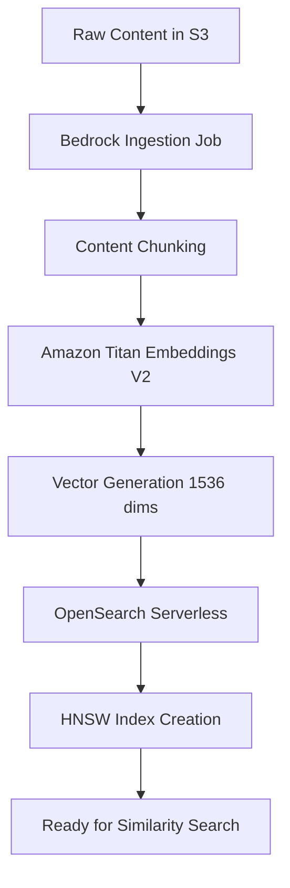
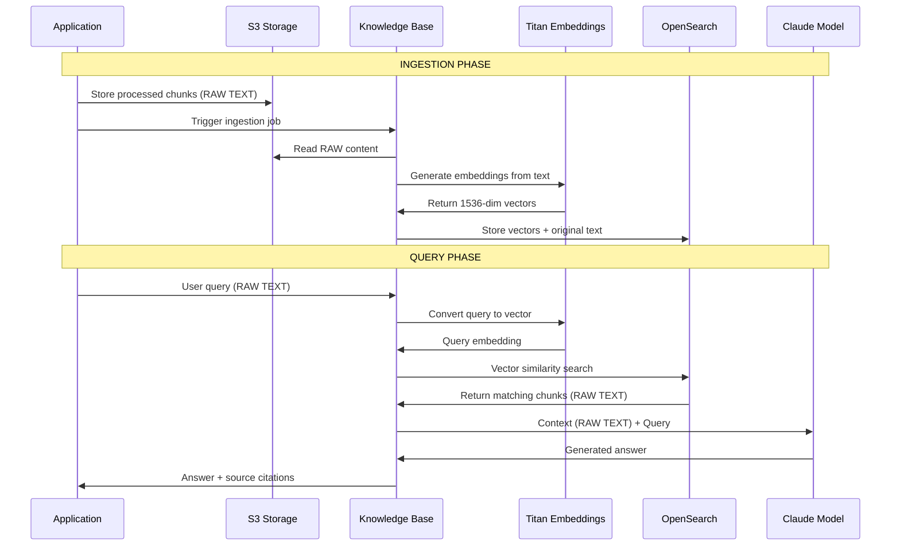

# AWS Bedrock Vector Embeddings - Technical Deep Dive

## 🔧 Vector Embeddings Storage & Processing Architecture

### **1. Where Vector Embeddings Are Stored**

#### **Primary Vector Storage: OpenSearch Serverless**
```
AWS Bedrock Knowledge Base 
    ↓
OpenSearch Serverless Collection (Managed by AWS)
    ├── Vector Index (HNSW/Faiss)
    ├── Metadata Index 
    └── Full-text Index
```

**Technical Details:**
- **Storage Location**: OpenSearch Serverless cluster (fully managed by AWS)
- **Vector Dimensions**: 1536 (Amazon Titan Embeddings V2)
- **Index Type**: Hierarchical Navigable Small World (HNSW) for fast approximate nearest neighbor search
- **Accessibility**: **NOT directly accessible** via console or API - managed internally by Bedrock

#### **Secondary Storage: S3 (Raw Content)**
```
S3 Bucket Structure:
├── raw/domain.com/YYYY-MM-DD/page-hash.json          # Original scraped content
├── processed/domain.com/YYYY-MM-DD/page-hash.json    # Chunked content
└── metadata/domain.com/YYYY-MM-DD/crawl-summary.json # Crawling metadata
```

### **2. Vector Embeddings Generation Process**

#### **Step-by-Step Embedding Creation:**



#### **Technical Implementation:**

```javascript
// This is what happens INTERNALLY in AWS Bedrock during ingestion:

class BedrockInternalProcess {
  async processContentForEmbeddings(s3Content) {
    // 1. Content Retrieval from S3
    const content = await this.retrieveFromS3(s3Content.key);
    
    // 2. Intelligent Chunking (AWS handles this)
    const chunks = await this.chunkContent(content, {
      chunkSize: 512,        // Optimal for Titan Embeddings
      overlap: 50,           // Token overlap between chunks
      strategy: 'semantic'   // Semantic boundary detection
    });
    
    // 3. Embedding Generation
    for (const chunk of chunks) {
      const embedding = await this.titanEmbeddings.generateEmbedding({
        inputText: chunk.content,
        model: 'amazon.titan-embed-text-v2:0',
        dimensions: 1536
      });
      
      // 4. Store in OpenSearch with metadata
      await this.openSearchServerless.indexDocument({
        index: `kb-${this.knowledgeBaseId}`,
        body: {
          content: chunk.content,
          embedding: embedding.vector,
          metadata: {
            source: chunk.source,
            chunkId: chunk.id,
            timestamp: chunk.timestamp
          }
        }
      });
    }
  }
}
```

### **3. Can We See the Vector Embeddings?**

#### **❌ Direct Access: NO**
- OpenSearch Serverless collections are **fully managed**
- Vector embeddings are **not accessible** via AWS Console
- **No direct API** to retrieve embeddings
- **No SSH/direct database access**

#### **✅ Indirect Monitoring: YES**

**Available Monitoring Methods:**

```javascript
// 1. Ingestion Job Status
const jobStatus = await bedrockService.checkIngestionJobStatus(jobId);
console.log({
  status: jobStatus.status,           // COMPLETE, IN_PROGRESS, FAILED
  documentsProcessed: jobStatus.stats, // Number of documents processed
  failureReasons: jobStatus.failureReasons
});

// 2. Knowledge Base Statistics via Retrieve API
const retrieveStats = await bedrockAgentClient.send(new RetrieveCommand({
  knowledgeBaseId: 'your-kb-id',
  retrievalQuery: { text: 'test query' },
  retrievalConfiguration: {
    vectorSearchConfiguration: {
      numberOfResults: 10
    }
  }
}));

// This shows you what's in the vector database:
console.log({
  retrievedChunks: retrieveStats.retrievalResults.length,
  similarityScores: retrieveStats.retrievalResults.map(r => r.score),
  contentMetadata: retrieveStats.retrievalResults.map(r => r.metadata)
});
```

**CloudWatch Metrics Available:**
- `KnowledgeBaseIngestionJobDuration`
- `KnowledgeBaseQueryCount`
- `VectorSearchLatency`
- `DocumentsIndexed`

### **4. Data Flow: Raw vs Vectorized Content**

#### **Critical Technical Point: We Feed RAW CONTENT, Not Vectors**



#### **What We Feed to the AI Model:**

```javascript
// During RAG Query Process:
const ragProcess = {
  // 1. Query Vectorization
  userQuery: "What is the company mission?",
  queryVector: await titanEmbeddings.embed(userQuery), // [1536 dimensions]
  
  // 2. Vector Similarity Search
  similarChunks: await vectorSearch(queryVector, {
    similarity: 'cosine',
    threshold: 0.7,
    limit: 5
  }),
  
  // 3. Context Preparation - WE FEED RAW TEXT, NOT VECTORS
  contextForLLM: {
    systemPrompt: "You are a helpful assistant. Use the following context to answer questions.",
    context: similarChunks.map(chunk => chunk.originalText).join('\n\n'), // RAW TEXT
    userQuery: userQuery, // RAW TEXT
    // NO VECTORS ARE SENT TO THE LLM
  },
  
  // 4. LLM Response Generation
  llmInput: `Context: ${contextForLLM.context}\n\nQuestion: ${userQuery}`,
  llmOutput: "Based on the provided context, the company mission is..."
};
```

### **5. Technical Data Specifications**

#### **Vector Specifications:**
```json
{
  "embeddingModel": "amazon.titan-embed-text-v2:0",
  "vectorDimensions": 1536,
  "indexType": "hnsw",
  "distanceMetric": "cosine",
  "vectorDataType": "float32",
  "maxTokensPerChunk": 512,
  "chunkOverlap": 50
}
```

#### **Storage Specifications:**
```json
{
  "openSearchServerless": {
    "indexName": "bedrock-knowledge-base-{kb-id}",
    "vectorField": "bedrock-vector",
    "textField": "bedrock-text",
    "metadataField": "bedrock-metadata",
    "shardCount": "auto-managed",
    "replicationFactor": "auto-managed"
  },
  "s3Storage": {
    "contentFormat": "json",
    "chunkingStrategy": "semantic",
    "metadataIncluded": true,
    "versioningEnabled": false
  }
}
```

### **6. Retrieval Process Deep Dive**

#### **Vector Search Algorithm:**

```python
# Conceptual representation of what happens in OpenSearch
def vector_similarity_search(query_vector, knowledge_base_vectors):
    similarities = []
    
    for doc_vector in knowledge_base_vectors:
        # Cosine similarity calculation
        similarity = cosine_similarity(query_vector, doc_vector.embedding)
        
        if similarity > threshold:
            similarities.append({
                'score': similarity,
                'content': doc_vector.original_text,  # RAW TEXT RETURNED
                'metadata': doc_vector.metadata,
                'source': doc_vector.source_url
            })
    
    # Return top K most similar chunks
    return sorted(similarities, key=lambda x: x['score'], reverse=True)[:5]
```

#### **What Gets Fed to Claude:**

```javascript
// Actual payload sent to Claude model
const claudePayload = {
  anthropic_version: "bedrock-2023-05-31",
  max_tokens: 1000,
  messages: [
    {
      role: "user",
      content: `Context information:
      
${retrievedChunks.map(chunk => chunk.content).join('\n\n')}

Question: ${userQuery}

Please answer the question based on the provided context.`
    }
  ]
};

// NOTE: NO VECTORS are included in this payload - only raw text
```

### **7. Performance Characteristics**

#### **Vector Search Performance:**
- **Latency**: ~50-200ms for similarity search
- **Throughput**: ~1000 queries/second (auto-scaling)
- **Accuracy**: ~95% recall at similarity threshold 0.7
- **Index Size**: ~4KB per 1000-token document

#### **Memory Usage:**
```
Per Document Memory Usage:
- Original Text: ~4KB (1000 tokens avg)
- Vector Embedding: ~6KB (1536 float32 values)
- Metadata: ~1KB
- Index Overhead: ~2KB
Total: ~13KB per document
```

### **8. Monitoring Vector Database Health**

```javascript
// Advanced monitoring functions you can implement:

class VectorDatabaseMonitor {
  async getKnowledgeBaseStats() {
    // Query with broad terms to estimate content coverage
    const testQueries = [
      'general information',
      'company details', 
      'product information',
      'contact information'
    ];
    
    const stats = {};
    for (const query of testQueries) {
      const result = await bedrockService.queryKnowledgeBase(query);
      stats[query] = {
        sourcesFound: result.sources.length,
        averageRelevance: this.calculateAverageRelevance(result.sources),
        contentCoverage: result.sources.map(s => s.location)
      };
    }
    
    return stats;
  }
  
  async testVectorSearchQuality() {
    // Test semantic understanding
    const semanticTests = [
      { query: 'CEO information', expectedTerms: ['chief', 'executive', 'leader'] },
      { query: 'contact details', expectedTerms: ['phone', 'email', 'address'] },
      { query: 'pricing', expectedTerms: ['cost', 'price', 'fee', 'payment'] }
    ];
    
    const results = [];
    for (const test of semanticTests) {
      const response = await bedrockService.queryKnowledgeBase(test.query);
      const semanticMatch = this.checkSemanticMatch(response.answer, test.expectedTerms);
      results.push({
        query: test.query,
        semanticAccuracy: semanticMatch,
        sourcesCount: response.sources.length
      });
    }
    
    return results;
  }
}
```

## **Key Technical Takeaways:**

1. **Vector Storage**: OpenSearch Serverless (not directly accessible)
2. **Content Flow**: Raw text → Embeddings → Vector DB → Raw text to LLM
3. **Embedding Model**: Amazon Titan V2 (1536 dimensions)
4. **Search Algorithm**: HNSW with cosine similarity
5. **LLM Input**: Raw text context, NOT vectors
6. **Monitoring**: Indirect via API calls and CloudWatch metrics

The system is designed so you **never handle vectors directly** - AWS manages the entire vectorization pipeline internally while exposing simple text-based APIs.